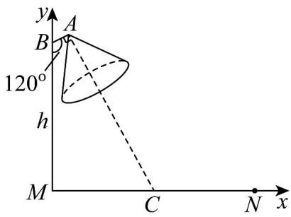

> [!faq]- 《专题2.2 直线的方程（高效培优讲义）》官方解析
>
> > [!success]- **【答案】** 10.12m
>
> > [!note]- **【分析】**
> > 建立如图所示坐标系，利用垂直关系得到斜率关系从而得到直线方程，再代入点 $C(7,0)$ 即可求出；
>
> > [!note]- **【解析】**
> > 如图，记路面宽 $|MN| = 14\mathrm{m}$ ，以灯柱底端 $M$ 为原点， $MN$ ，MB分别为 $x$ ，y轴建立平面直角坐标
> >
> > 系，
> >
> > 则点 $B$ 的坐标为 $(0,h)$ ， $MN$ 的中点 $C$ 的坐标为 $(7,0)$
> >
> > 因为 $\angle MBA = 120^{\circ}$ ，所以直线 BA 的倾斜角为 $30^{\circ}$ ，
> >
> > 由 $\left|BA\right|=1m$ ，得点A的坐标为 $\left(1\times\cos30^{\circ},h+1\times\sin30^{\circ}\right)$ ，即 $A\left(\frac{\sqrt{3}}{2},h+\frac{1}{2}\right)$
> >
> > 又因为 $CA \perp BA$ ，所以 $k_{CA} = -\frac{1}{k_{BA}} = -\frac{1}{\tan 30^{\circ}} = -\sqrt{3}$
> >
> > 所以直线 $AC$ 的方程为 $y - \left(h + \frac{1}{2}\right) = -\sqrt{3}\left(x - \frac{\sqrt{3}}{2}\right)$
> >
> > 又直线 $AC$ 过点 $C(7,0)$ ，所以 $-\left(h + \frac{1}{2}\right) = -\sqrt{3}\left(7 - \frac{\sqrt{3}}{2}\right)$ ，解得 $h = 7\sqrt{3} - 2 \approx 10.12(\mathrm{m})$ 。
> >
> > 故灯柱高 h 约为 10.12m .
> >
> > <!-- source-part:2 pages:51-72 -->
> >
> > 
> >
> > ## 方法技巧
> >
> > 用坐标法解决生活问题.
