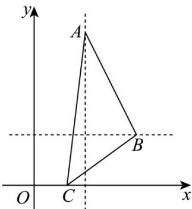
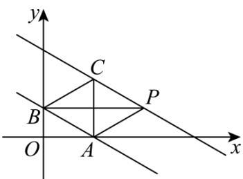

<!-- source-part:1 pages:1-50 -->

## 专题2.3 直线的交点坐标与距离公式

内容概览

教学目标、教学重难点

<table><tr><td>教学目标</td><td>1.能用解方程组的方法求两直线的交点坐标.2.探索并掌握两点间的距离公式.3.探索并掌握点到直线的距离公式.4.会求两条平行直线间的距离.</td></tr><tr><td>教学重难点</td><td>1.重点掌握点到直线的距离公式.2.难点直线的恒过定点问题</td></tr></table>

## 知识清单

## 知识点 01 直线的交点

求两直线 $A_{1}x + B_{1}y + C_{1} = 0(A_{1}B_{1}C_{1}\neq 0)$ 与 $A_{2}x + B_{2}y + C_{2} = 0(A_{2}B_{2}C_{2}\neq 0)$ 的交点坐标，只需求两直线方程联立所得方程组 $\left\{ \begin{array}{l}A_1x + B_1y + C_1 = 0\\ A_2x + B_2y + C_2 = 0 \end{array} \right.$ 的解即可．若有 $\frac{A_1}{A_2} = \frac{B_1}{B_2} = \frac{C_1}{C_2}$ ，则方程组有无穷多个解，此时两直线重合；若有 $\frac{A_1}{A_2} = \frac{B_1}{B_2}\neq \frac{C_1}{C_2}$ ，则方程组无解，此时两直线平行；若有 $\frac{A_1}{A_2}\neq \frac{B_1}{B_2}$ ，则方程组有唯一解，此时两直线相交，此解即两直线交点的坐标．

【即学即练】

1. 过直线 $x + y + 1 = 0$ 与 2x - y - 4 = 0 的交点，且一个方向向量 $v = (-13)$ 的直线方程为（）

【答案】
A. $3x + y - 1 = 0$ B. $x + 3y - 5 = 0$ C. $3x + y - 3 = 0$ D. $x + 3y + 5 = 0$

【答案】A

【分析】首先求出交点的坐标，再利用直线的方向向量求出直线的斜率，代入直线的点斜式方程写出直线的

方程即可求解·

【详解】联立 $\left\{\begin{aligned}x+y+1&=0\\ 2x-y-4&=0\end{aligned}\right.$ ，得交点坐标为 $(1,-2)$ ，

因为直线的一个方向向量 $v = (-1, 3)$ ，所以直线的斜率为 $k = -3$

所以由直线的点斜式方程可得所求直线的方程为 $y+2=-3(x-1)$ ，即 $3x+y-1=0$ 。

故选：A.

2. 在VABC中，已知点 $A(1,5), AC$ 边上的中线所在直线的方程为 $x - 2y + 7 = 0$ ， $\angle ACB$ 的角平分线所在直线

方程为 $x + 3y - 6 = 0$ ，则点 $C$ 的坐标为

【答案】 $\left(-\frac{3}{5},\frac{11}{5}\right)$

【分析】设 $C$ 的坐标为 $(a,b)$ ，即可得到 $AC$ 的中点坐标，再根据中点在中线上，点 $C$ 在角平分线上得到方程

组，解得即可·

【详解】设 C 的坐标为 $(a,b)$ ，则 AC 的中点坐标为 $\left(\frac{a+1}{2},\frac{b+5}{2}\right)$

则 $\left\{ \begin{array}{l}a + 3b - 6 = 0\\ \frac{a + 1}{2} -2\times \frac{b + 5}{2} +7 = 0 \end{array} \right.$ ，解得 $\left\{ \begin{array}{ll}a = -\frac{3}{5}\\ b = \frac{11}{5} \end{array} \right.$ ，则点 $C$ 的坐标为 $\left(-\frac{3}{5},\frac{11}{5}\right)\cdot$

故答案为： $\left(-\frac{3}{5},\frac{11}{5}\right)$

## 知识点 02 过两条直线交点的直线系方程

一般地，具有某种共同属性的一类直线的集合称为直线系，它的方程叫做直线系方程，直线系方程中除含有

$x, y$ 以外，还有根据具体条件取不同值的变量，称为参变量，简称参数。由于参数取法不同，从而得到不同

的直线系.

过两直线的交点的直线系方程：经过两直线 $l_{1}: A_{1}x + B_{1}y + C_{1} = 0$ ， $l_{2}: A_{2}x + B_{2}y + C_{2} = 0$ 交点的直线方程为 $A_{1}x + B_{1}y + C_{1} + \lambda (A_{2}x + B_{2}y + C_{2}) = 0$ ，其中 $\lambda$ 是待定系数。在这个方程中，无论 $\lambda$ 取什么实数，都得不到 $A_{2}x + B_{2}y + C_{2} = 0$ ，因此它不能表示直线 $l_{2}$ 。

## 【即学即练】

1．若 $P(2,3)$ 既是 $A(a_{1},b_{1}),B(a_{2},b_{2})$ 的中点，又是直线 $l_{1}:a_{1}x + b_{1}y - 13 = 0$ 与直线 $l_{2}:a_{2}x + b_{2}y - m = 0$ 的交点，则

线段 $AB$ 的垂直平分线的方程是（ ）A $3x - 2y = 0$ B $3x - 2y - 12 = 0$ C $2x - 3y - 13 = 0$ D $2x - 3y + 5 = 0$

【答案】A

【分析】首先根据条件求 $m$ ，再根据两点确定一条直线，求直线 $AB$ 方程，根据垂直关系，即可求中垂线方

程·

【详解】由条件可知， $\frac{a_{1}+a_{2}}{2}=2$ ， $\frac{b_{1}+b_{2}}{2}=3$ ，

且 $\left\{ \begin{array}{l} 2a_{1} + 3b_{1} - 13 = 0 \\ 2a_{1} + 3b_{1} - m = 0 \end{array} \right.$ ，两式相加得 $2(a_{1} + a_{2}) + 3(b_{1} + b_{2}) - 13 - m = 0$ ，

即 $2 \times 4 + 3 \times 6 - 13 - m = 0$ ，得 $m = 13$

点 P 是直线 $l_{1}$ 和 $l_{2}$ 的交点，所以 $\left\{\begin{aligned}&2a_{1}+3b_{1}-13=0\\ &2a_{2}+3b_{2}-13=0\end{aligned}\right.$

所以点 $A(a_{1},b_{1}),B(a_{2},b_{2})$ 满足直线 $2x + 3y - 13 = 0$ ，即直线 $AB$ 方程为 $2x + 3y - 13 = 0$ ， $k_{AB} = -\frac{2}{3}$ ，与直线 $AB$ 垂直的直线方程的斜率为 $k = \frac{3}{2}$ ，

所以中垂线方程为 $y-3=\frac{3}{2}(x-2)$ ，整理为 3x-2y=0。

故选：A

2．已知点 $A(4,2)$ ， $B(0,3)$ 和直线 $l: mx - y - 3m + 1 = 0$ （ $m \in \mathbb{R}$ ），直线 $l$ 与线段 $AB$ 有公共点，则 $m$ 的取值范围是 \_\_\_\_。

【答案】 $\left(-\infty, -\frac{2}{3}\right] \cup [1, +\infty)$

【分析】首先求直线所过的定点，再求边界的斜率，再利用数形结合，写出范围·

【详解】 $mx - y - 3m + 1 = 0$ ，得 $m(x - 3) - y + 1 = 0$ ，所以直线 $l$ 过点 $P(3,1)$

$$
k _ {P A} = \frac {2 - 1}{4 - 3} = 1 \quad k _ {P B} = \frac {3 - 1}{0 - 3} = - \frac {2}{3}
$$

若直线 l 与线段 AB 有公共点，所以直线斜率 m 的取值范围是 $\left(-\infty, -\frac{2}{3}\right] \cup [1, +\infty)$ .

故答案为： $\left(-\infty,-\frac{2}{3}\right]\cup\left[1,+\infty\right)$

## 知识点 03 两点间的距离公式

两点 $P_{1}(x_{1},y_{1}),P_{2}(x_{2},y_{2})$ 间的距离公式为 $\left|P_1P_2\right| = \sqrt{(x_2 - x_1)^2 + (y_2 - y_1)^2}$

【即学即练】

1. 求 $\sqrt{x^{2}-2x+10}-\sqrt{x^{2}-4x+5}$ 的值域.

【答案】 $(-1, \sqrt{5}]$

【分析】设 $A(1,3)$ , $B(2,1)$ , $C(x,0)$ ，问题化为求 $f(x)=|AC|-|BC|$ 的范围，数形结合确定值域即可.

【详解】令 $f(x) = \sqrt{x^2 - 2x + 10} - \sqrt{x^2 - 4x + 5} = \sqrt{(x - 1)^2 + (0 - 3)^2} - \sqrt{(x - 2)^2 + (0 - 1)^2}$

设 $A(1,3)$ , $B(2,1)$ , $C(x,0)$ ，如下图示，

则 $f(x) = |AC| - |BC|\leq |AB| = \sqrt{5}$ ，当且仅当 $C$ 在线段 $AB$ 的延长线上时取等号，

当 $x \to -\infty$ 时，直线 $AC, BC$ 可近似看作平行关系，此时 $f(x) \to -1$

综上，目标式的范围是 $(-1,\sqrt{5}]$ .

2. 已知直线 $l$ 经过点 $C(4,2)$ ，且与 $x$ 轴、 $y$ 轴分别交于点 A、点 B，当 $\left|AC\right| \cdot \left|BC\right|$ 取最小值时，直线 $l$ 的方程为 \_\_\_\_。

【答案】 $y = x - 2$ 或 $y = -x + 6$

【分析】表达出 $y - 2 = k(x - 4)$ ，得到 $\left|CA\right| = 2\sqrt{\frac{1}{k^2} + 1}$ ， $\left|CB\right| = 4\sqrt{1 + k^2}$ ，由基本不等式得到 $\left|AC\right| \cdot \left|BC\right|$ 的最小

值，得到 $k = \pm 1$ ，即可得到直线方程·

【详解】因为直线 l 与 x 轴、y 轴分别交于点 A、点 B，

所以直线 l 的斜率存在，可设直线 l 的方程为 $y - 2 = k(x - 4)$ ，

所以 $A\left(4-\frac{2}{k},0\right)$ ， $B(0,2-4k)$ ，所以 $\left|CA\right|=\sqrt{\frac{4}{k^{2}}+4}=2\sqrt{\frac{1}{k^{2}}+1}$ ， $\left|CB\right|=\sqrt{16+16k^{2}}=4\sqrt{1+k^{2}}$

所以 $|CA|\cdot |CB| = 8\sqrt{\left(\frac{1}{k^2} + 1\right)\left(1 + k^2\right)} = 8\sqrt{k^2 + \frac{1}{k^2} + 2}$ 16

当且仅当 $k^{2}=\frac{1}{k^{2}}$ 时取等号，此时 $k=\pm1$ ，

此时直线的方程为 $y = x - 2$ 或 $y = -x + 6$

故答案为： $y = x - 2$ 或 $y = -x + 6$

## 知识点 04 点到直线的距离公式

点 $P(x_0,y_0)$ 到直线 $Ax + By + C = 0$ 的距离为 $d = \frac{|Ax_0 + By_0 + C|}{\sqrt{A^2 + B^2}}$

【即学即练】

1. 已知 $P(m, n)$ 在直线 $3x + 4y + 15 = 0$ 上，则 $\sqrt{m^2 + n^2}$ 的最小值为 \_\_\_\_.

【答案】3

【分析】根据 $\sqrt{m^{2}+n^{2}}$ ，即表示直线 $3x+4y+15=0$ 上的点 P 到原点距离，由点到直线的距离公式计算，即

可得结果·

【详解】因为 $\sqrt{m^{2}+n^{2}}$ 表示点 P 到原点 $(0,0)$ 的距离，而点 P 在直线 $3x+4y+15=0$ 上，

所以 $\sqrt{\mathrm{m}^2 + \mathrm{n}^2}$ 的最小值即为原点 $(0,0)$ 到直线 $3x + 4y + 15 = 0$ 的距离， $d = \frac{|3\times 0 + 4\times 0 + 15|}{\sqrt{3^2 + 4^2}} = 3$

所以 $\sqrt{m^{2}+n^{2}}$ 的最小值为 3.

故答案为：3·

2. 点 $(3,2)$ 到直线 $x+2y-5=0$ 的距离为
【答案】 $\frac{2\sqrt{5}}{5}$

【分析】根据点到直线距离公式计算即可·

【详解】点 $(3,2)$ 到直线 $x+2y-5=0$ 的距离为 $\frac{|3+2\times2-5|}{\sqrt{1^{2}+2^{2}}}=\frac{2\sqrt{5}}{5}$

故答案为： $\frac{2\sqrt{5}}{5}$

## 知识点 05 两平行线间的距离

本类问题常见的有两种解法：①转化为点到直线的距离问题，在任一条直线上任取一点，此点到另一条直线的距离即为两直线之间的距离；②距离公式：直线 $Ax + By + C_1 = 0$ 与直线 $Ax + By + C_2 = 0$ 的距离为 $d = \frac{|C_2 - C_1|}{\sqrt{A^2 + B^2}}$

## 【即学即练】

1. 直线 $3x - 4y = 1$ 与直线 $6x - 8y = 1$ 间的距离是（）A. $\frac{1}{5}$ B. $\frac{1}{10}$ C. $\frac{1}{15}$ D. 1

【答案】B

【分析】利用平行线间距离公式计算得解·

【详解】直线 3x-4y=1 方程为 6x-8y-2=0 ，直线 6x-8y=1 方程为 6x-8y-1=0 ，

所以所求距离为 $\frac{|-1-(-2)|}{\sqrt{6^{2}+8^{2}}}=\frac{1}{10}$ .

故选：B

2. 已知直线 $y = -\frac{\sqrt{3}}{3} x + 1$ 与 $x$ 轴， $y$ 轴分别交于点 $A, B$ ，以线段 $AB$ 为边在第一象限内作等边 $VABC$ ，如果

在第一象限内有一点 $P(2\sqrt{3},m)$ 使得 $\triangle ABP$ 和 VABC 的面积相等，则 m= \_\_\_\_.

【答案】1

【分析】根据题意画出图形，求出点A与B的坐标，即可求出AB的长，进而求出等边三角形的高，由 $\triangle ABP$

和VABC的面积相等，得到点C与点P到直线AB的距离相等，利用平行线距离列出直线CP方程，把点P代

入 CP 直线方程求解即可.

【详解】如图所示：

因为直线 $y = -\frac{\sqrt{3}}{3}x + 1$ 与 x 轴，y 轴分别交于点 A，B，

所以 $A(\sqrt{3},0)$ ， $B(0,1)$ ，所以 AB=2。

又 $\triangle ABP$ 和VABC的面积相等，

所以 $CP \parallel AB$ ，所以可设直线 CP 的方程为 $y = -\frac{\sqrt{3}}{3}x + c(c > 1)$ .

依题意，得点 $B$ 到直线 $CP$ 的距离为 $\sqrt{3}$ ，即 $\frac{|c - 1|}{\sqrt{1 + \frac{1}{3}}} = \sqrt{3}$ ，所以 $c = 3$ 或 $c = -1$ （舍），

所以直线 CP 的方程为 $y = -\frac{\sqrt{3}}{3}x + 3$ 又点 $P(2\sqrt{3}, m)$ 在直线 $y = -\frac{\sqrt{3}}{3}x + 3$ 上，

所以 $m = -\frac{\sqrt{3}}{3} \times 2\sqrt{3} + 3 = 1$ ，即 $m = 1 \cdot$

故答案为：1

## 题型精讲

![[高中/课堂同步/题库/人教A版高中数学同步讲义(2026)/03_选择性必修第一册/第二章 直线和圆的方程/专题2.3 直线的交点坐标与距离公式（高效培优讲义）/题型01_判断两直线的位置关系/题型01_判断两直线的位置关系.md]]
![[高中/课堂同步/题库/人教A版高中数学同步讲义(2026)/03_选择性必修第一册/第二章 直线和圆的方程/专题2.3 直线的交点坐标与距离公式（高效培优讲义）/题型02_过两条直线交点的直线系方程/题型02_过两条直线交点的直线系方程.md]]
![[高中/课堂同步/题库/人教A版高中数学同步讲义(2026)/03_选择性必修第一册/第二章 直线和圆的方程/专题2.3 直线的交点坐标与距离公式（高效培优讲义）/题型03_交点问题/题型03_交点问题.md]]
![[高中/课堂同步/题库/人教A版高中数学同步讲义(2026)/03_选择性必修第一册/第二章 直线和圆的方程/专题2.3 直线的交点坐标与距离公式（高效培优讲义）/题型04_对称问题/题型04_对称问题.md]]
![[高中/课堂同步/题库/人教A版高中数学同步讲义(2026)/03_选择性必修第一册/第二章 直线和圆的方程/专题2.3 直线的交点坐标与距离公式（高效培优讲义）/题型05_两点间的距离/题型05_两点间的距离.md]]
![[高中/课堂同步/题库/人教A版高中数学同步讲义(2026)/03_选择性必修第一册/第二章 直线和圆的方程/专题2.3 直线的交点坐标与距离公式（高效培优讲义）/题型06_点到直线的距离/题型06_点到直线的距离.md]]
![[高中/课堂同步/题库/人教A版高中数学同步讲义(2026)/03_选择性必修第一册/第二章 直线和圆的方程/专题2.3 直线的交点坐标与距离公式（高效培优讲义）/题型07_两平行直线间的距离/题型07_两平行直线间的距离.md]]
![[高中/课堂同步/题库/人教A版高中数学同步讲义(2026)/03_选择性必修第一册/第二章 直线和圆的方程/专题2.3 直线的交点坐标与距离公式（高效培优讲义）/题型08_距离问题的综合灵活运用/题型08_距离问题的综合灵活运用.md]]
![[高中/课堂同步/题库/人教A版高中数学同步讲义(2026)/03_选择性必修第一册/第二章 直线和圆的方程/专题2.3 直线的交点坐标与距离公式（高效培优讲义）/题型09_线段和与差的最值问题/题型09_线段和与差的最值问题.md]]
![[高中/课堂同步/题库/人教A版高中数学同步讲义(2026)/03_选择性必修第一册/第二章 直线和圆的方程/专题2.3 直线的交点坐标与距离公式（高效培优讲义）/强化训练/强化训练.md]]
