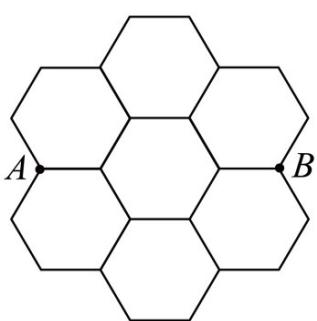
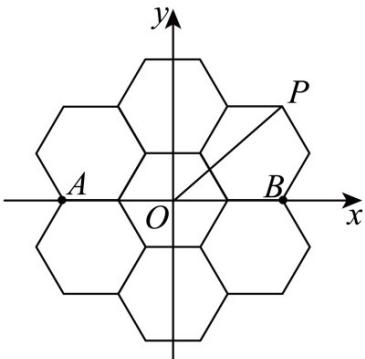

> [!faq]- 《专题2.3 直线的交点坐标与距离公式（高效培优讲义）》官方解析
>
> > [!success]- **【答案】** C
>
> > [!note]- **【分析】**
> > 应用点到直线距离计算判定两条直线位置关系即可·
>
> > [!note]- **【解析】**
> > 直线 $l:ax+by+c=0,\quad A(x_{1},y_{1}),B(x_{2},y_{2})$ （其中 $x_{1}\neq x_{2}$ ），
> >
> > 当 $\frac{ax_1 + by_1 + c}{ax_2 + by_2 + c} > 1$ 时， $A(x_1, y_1), B(x_2, y_2)$ 在直线 $l$ 的同侧，
> >
> > 所以 $\frac{\frac{|ax_1 + by_1 + c|}{\sqrt{a^2 + b^2}}}{\frac{|ax_2 + by_2 + c|}{\sqrt{a^2 + b^2}}} > 1$ ，所以 $\frac{|ax_1 + by_1 + c|}{\sqrt{a^2 + b^2}} > \frac{|ax_2 + by_2 + c|}{\sqrt{a^2 + b^2}}$ ，所以 到直线 的距离大于 到直线 的距离，A l B l
> >
> > 所以直线 l 与直线 AB 不平行，
> >
> > 所以直线 l 与直线 AB 相交，
> >
> > 故选：C.
> >
> > 4. 实数 $a, b$ 满足 $a + b + 1 = 0$ ，则 $a^2 - 2a + b^2$ 的最小值为（）A.2 B.1 C.0 D.-1
> >
> > 【答案】B
> >
> > 【分析】由点到线的距离公式求解最小值，即可求解·
> >
> > 【详解】 $a^2 - 2a + b^2 = (a - 1)^2 + b^2 - 1$
> >
> > 其中 $(a-1)^{2}+b^{2}$ 为两点 $(1,0)$ 与 $(a,b)$ 距离的平方，
> >
> > 所以其最小值即为 $(1,0)$ 到直线 $a + b + 1 = 0$ 距离的平方，即 $\left(\frac{2}{\sqrt{2}}\right)^2 = 2$
> >
> > 所以 $\left(a-1\right)^{2}+b^{2}-1$ 的最小值为 1，
> >
> > 故选：B
> >
> > 5. 蜂巢的精密结构是通过优胜劣汰的进化自然形成的．若不计蜂巢壁的厚度，蜂巢的横截面可以看成正六边形网格图，如图所示．设 $P$ 为图中7个正六边形（边长为4）的某一个顶点， $A,B$ 为两个固定顶点，则 $\overline{PA} \cdot \overline{PB}$ 的最大值为（）
> >
> > 【答案】
> >
> > 
> >
> > C 72 D 76
> >
> > 【答案】B
> >
> > 【分析】利用坐标法可得 $PA \cdot PB = x^{2} + y^{2} - 64$ ，设点 $P(x, y)$ 到原点的距离为 $d$ ，则 $PA \cdot PB$ 的最大值为 $d_{\max}^{2} - 64$ ，利用数形结合法可知，离原点距离最远的正六边形顶点为最外围的顶点，利用两点间的距离公式
> >
> > 即可求解·
> >
> > 【详解】设点 $P(x,y)$ ，正六边形的边长为 $^{4}$ ，
> >
> > 所以 $A(-8,0)$ , $B(8,0)$
> >
> > 所以 $\stackrel{\square\square}{PA} = (-8 - x, -y), \stackrel{\square\square\square}{PB} = (8 - x, -y)$
> >
> > 所以 $\overline{PA} \cdot \overline{PB} = -(8 + x)(8 - x) + y^{2} = x^{2} + y^{2} - 64$
> >
> > 设点 $P(x,y)$ 到原点的距离为 d，则 $PA \cdot PB$ 的最大值为 $d_{\max}^{2} - 64$ ，
> >
> > 由图可知，离原点距离最远的正六边形顶点为最外围的顶点，
> >
> > 如图，可取 $P(8,4\sqrt{3})$
> >
> > 所以 $d_{\mathrm{max}}^2 - 64 = |OP|^2 - 64 = 64 + 48 - 64 = 48$
> >
> > 即 $PA \cdot PB$ 的最大值为 48.
> >
> > 
> >
> > 故选 **B**·
