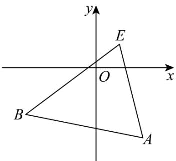

> [!faq]- 《专题2.3 直线的交点坐标与距离公式（高效培优讲义）》官方解析
>
> > [!success]- **【答案】** A．直线 $y = ax - 2a + 3(a \in \mathbf{R})$ 过定点(2,3) B．若两直线 $ax + 2y = 0$ 与 $x + (a + 1)y + 4 = 0$ 平行，则实数 $a$ 的值为1 C．过点 $M(-3,2)$ ，且在两坐标轴上的截距相等的直线的方程为 $x + y + 1 = 0$ D．点 $A(2,-3), B(-3,-2)$ ，直线 $l: mx + y - m - 1 = 0$ 与线段AB相交，则实数 $m$ 的取值范围是 $-4 \leq m \leq \frac{3}{4}$
>
> > [!note]- **【分析】**
> > A 选项，将直线变形为点斜式，求出所过定点；B 选项，根据两直线平行，得到方程，求出实数 a 的
> >
> > 值，检验后得到答案； $^{C}$ 选项，分两种情况（ $^{1}$ ）直线过原点；（ $^{2}$ ）直线不过原点讨论求解，即可判断 $^{C}$ ； $^{D}$
> >
> > 选项，求出 $l: mx + y - m - 1 = 0$ 过定点 $E(1,1)$ ，画出图象，数形结合得到实数 $m$ 的取值范围·
>
> > [!note]- **【解析】**
> > A选项， $y = ax - 2a + 3(a \in \mathbf{R}) \Rightarrow y - 3 = a(x - 2)(a \in \mathbf{R})$
> >
> > 故直线恒过定点 $(2,3)$ ，故 $^{A}$ 正确；
> >
> > B 选项，两直线 $ax + 2y = 0$ 与 $x + (a + 1)y + 4 = 0$ 平行，
> >
> > 则 $a(a + 1) - 2 = 0$ ，解得 $a = 1$ 或-2
> >
> > 当 $a = 1$ 时，两直线 $x + 2y = 0$ 与 $x + 2y + 4 = 0$ 满足要求，
> >
> > 当 $a = -2$ 时，两直线 $-2x + 2y = 0$ 与 $x - y + 4 = 0$ 满足要求，
> >
> > 综上， $a = 1$ 或-2，故B错误；
> >
> > C 选项，当直线过原点且经过点 $M(-3,2)$ 时，可得直线方程为 $y = -\frac{2}{3} x$
> >
> > 当直线不过原点时，设直线为 $\frac{x}{m} +\frac{y}{m} = 1$ ，将点 $M(-3,2)$ 代入解得 $m = -1$
> >
> > 所以直线方程为 $x + y + 1 = 0$ ，故C错误；
> >
> > D 选项，直线 $l: mx + y - m - 1 = 0 \Rightarrow y - 1 = -m(x - 1)$ ，直线经过定点 $E(1,1)$
> >
> > 画出坐标系，如下：
> >
> > 
> >
> > 其中 $k_{AE}=\frac{-3-1}{2-1}=-4, k_{BE}=\frac{-2-1}{-3-1}=\frac{3}{4}$
> >
> > 则要想直线与线段 $AB$ 相交，则直线斜率 $-m \leq -4$ 或 $-m = \frac{3}{4}$ ，
> >
> > 解得 m 4 或 $m \leq -\frac{3}{4}$ ，故 D 错误
> >
> > 故选 **BCD**
