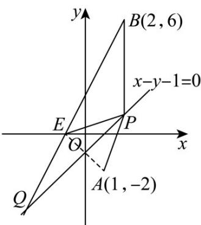

> [!faq]- 《专题2.3 直线的交点坐标与距离公式（高效培优讲义）》官方解析
>
> > [!success]- **【答案】** $-3\sqrt{5}$
>
> > [!note]- **【解析】**
> > 如图，设关于直线的对称点为，则 $\left\{ \begin{array}{l} \frac{m + 1}{2} - \frac{n - 2}{2} - 1 = 0 \\ \frac{n + 2}{m - 1} \times 1 = -1 \end{array} \right.$
> >
> > 解得 $\left\{\begin{aligned}m&=-1\\ n&=0\end{aligned}\right.$ ，则 $E(-1,0)$ ，
> >
> > 于是 $|PA|-|PB|=|PE|-|PB|$
> >
> > 结合图形知，当 $B, E, P$ 三点共线时，此时 $|PE| - |PB|$ 取得最小值 $-|BE| = -3\sqrt{5}$
> >
> > 即 $|PA| - |PB|$ 取得最小值为 $-3\sqrt{5}$
> >
> > 
> >
> > 故答案为： $-3\sqrt{5}$
> >
> > ## 方法技巧
> >
> > ## (1) 点关于点对称
> >
> > 点关于点对称的本质是中点坐标公式：设点 $P(x_{1},y_{1})$ 关于点 $Q(x_0,y_0)$ 的对称点为 $P^{\prime}(x_{2},y_{2})$ ，则根据中点
> >
> > 坐标公式，有 $\left\{ \begin{array}{ll}x_0 = \frac{x_1 + x_2}{2}\\ y_0 = \frac{y_1 + y_2}{2} \end{array} \right.$ 可得对称点的坐标为 $P^{\prime}(x_{2},y_{2})(2x_{0} - x_{1},2y_{0} - y_{1})$
> >
> > ## (2) 点关于直线对称
> >
> > 点 $P(x_{1},y_{1})$ 关于直线 $l:Ax + By + C = 0$ 对称的点为 $P^{\prime}(x_2,y_2)$ ，连接 $PP^{\prime}$ ，交 $l$ 于 $M$ 点，则 $l$ 垂直平分 $PP^{\prime}$
> >
> > 所以 $PP' \perp l$ ，且 $M$ 为 $PP'$ 中点，又因为 $M$ 在直线 $l$ 上，故可得 $\left\{\begin{aligned}k_{l} & \cdot k_{PP'} = -1 \\ A & \frac{x_{1} + x_{2}}{2} + B\frac{y_{1} + y_{2}}{2} + C = 0\end{aligned}\right.$ ，解出 $(x_{2}, y_{2})$
> >
> > 即可.
> >
> > ## (3) 直线关于点对称
> >
> > 法一：在已知直线上取两点，利用中点坐标公式求出它们关于已知点对称的两点坐标，再由两点式求出直线
> >
> > 方程；
> >
> > 法二：求出一个对称点，再利用两对称直线平行，由点斜式得到所求直线方程.
> >
> > ## (4) 直线关于直线对称
> >
> > 求直线 $l_{1}:ax + by + c = 0$ ，关于直线 $l_{2}:dx + ey + f = 0$ （两直线不平行）的对称直线 $l_{3}$
> >
> > 第一步：联立 $l_{1}$ ， $l_{2}$ 算出交点 $P(x_{0},y_{0})$
> >
> > 第二步：在 $l_{1}$ 上任找一点（非交点） $Q(x_{1},y_{1})$ ，利用点关于直线对称的秒杀公式算出对称点 $Q^{\prime}(x_2,y_2)$
> >
> > 第三步：利用两点式写出 $l_{3}$ 方程
