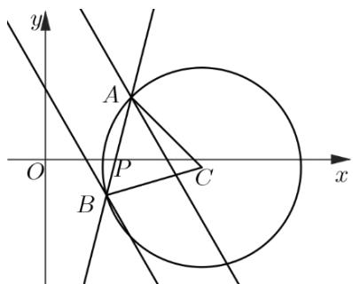

> [!faq]- 《专题2.3 直线的交点坐标与距离公式（高效培优讲义）》官方解析
>
> > [!success]- **【答案】** $x = 1$ 或 $x + \sqrt{3} y - 1 = 0$
>
> > [!note]- **【分析】**
> > 由题意作图，根据三角形的面积计算，结合正弦函数的性质，可得面积最值，根据等腰直角三角形
> >
> > 的性质，可得 $AB$ 的值，分直线 $l$ 的斜率存在与不存在两种情况，联立方程求交点，由两点距离公式，建立方
> >
> > 程，可得答案·
>
> > [!note]- **【解析】**
> > 
> >
> > 由 $C:(x - a)^2 +(y - b)^2 = 2$ ，则其圆心 $C(a,b)$ ，半径 $r = \sqrt{2}$ ，设 $\angle ACB = \theta$
> >
> > 易知 $S_{\triangle ABC} = \frac{1}{2} r^2 \sin \theta = \sin \theta$ ，则当 $\theta = 90^\circ$ 时， $S_{\triangle ABC}$ 取得最大值为 1，
> >
> > 在等腰 $\mathrm{Rt}^{\triangle}$ ABC中 $AB = \sqrt{r^2 + r^2} = 2$
> >
> > 当直线 $l$ 的斜率不存在时，直线 $l: x = 1$
> >
> > 代入直线 $l_{1}:\sqrt{3}x+y-1=0$ ，解得 $y=1-\sqrt{3}$ ，则 $A(1,1-\sqrt{3})$ ；
> >
> > 代入直线 $l_{2}:\sqrt{3}x+y-3=0$ ，解得 $y=3-\sqrt{3}$ ，则 $B(1,3-\sqrt{3})$ ；
> >
> > 所以 $AB = 3 - \sqrt{3} - 1 + \sqrt{3} = 2$ ，显然此时 $S_{\triangle ABC}$ 取得最大值为1.
> >
> > 当直线 l 的斜率存在时，可设直线 $l: y = k(x - 1)$
> >
> > 联立可得 $\left\{\begin{aligned}y&=k(x-1)\\\sqrt{3}x+y&=1=0\end{aligned}\right.$ ，解得 $x=\frac{k+1}{k+\sqrt{3}}$ ， $y=\frac{(1-\sqrt{3})k}{k+\sqrt{3}}$ ，则 $A\left(\frac{k+1}{k+\pi},\frac{(1-\sqrt{3})k}{k+\sqrt{3}}\right)$ ；
> >
> > 联立可得 $\left\{\begin{aligned}y&=k(x-1)\\\sqrt{3}x+y-3&=0\end{aligned}\right.$ ，解得 $x=\frac{k+3}{k+\sqrt{3}}$ ， $y=\frac{(3-\sqrt{3})k}{k+\sqrt{3}}$ ，则 $B\left(\frac{k+3}{k+\pi},\frac{(3-\sqrt{3})k}{k+\sqrt{3}}\right)$ ；
> >
> > $$
> > A B = \sqrt {\left(\frac {k + 1}{k + \sqrt {3}} - \frac {k + 3}{k + \sqrt {3}}\right) ^ {2} + \left(\frac {(1 - \sqrt {3}) k}{k + \sqrt {3}} - \frac {(3 - \sqrt {3}) k}{k + \sqrt {3}}\right) ^ {2}} = \frac {2 \sqrt {1 + k ^ {2}}}{k + \sqrt {3}},
> > $$
> >
> > 由 $AB = 2$ ，则 $1 + k^2 = k^2 + 2\sqrt{3}k + 3$ ，解得 $k = -\frac{\sqrt{3}}{3}$ ，即直线 $l: x + \sqrt{3}y - 1 = 0$
> >
> > 所以 $S_{\triangle ABC}$ 取得最大值为 1，则直线 l: x = 1 或 $x + \sqrt{3}y - 1 = 0$ .
> >
> > 故答案为：1； $x=1$ 或 $x+\sqrt{3}y-1=0$ .
