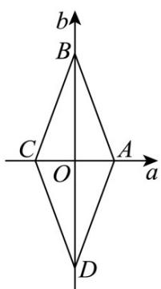

> [!faq]- 《专题2.3 直线的交点坐标与距离公式（高效培优讲义）》官方解析
>
> > [!success]- **【答案】** BD
>
> > [!note]- **【分析】**
> > 由题意得，结合可知，画出图形可知 $P$ 点轨迹是一个菱形，故 $\mathsf{A}$ 、 $\mathsf{C}$ 错误；由点到直线的距离即可验
> >
> > 证 D；B 转换成面积的两倍来求即可·
>
> > [!note]- **【解析】**
> > 设 P 点坐标为 $(a,b)$ ，则由已知条件 $OP = xOA + yOB$ 可得 $\left\{\begin{aligned} a &= x \\ b &= 3y \end{aligned}\right.$ ，整理得 $\left\{\begin{aligned} x &= a \\ y &= \frac{b}{3} \end{aligned}\right.$
> >
> > 又因为 $|x| + |y| = 1$ ，所以 $P$ 点坐标对应轨迹方程为 $|3a| + |b| = 3$
> >
> > a 0 b 0 3a + b = 3 a 0 b < 0 b = 3a - 3 ; 且 时，方程为
> >
> > $a < 0$ ，且 $b = 3a + 3$ 时，方程为 $b = 3a + 3$ ； $a < 0$ ，且 $b < 0$ 时，方程为 $3a + b = -3$
> >
> > P 点对应的轨迹如图所示：
> >
> > $k_{AB}=k_{CD}=-3$ ，且 $\left|AB\right|=\left|BC\right|=\left|CD\right|=\left|DA\right|=\sqrt{10}$ ，所以P点的轨迹为菱形，故A、C错误；
> >
> > 原点到 AB : $3a + b - 3 = 0$ 的距离为 $\frac{3\sqrt{10}}{10}$ ，D 正确；
> >
> > 轨迹图形是菱形，面积为 $2 \times \frac{1}{2} \times 2 \times 3 = 6$ ，B正确.
> >
> > 故选：BD.
> >
> > 
