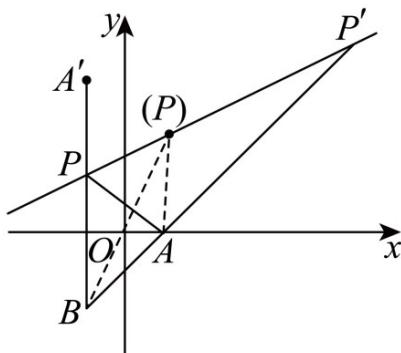

> [!faq]- 《专题2.3 直线的交点坐标与距离公式（高效培优讲义）》官方解析
>
> > [!success]- **【答案】** AC
>
> > [!note]- **【分析】**
> > 应用点关于直线对称，结合饮马模型求 $\left|PA\right|+\left|PB\right|$ 的最小值，利用三角形的三边关系及点线位置关系求 $\left|PA\right|-\left|PB\right|$ 的最值，即可得答案·
>
> > [!note]- **【解析】**
> > 令 是 关于 的对称点，则 $\left\{\begin{aligned}\frac{b}{a-2}&=-2\\ \frac{a+2}{2}&-2\times\frac{b}{2}+8=0\end{aligned}\right.$
> >
> > 所以 $a = -2, b = 8$ ，即 $A'(-2, 8)$ ， $P$ 为 $A'B$ 与 $l$ 的交点，如下图 $|PA'| = |PA|$ ，则 $\left|PA\right| + \left|PB\right| = \left|PA'\right| + \left|PB\right| \left|A'B\right| = 12$
> >
> > 当且仅当 $B, P, A'$ 共线且 $P$ 在线段 $A'B$ 上时取等号，即 $\left|PA\right| + \left|PB\right|$ 的最小值为 12；由图知 $-\left|AB\right| \leq \left|PA\right| - \left|PB\right| < \left|AB\right|$ （直线 $AB$ 与直线 $l$ 的交点离 A 点更近），即 $-4\sqrt{2} \leq \left|PA\right| - \left|PB\right| < 4\sqrt{2}$ ，当且仅当 $B, P', A$ 共线且 $P'$ 在射线 $BA$ 上时取最小值，但无最大值，即最小值是 $\left|P'A\right| - \left|P'B\right|$ ，为 $-4\sqrt{2}$ 故选：AC
> >
> > 
> >
> > ## 方法技巧
> >
> > 利用距离的几何意义进行等价转换.
