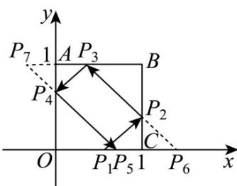

> [!faq]- 《专题2.3 直线的交点坐标与距离公式（高效培优讲义）》官方解析
>
> > [!success]- **【答案】** C
>
> > [!note]- **【分析】**
> > 设初始入射点设 $P_{1}(n,0)$ ，确定入射点和反射点的坐标从而利用直线的点斜式方程得入射与反射直线利用点在线段 $BC$ ， $AB$ ， $OA$ ， $OC$ 上从而可得对应坐标范围，建立 $m,n$ 的不等关系，根据 $n$ 的范围得 $m$ 的取值范围即可·
>
> > [!note]- **【解析】**
> > 设线段 OC 上的入射点为 $P_{1}$ ，依次在 BC，AB，OA 上的反射点为 $P_{2}, P_{3}, P_{4}$ ，最后射出的点为 $P_{5}$
> >
> > 
> >
> > 设 $P_{1}$ 关于 $BC$ 对称的点为 $P_{6}$ ， $P_{3}$ 关于 $OA$ 对称的点为 $P_{7}$ ，设 $P_{1}(n,0)$ ，且 $n \in (0,1)$ ，则 $P_{6}(2-n,0)$ ，由 $\overline{P_{1}P_{2}} //s$ 可得 $k_{P_{1}P_{2}} = \frac{m}{1} = m$ ，所以直线 $P_{1}P_{2}: y = m(x - n)$ ，由对称性可得 $k_{P_{2}P_{3}} = -m$ ，所以直线 $P_{2}P_{3}: y = -m(x - 2 + n)$ ，则 $P_{3}\left(2 - n - \frac{1}{m}, 1\right)$ ，所以直线 $P_{3}P_{4}: y = m\left(x - 2 + n + \frac{1}{m}\right) + 1$ 。故 $P_{4}(0,2 - 2m + mn)$ ，所以 $P_{4}P_{5}: y = -mx + 2 - 2m + mn$ ，故 $P_{5}\left(\frac{2}{m} - 2 + n, 0\right)$ ，
> >
> > 则由题可得 $\left\{ \begin{array}{l}0 <   2 - n - \frac{1}{m} <  1\\ 0 <   2 - 2m + mn <   1\Rightarrow \left\{ \begin{array}{l} \frac{1}{2 - n} <  m <   \frac{1}{1 - n}\\  \frac{1}{2 - n} <  m <   \frac{2}{2 - n}\\  \frac{2}{3 - n} <  m <   \frac{2}{2 - n} \end{array} \right. (\text{）}, \end{array} \right.$
> >
> > 又 $\frac{1}{1 - n} -\frac{2}{2 - n} = \frac{2 - n - 2(1 - n)}{(1 - n)(2 - n)} = \frac{n}{(1 - n)(2 - n)} >0$ ，所以 $\frac{1}{1 - n} >\frac{2}{2 - n}$
> >
> > $\frac{1}{2 - n} - \frac{2}{3 - n} = \frac{3 - n - 2(2 - n)}{(2 - n)(3 - n)} = \frac{n - 1}{(1 - n)(2 - n)} < 0$ ，所以 $\frac{1}{2 - n} < \frac{2}{3 - n}$
> >
> > 所以不等式组（ $^{*}$ ）解得 $\frac{2}{3-n}<m<\frac{2}{2-n}$ ，因为 $n\in(0,1)$ ，
> >
> > 函数 $y = \frac{2}{3 - n}, y = \frac{2}{2 - n}$ 在 $n \in (0,1)$ 上均为增函数，所以 $\frac{2}{3} < m < 2$ ，
> >
> > 故 $m$ 的取值范围是 $\left(\frac{2}{3}, 2\right)$ .
> >
> > 故选 **C**.
