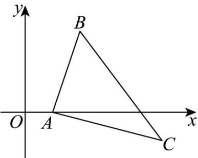

> [!faq]- 《专题2.3 直线的交点坐标与距离公式（高效培优讲义）》官方解析
>
> > [!success]- **【答案】** 5
>
> > [!note]- **【分析】**
> > 整理函数解析式，可转化为到点的距离之和，结合图象，可得答案·
>
> > [!note]- **【解析】**
> > $f(x)=\sqrt{(x-2)^{2}+(0-3)^{2}}+\sqrt{(x-5)^{2}+[0-(-1)]^{2}}$
> >
> > 转化为 x 轴上的动点 A 到两定点 $B(2,3)$ ， $C(5,-1)$ 的距离之和最小，
> >
> > 
> >
> > 由图可知 $AB + AC \leq BC$ ，距离之和的最小值为 5。
> >
> > 故答案为：5·
> >
> > ## 方法技巧
> >
> > 利用三角形的性质进行判断.
