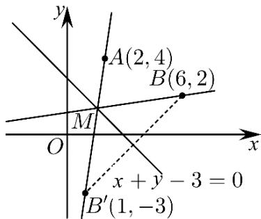

> [!faq]- 《专题2.3 直线的交点坐标与距离公式（高效培优讲义）》官方解析
>
> > [!success]- **【答案】** A. 将军从出发点到河边的路线所在直线的方程是 $6x - y - 8 = 0$ B. 将军在河边饮马的地点的坐标为 $\left(\frac{13}{8}, \frac{11}{8}\right)$ C. 将军从河边回军营的路线所在直线的方程是 $x - 6y + 6 = 0$ D. “将军饮马”走过的总路程为 $5\sqrt{2}$
>
> > [!note]- **【分析】**
> > 求出点 B 关于直线 $x + y - 3 = 0$ 的对称点为 $B'(1, -3)$ ，直线 $AB'$ 的方程为 7x - y - 10 = 0 即为从出发点
> >
> > 到河边的路线所在直线方程，可得 $^{A}$ 错误；联立直线方程可解得交点坐标即为饮马地点的坐标为 $\left(\frac{13}{8},\frac{11}{8}\right)$
> >
> > $$
> > x - 7 y + 8 = 0
> > $$
> >
> > $$
> > \mathrm{C}
> > $$
> >
> > 长度总和即可求出“将军饮马”走过的总路程为 $5\sqrt{2}$ ，可知D正确·
>
> > [!note]- **【解析】**
> > 由题可知 A, B 在 $x + y - 3 = 0$ 的同侧，
> >
> > 设点 $B$ 关于直线 $x + y - 3 = 0$ 的对称点为 $B^{\prime}(a,b)$ ，如下图所示：
> >
> > 
> >
> > 则 $\left\{\begin{aligned}\frac{a+6}{2}+\frac{b+2}{2}-3=0\\\frac{b-2}{a-6}\times(-1)=-1\end{aligned}\right.$ ，解得 $\left\{\begin{aligned}a=1,\\ b=-3\end{aligned}\right.$ ，即 $B'(1,-3)$ .
> >
> > 对于 $^{A}$ ，将军从出发点到河边的路线所在直线即为 $AB'$ ，
> >
> > 又 $A(2,4)$ ，所以直线 $AB'$ 的方程为 $y - 4 = \frac{-3 - 4}{1 - 2} (x - 2)$ ，即 $7x - y - 10 = 0$ ，故 $\mathsf{A}$ 错误；
> >
> > 对于 $^{B}$ ，设将军在河边饮马的地点为 M，则 M 即为 7x - y - 10 = 0 与 $x + y - 3 = 0$ 的交点，
> >
> > 联立两直线方程解得 $M\left(\frac{13}{8},\frac{11}{8}\right)$ ，故 B 正确；
> >
> > 对于 $C$ ，将军从河边回军营的路线所在直线为 $BM$ ，又 $B(6,2)$
> >
> > 所以直线 $\underset{BM}{\text{的方程为}} y - 2 = \frac{\frac{11}{8} - 2}{\frac{13}{8} - 6}(x - 6)$ ，即 $x - 7y + 8 = 0$ ，故 $C$ 错误；
> >
> > 对于 D，总路程 $\left|MA\right| + \left|MB\right| = \left|MA\right| + \left|MB'\right| = \left|AB'\right| = \sqrt{(2-1)^{2} + (4+3)^{2}} = 5\sqrt{2}$
> >
> > 所以“将军饮马”的总路程为 $5\sqrt{2}$ ，故 D 正确.
> >
> > 故选 **BD**.
