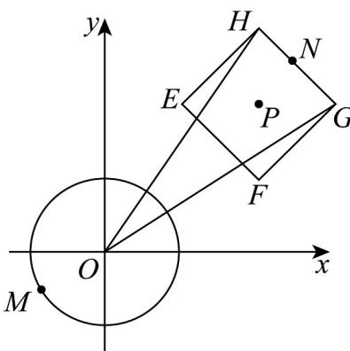

> [!faq]- 《专题2.4 圆的方程（高效培优讲义）》官方解析
>
> > [!success]- **【答案】** D
>
> > [!note]- **【分析】**
> > 利用给定的定义求出点 $M, N$ 的轨迹并画出图形，结合圆的性质求出最大值
>
> > [!note]- **【解析】**
> > 设 $M(x,y)$ ，由 $d(M,O) \leq 1$ ，得 $x^{2} + y^{2} \leq 1$ ，因此点 $M$ 在以原点为圆心， $^{1}$ 为半径的圆及内部，设 $N(x,y)$ ，由 $D(N,P) \leq 1$ ，得 $|x - 2| + |y - 2| \leq 1$ ，点 $N$ 在以 $E(1,2), F(2,1), G(3,2), H(2,3)$ 为顶点的正方形 $EFGH$ 及内部，当且仅当点 $N$ 与 $G,H$ 之一重合时， $|ON|_{\max} = \sqrt{13}$ ，所以 $\left|MN\right|_{\max} = 1 + \left|ON\right|_{\max} = \sqrt{13} + 1$ 。
> >
> > 
> >
> > 故选 **D**
