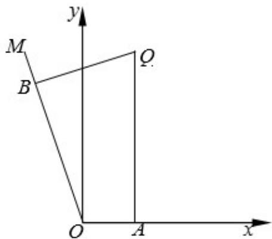

<!-- question-source:start -->
【变式1】如图，在平面直角坐标系 $xOy$ 中， $Q$ 为第一象限内一点， $QA$ 垂直于 $x$ 轴， $QB$ 垂直于射线 $OM$ ，垂

足分别为 A, B，且 $QA = 10$ ， $QB = 4\sqrt{5}$ ， $\tan\angle AOB = -2$ 。

(1)求 $OQ$ 的值；

(2)已知圆 $C$ 通过 $O, A, Q, B$ 四点，

①圆 C 的方程；

②设 $P$ 是圆 $C$ 上的任意一点，在 $x$ 轴及射线 $OM$ 上是否分别存在定点 $E, F$ ，使 $\frac{PE}{PF}$ 为定值？若存在，指出定

点的位置；若不存在，请说明理由。
<!-- question-source:end -->

![[高中/课堂同步/题库/人教A版高中数学同步讲义(2026)/03_选择性必修第一册/第二章 直线和圆的方程/专题2.4 圆的方程（高效培优讲义）/题型03_点与圆的位置关系/questions/answers/Q00080658A1.md]]
