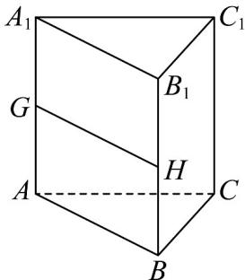
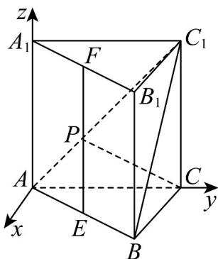
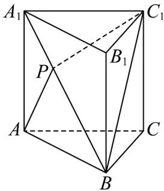
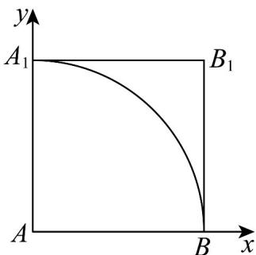

> [!faq]- 《专题2.4 圆的方程（高效培优讲义）》官方解析
>
> > [!success]- **【答案】** A. 当 $\mu=\frac{1}{2}$ 时，三棱锥 $P-ABC_{1}$ 的体积为定值 B. 当 $\lambda=\frac{1}{2}$ 时，有且仅有一个点 P，使得 $CP \perp$ 平面 $ABC_{1}$ C. 当 $\lambda + \mu = 1$ 时， $|AP| + |PC_{1}|$ 的最小值为 $\frac{\sqrt{2}}{2} + 1$ D. 当 $\lambda^{2} + \mu^{2} = 1$ 时， $|PB_{1}|$ 的最小值为 $\sqrt{2} - 1$
>
> > [!note]- **【分析】**
> > 先判断 $P \in GH$ ，然后利用线面平行的判定定理得 $GH // 平面 ABC_{1}$ ，结合三棱锥的题意即可判断
> >
> > A，建立空间直角坐标系，设 $P\left(\frac{\sqrt{3}}{4}, \frac{1}{4}, z\right)$ ，利用 $AC_{1} \perp CP$ 及空间向量垂直的坐标运算求解判断 B，先判断 $P \in BA_{1}$ ，把平面 $A_{1}BC_{1}$ 绕 $BA_{1}$ 旋转到与平面 $ABA_{1}$ 共面，当 A，P， $C_{1}$ 三点共线时 $|AP| + |PC_{1}|$ 有最小值，先利用余弦定理及两角和的余弦公式求出 $\cos \angle ABC_{1}$ ，利用余弦定理求解判断 C，先判断 P 在含边界的矩形 $ABB_{1}A$ 区域内，然后建立平面直角坐标系，从而得 P 的轨迹是以 A 为圆心， $^{1}$ 为半径的 $\frac{1}{4}$ 圆弧，利用点圆的位置关系求解最值即可判断 D.
>
> > [!note]- **【解析】**
> > 对于A.设G，H为 $AA_{1}$ ， $BB_{1}$ 的中点， $\mu=\frac{1}{2}$ ，∴ $P\in GH$
> >
> > 
> >
> > $\therefore GH \parallel AB, AB \subset \text{平面} ABC_{1}, GH \notin \text{平面} ABC_{1}, \therefore GH // \text{平面} ABC_{1}$
> >
> > ∴三棱锥 $P - ABC_{1}$ 的体积为定值，∴A 正确；
> >
> > 对于 B. 过 A 在平面 ABC 内作 $AS \perp AC$ ，以 A 为原点，
> >
> > 以 AS 、 AC 、 $AA_{1}$ 为 x 轴、 y 轴、 z 轴建立空间直角坐标系，如图·
> >
> > 
> >
> > 设 $E$ ， $F$ 为 $AB$ ， $A_{1}B_{1}$ 的中点， $\because \lambda = \frac{1}{2}$ ， $\therefore P\in EF$
> >
> > $\therefore B\left(\frac{\sqrt{3}}{2},\frac{1}{2},0\right)$ ， $C(0,1,0)$ ，设 $P\left(\frac{\sqrt{3}}{4},\frac{1}{4},z\right)$
> >
> > $\therefore AC_{1} = (0,1,1)$ $\vec{CP} = \left(\frac{\sqrt{3}}{4}, -\frac{3}{4}, z\right)$
> >
> > ∵ $CP \perp$ 平面 $ABC_{1}$ ， $AC_{1} \subset$ 平面 $ABC_{1}$ ，∴ $AC_{1} \perp CP$ ，∴ $\overrightarrow{CP} \cdot \overrightarrow{AC_{1}} = \left( \frac{\sqrt{3}}{4}, -\frac{3}{4}, z \right) (0, 1, 1) = -\frac{3}{4} + z = 0$ ，解得 $z = \frac{3}{4}$
> >
> > ∴仅有一个点 $P\left(\frac{\sqrt{3}}{4},\frac{1}{4},\frac{3}{4}\right)$ ，使得 $CP \perp$ 平面 $ABC_{1}$ ，∴ $^{B}$ 正确
> >
> > 对于 C.∵ $\lambda + \mu = 1$ ，∴ $P \in BA_{1}$
> >
> > 把平面 $A_{1}BC_{1}$ 绕 $BA_{1}$ 旋转到与平面 $ABA_{1}$ 共面，
> >
> > 
> >
> > 当 ， ， 三点共线时 有最小值，
> > ∴ A P C₁ |AP| + |PC₁|
> >
> > $\cos \angle A_{1}BC_{1} = \frac{BA_{1}^{2} + BC_{1}^{2} - C_{1}A_{1}^{2}}{4BA_{1}\times BC_{1}} = \frac{3}{4}$
> >
> > $$
> > \therefore \angle A _ {1} B C _ {1} \in \left(0 ^ {\circ}, 1 8 0 ^ {\circ}\right), \quad \sin \angle A _ {1} B C _ {1} = \frac {\sqrt {7}}{4}
> > $$
> >
> > $$
> > \cos \angle A B C _ {1} = \cos (4 5 ^ {\circ} + \angle A _ {1} B C _ {1}) = \cos 4 5 ^ {\circ} \cos \angle A _ {1} B C _ {1} - \sin 4 5 ^ {\circ} \sin \angle A _ {1} B C _ {1}
> > $$
> >
> > $$
> > = \frac {\sqrt {2}}{2} \left(\frac {3}{4} - \frac {\sqrt {7}}{4}\right) = \frac {\sqrt {2} (3 - \sqrt {7})}{8}
> > $$
> >
> > $$
> > \therefore A C _ {1} ^ {2} = A B ^ {2} + C _ {1} B ^ {2} - 2 A B \times C _ {1} B \cos \angle A B C _ {1} = 1 + 2 - 2 \times \sqrt {2} \times \frac {\sqrt {2} (3 - \sqrt {7})}{8} = \frac {3 + \sqrt {7}}{2},
> > $$
> >
> > $\therefore AC_{1}=\frac{\sqrt{6+2\sqrt{7}}}{2},\therefore\left|AP\right|+\left|PC_{1}\right|$ 的最小值为 $\frac{\sqrt{6+2\sqrt{7}}}{2},\therefore^{C}$ 不正确；
> >
> > 对于 D. 点 P 满足 $\overline{AP} = \lambda \overline{AB} + \mu \overline{AA}_{1}$ ，其中 $\lambda \in [0,1]$ ， $\mu \in [0,1]$ ，
> >
> > ∴ P 在含边界的矩形 $ABB_{1}A_{1}$ 区域内，
> >
> > 以 A 为原点，以 AB ， $AA_{1}$ 为 x 轴、y 轴建立平面直角坐标系，
> >
> > 
> >
> > 设 $P(x,y)$ ， $\stackrel{\square\sqcup\sqcup}{AP} = (x,y) = \lambda AB + \mu AA_{1} = \lambda (1,0) + \mu (0,1) = (\lambda ,\mu)$ ， $\therefore x = \lambda$ ， $y = \mu$
> >
> > $\because \lambda^2 + \mu^2 = 1 \therefore x^2 + y^2 = 1$ ， $\therefore P$ 的轨迹是以 A 为圆心， $1$ 为半径的 $\frac{1}{4}$ 圆弧，
> >
> > ∴当A，P， $B_{1}$ 三点共线时， $\left|PB_{1}\right|$ 最小，∴ $\left|PB_{1}\right|$ 的最小值为 $\sqrt{2}-1$ ，∴D正确·
> >
> > 故选 **ABD**
