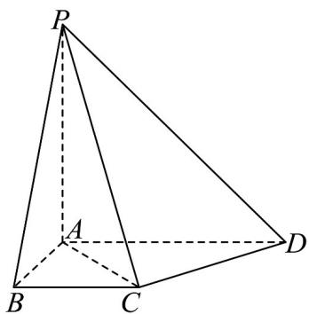

<!-- question-source:start -->
【变式2】如图，四棱锥 $P - ABCD$ 中， $PA \perp$ 平面 $ABCD$ ， $AB \perp AD$ ， $AD // BC$ ， $AD = 2AB = 2BC = 2$ .

(1)证明：平面 $PAC \perp$ 平面PCD；

(2)若 PA = 2 ，动点 M 在 $\triangle PAD$ 内（含边界）且 $MB^{2} + MD^{2} = 5$ .

(i) 求线段 $CM$ 的轨迹形成的面积；

(ii) 设直线 CM 与平面 PBD 所成角为 $\theta$ ，求 $\sin\theta$ 的取值范围.
<!-- question-source:end -->

![[高中/课堂同步/题库/人教A版高中数学同步讲义(2026)/03_选择性必修第一册/第二章 直线和圆的方程/专题2.4 圆的方程（高效培优讲义）/题型06_轨迹问题/questions/answers/Q00080670A1.md]]
