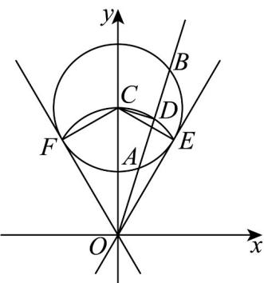

> [!faq]- 《专题2.4 圆的方程（高效培优讲义）》官方解析
>
> > [!success]- **【答案】** $AB$ 的中点，则点 $D$ 的轨迹长度为（） A. $\frac{8\pi}{3}$ B. $2\pi$ C. $\frac{4\pi}{3}$ D. $\frac{2\pi}{3}$
>
> > [!note]- **【分析】**
> > 根据 $D$ 点的性质，求出轨迹方程，确定轨迹是一个新的圆，找到轨迹对应的圆心角度数，即可求出
> >
> > 轨迹长度·
>
> > [!note]- **【解析】**
> > 
> >
> > 由题意知 $x^{2} + y^{2} - 8y + 12 = 0$ ，变形得 $x^{2} + (y - 4)^{2} = 4$ ，可知圆 $C$ 是以 $(0,4)$ 为圆心，以 $^2$ 为半径的圆，画出示
> >
> > 意图，根据垂径定理可知， $\angle CDO = \frac{\pi}{2}$ ，则点 $D$ 的轨迹是以 $(0,2)$ 为圆心，以 $^2$ 为半径的圆的一部分。
> >
> > 如图，过原点 $O$ 作圆 $C$ 的切线 $OE, OF$ 切点分别为 $E, F$ ，连接 $CE, CF$ .
> >
> > 易知 $CE = CF = 2, OC = 4$ ，则 $\sin \angle COE = \frac{CE}{CO} = \frac{1}{2}$ ，所以 $\angle COE = \frac{\pi}{6}$ ，同理可知 $\angle COF = \frac{\pi}{6}$ ，可得 $\angle FOE = \frac{\pi}{3}$ ，当圆周角为 $\frac{\pi}{3}$ 时，圆心角为 $\frac{2\pi}{3}$ ，则弧长轨迹 $FE = 2 \times \frac{2\pi}{3} = \frac{4\pi}{3}$ .
> >
> > 故选 **C**.
