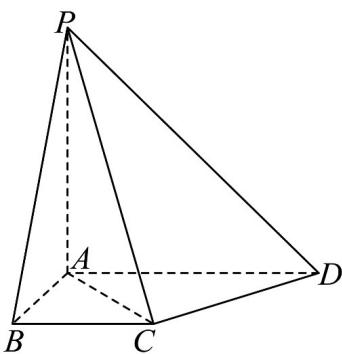
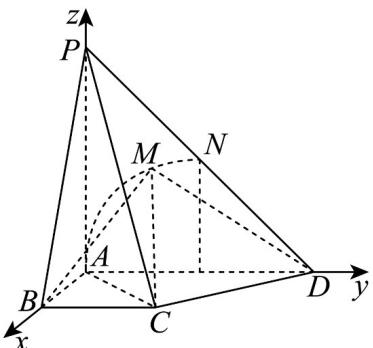

> [!faq]- 《专题2.4 圆的方程（高效培优讲义）》官方解析
>
> > [!success]- **【答案】** (1)证明见解析； (2) (i) $\frac{\sqrt{2}}{4}\pi$ ; (ii) $\sin\theta\in\left[\frac{\sqrt{3}}{6},\frac{\sqrt{3}}{2}\right]$ .
>
> > [!note]- **【分析】**
> > （1）通过线线垂直证明 $CD \perp$ 平面 PAC，即可完成证明；
> >
> > (2) (i) 如图建立空间直角坐标系，设 $M$ 的坐标为 $(0, y, z)$ ，由 $MB^2 + MD^2 = 5$ 可得动点 $M$ 的轨迹，即可求
> >
> > 解；
> >
> > (ii) 由 (i) 可设 $M(0,1 + \cos \alpha, \sin \alpha)$ ，据此可表示出平面 $PBD$ 的法向量，然后由空间向量结合三角函数知
> >
> > 识可得答案·
>
> > [!note]- **【解析】**
> > （1）
> >
> > 
> >
> > 由 $AB \perp AD$ ，AD // BC 可知，
> >
> > 三角形 $ABC$ 为等腰直角三角形， $AC = \sqrt{2}$ ， $\angle BAC = \angle CAD = \frac{\pi}{4}$
> >
> > 又因为 $AD = 2$ ，由余弦定理得： $CD^{2} = AC^{2} + AD^{2} - 2AC\cdot AD\cos \frac{\pi}{4} = 2$
> >
> > 即得 $AD^{2}=AC^{2}+CD^{2}$ ， $AC\perp CD$
> >
> > 因为 $PA \perp$ 平面 $ABCD$ , $CD \subset$ 平面 $ABCD$ , 所以 $PA \perp CD$ .
> >
> > 又因为 $PA \cap AC = A$ ，PA, $AC \subset$ 平面 PAC，所以 $CD \perp$ 平面 PAC.
> >
> > 又因为 $CD \subset$ 平面 $PCD$ ，所以平面 $PAC \perp$ 平面 $PCD$ .
> >
> > (2) (i) 依题意，建立如图坐标系 A - xyz
> >
> > 
> >
> > 设 $M$ 的坐标为 $(0,y,z)$ ， $B(1,0,0)$ ， $D(0,2,0)$
> >
> > 由 $MB^{2} + MD^{2} = 1 + y^{2} + z^{2} + (y - 2)^{2} + z^{2} = 5$
> >
> > 化简得： $y^{2}-2y+z^{2}=0$ ，即 $(y-1)^{2}+z^{2}=1$
> >
> > 则动点 M 的轨迹是以线段 AD 的中点为圆心，以 $^{1}$ 为半径的圆弧，
> >
> > 由于线段 $PD$ 的中点 $N(0,1,1)$ ，所以该圆弧经过点 $N(0,1,1)$
> >
> > 故动点 M 的轨迹是四分之一圆弧 AN，
> >
> > 线段 $CM$ 的轨迹形成的面积为圆锥侧面的 $\frac{1}{4}$ ，面积为 $\frac{1}{4}\pi \times 1\times \sqrt{2} = \frac{\sqrt{2}}{4}\pi$
> >
> > （ii）由（i）可设 $M(0,1 + \cos \alpha ,\sin \alpha)$ ， $\frac{\pi}{2}\leq \alpha \leq \pi$ ， $P(0,0,2)$ ， $C(1,1,0)$ ， $BP = (-1,0,2)$ ，BD $= (-1,2,0)$ ，CM $= (-1,\cos \alpha ,\sin \alpha)$
> >
> > 设平面 $_{BDP}$ 的一个法向量为 $n = (x, y, z)$ ，则 $\begin{cases} BP \cdot n = 0, \\ BD \cdot n = 0, \end{cases}$ 即 $\begin{cases} -x + 2z = 0, \\ -x + 2y = 0, \end{cases}$
> >
> > 取 $x = 2$ ，则 $n = (2,1,1)$
> >
> > $$
> > \sin \theta = \left| \cos C M, n \right| = \frac {\left| - 2 + \sin \alpha + \cos \alpha \right|}{\sqrt {4 + 1 + 1} \cdot \sqrt {1 + \sin^ {2} \alpha + \cos^ {2} \alpha}}
> > $$
> >
> > $$
> > = \frac {\left| - 2 + \sqrt {2} \sin \left(\alpha + \frac {\pi}{4}\right) \right|}{\sqrt {6} \cdot \sqrt {2}} = \frac {\sqrt {2} - \sin \left(\alpha + \frac {\pi}{4}\right)}{\sqrt {6}}
> > $$
> >
> > 因为 $\frac{\pi}{2} \leq \alpha \leq \pi$ ，所以 $\frac{3\pi}{4} \leq \alpha + \frac{\pi}{4} \leq \frac{5\pi}{4}$ ，所以 $-\frac{\sqrt{2}}{2} \leq \sin \left( \alpha + \frac{\pi}{4} \right) \leq \frac{\sqrt{2}}{2}$
> >
> > 所以 $\frac{\sqrt{2}}{2} \leq \sqrt{2} - \sin \left( \alpha + \frac{\pi}{4} \right) \leq \frac{3\sqrt{2}}{2}$ ，所以 $\frac{\sqrt{3}}{6} \leq \sin \theta \leq \frac{\sqrt{3}}{2}$
> >
> > 综上所述， $\sin \theta \in \left[\frac{\sqrt{3}}{6}, \frac{\sqrt{3}}{2}\right]$ .
