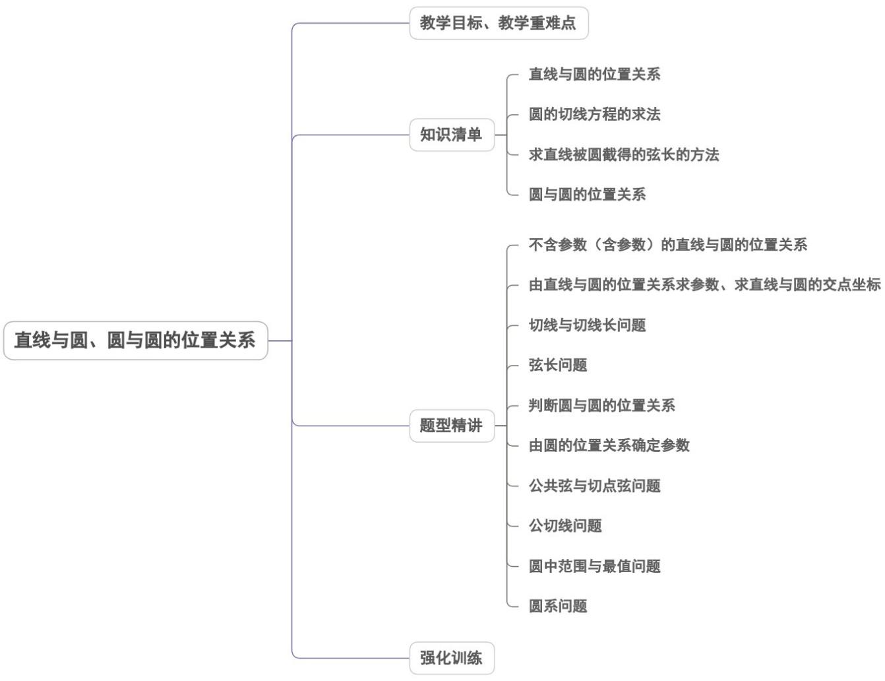

<!-- source-part:1 pages:1-50 -->

## 专题 2.5 直线与圆、圆与圆的位置关系

内容概览

教学目标、教学重难点

<table><tr><td>教学目标</td><td>1.能根据给定直线、圆的方程,判断直线与圆的位置关系.2.能用直线和圆的方程解决一些简单的问题.体会用代数方法处理几何问题的思想.3.能根据给定圆的方程,判断圆与圆的位置关系.4.能用直线和圆的方程解决一些简单的问题,体会用代数方法处理几何问题的思想.</td></tr><tr><td>教学重难点</td><td>1.重点掌握如何判断直线与圆、圆与圆的位置关系2.难点能用直线和圆的方程解决一些简单的问题</td></tr></table>

## 知识清单

## 知识点 01 直线与圆的位置关系

1. 直线与圆的位置关系：

（1）直线与圆相交，有两个公共点；（2）直线与圆相切，只有一个公共点；（3）直线与圆相离，没有公共点．

2. 直线与圆的位置关系的判定：

(1) 代数法：判断直线 $l$ 与圆C的方程组成的方程组是否有解。如果有解，直线 $l$ 与圆C有公共点。

有两组实数解时，直线 $l$ 与圆C相交；有一组实数解时，直线 $l$ 与圆C相切；无实数解时，直线 $l$ 与圆C相离.

(2) 几何法：

由圆C的圆心到直线 $l$ 的距离 $d$ 与圆的半径 $r$ 的关系判断：

当 $d < r$ 时，直线 $l$ 与圆C相交；当 $d = r$ 时，直线 $l$ 与圆C相切；当 $d > r$ 时，直线 $l$ 与圆C相离.

【即学即练】

1. 设直线 $l: x + 2y + a^{2} = 0$ ，圆 $C: (x - 1)^{2} + (y - 2)^{2} = 4$ ，则 l 与圆 C（）

【答案】
A. 相交 B. 相切 C. 相离 D. 以上都有可能

【答案】C

【详解】圆 $C:(x-1)^{2}+(y-2)^{2}=4$ 的圆心为 $C(1,2)$ ，半径 r=2，

则圆心 $C$ 到直线 $l$ 的距离 $d = \frac{\left|1 + 4 + a^2\right|}{\sqrt{5}} = \frac{5 + a^2}{\sqrt{5}}\quad \frac{5}{\sqrt{5}} >2 = r$

故直线 l 与圆 C 相离．

故选：C.

2. 直线 $x + y - 2 = 0$ 和圆 $x^{2} + y^{2} - 2x = 0$ 的位置关系为（）A. 相交 B. 相离 C. 相切 D. 相交且过圆心

【答案】A

【详解】 $x^{2} + y^{2} - 2x = 0$ 的圆心和半径分别为 $(1,0), r = 1$

则圆心到直线 $x + y - 2 = 0$ 的距离为 $d = \frac{|1 + 0 - 2|}{\sqrt{1^2 + 1^2}} = \frac{1}{\sqrt{2}} < r = 1$

故直线与圆相交但不经过圆心，

故选：A

## 知识点 02 圆的切线方程的求法

1. 点 $M$ 在圆上，如图。

法一：利用切线的斜率 $k_{l}$ 与圆心和该点连线的斜率 $k_{OM}$ 的乘积等于-1，即 $k_{OM} \cdot k_l = -1$

法二：圆心 $O$ 到直线 $l$ 的距离等于半径 $r$ ：

2．点 $\left(x_{0},y_{0}\right)$ 在圆外，则设切线方程： $y-y_{0}=k(x-x_{0})$ ，变成一般式： $kx-y+y_{0}-kx_{0}=0$ ，因为与圆相切，

利用圆心到直线的距离等于半径，解出 $k$ ：

【即学即练】

1. 已知点 $M(1,2)$ 在圆 $C: x^2 + y^2 = r^2$ 上，则过点 $M$ 的圆 $C$ 的切线方程为 \_\_\_\_.

【答案】 $x + 2y - 5 = 0$

【详解】由于点 $M(1,2)$ 在圆 $C: x^{2} + y^{2} = r^{2}$ 上，

所以 $r^2 = 1^2 + 2^2 = 5$ ，所以圆 $C: x^2 + y^2 = 5$

所以圆心 $C(0,0)$ ， $k_{CM}=2$ ，

所以过点 $M$ 的圆 $C$ 的切线的斜率为 $-\frac{1}{2}$

所以过点 $M$ 的圆 $C$ 的切线方程为 $y - 2 = -\frac{1}{2} (x - 1)$

化简得 $x + 2y - 5 = 0$

故答案为： $x + 2y - 5 = 0$

2．已知 $M(x_{0},y_{0})$ 为圆 $O:x^{2}+y^{2}=4$ 上一点，过点M的圆O的切线l的方程为\_\_\_\_.

【答案】 $x_{0}x + y_{0}y - 4 = 0$

【详解】由圆 $O:x^{2} + y^{2} = 4$ ，可得圆心坐标为 $O(0,0)$ ，则 $k_{OM} = \frac{y_0}{x_0}$

则过点 $M$ 的圆 $O$ 的切线 $l$ 的斜率为 $k = -\frac{x_0}{y_0}$ ，且 $x_0^2 + y_0^2 = 4$

所以过点 M 的圆 O 的切线 l 的切线方程为 $y - y_{0} = -\frac{x_{0}}{y_{0}}(x - x_{0})$ ，

即 $x_0x + y_0y - (x_0^2 +y_0^2) = 0$ ，即 $x_0x + y_0y - 4 = 0$

故答案为： $x_0x + y_0y - 4 = 0$

## 知识点 03 求直线被圆截得的弦长的方法

1. 应用圆中直角三角形：半径 $r$ ，圆心到直线的距离 $d$ ，弦长 $l$ 具有的关系 $r^2 = d^2 + \left(\frac{l}{2}\right)^2$ ，这也是求弦长最

常用的方法.

2. 利用交点坐标：若直线与圆的交点坐标易求出，求出交点坐标后，直接用两点间的距离公式计算弦长.
【即学即练】

1. 已知直线 $y = x + t$ 与圆 $x^{2} + y^{2} = 4$ 相交于 A, B 两点， $|AB| = 2\sqrt{2}$ ，则 $|t| =$ （）A.5 B.4 C.3 D.2

【答案】D

【详解】设圆心 $O(0,0)$ 到直线 $x - y + t = 0$ 的距离为 $d$

则由点到直线的距离公式可得 $d = \frac{|0 - 0 + t|}{\sqrt{1 + 1}} = \frac{|t|}{\sqrt{2}}$

因为 $\left|AB\right|=2\sqrt{2}$ ，圆的半径为 2，所以 $2\sqrt{2^{2}-\frac{t^{2}}{2}}=2\sqrt{2}$ ，解得 $\left|t\right|=2$ 。

故选：D.

2. 已知直线 $y = 2x$ 与圆 $(x - a)^2 + y^2 = 4$ 相交于 $A, B$ 两点，若 $|AB| = 2\sqrt{3}$ ，则 $|a| =$ （）

【答案】

A. 1 B. $\frac{\sqrt{3}}{2}$ C. $\frac{\sqrt{5}}{2}$ D. $\frac{\sqrt{6}}{2}$

【答案】C

【详解】由题意有圆心 $(a,0)$ 到直线2x-y=0的距离为 $d=\frac{|2a|}{\sqrt{2^{2}+1}}=\frac{|2a|}{\sqrt{5}}$ ，
所以 $\left|AB\right|=2\sqrt{r^{2}-d^{2}}=2\sqrt{3}$ 又 $r^{2}=4$ 解得 $a^{2}=\frac{5}{4}\Rightarrow\left|a\right|=\frac{\sqrt{5}}{2}$

故选：C.

## 知识点 04 圆与圆的位置关系

1. 圆与圆的位置关系：

（1）圆与圆相交，有两个公共点；（2）圆与圆相切（内切或外切），有一个公共点；（3）圆与圆相离（内

含或外离），没有公共点。

2. 圆与圆的位置关系的判定：

(1) 代数法：判断两圆的方程组成的方程组是否有解。

有两组不同的实数解时，两圆相交；有一组实数解时，两圆相切；方程组无解时，两圆相离。

(2) 几何法：设 $\odot O_{1}$ 的半径为 $r_{1}$ ， $\odot O_{2}$ 的半径为 $r_{2}$ ，两圆的圆心距为 $d$ 。

当 $\left|r_{1}-r_{2}\right|<d<r_{1}+r_{2}$ 时，两圆相交；当 $r_{1}+r_{2}=d$ 时，两圆外切；当 $r_{1}+r_{2}<d$ 时，两圆外离；
当 $\left|r_{1}-r_{2}\right|=d$ 时，两圆内切；当 $\left|r_{1}-r_{2}\right|>d$ 时，两圆内含。

## 【即学即练】

1. 已知圆 $C_1: x^2 + y^2 - 4 = 0$ ，圆 $C_2: x^2 + y^2 - 4x + 4y - 8 = 0$ ，则两圆的位置关系是（）A. 外离 B. 外切 C. 相交 D. 内切

【答案】C

【详解】 $C_{1}:x^{2}+y^{2}=4$ ，圆心 $C_{1}(0,0)$ ，半径 $r_{1}=2$ ，

$C_2: x^2 + y^2 - 4x + 4y - 8 = 0$ 可化简为 $(x - 2)^2 + (y + 2)^2 = 16$

则圆 $C_2$ 的圆心为 $C_2(2, - 2)$ ，半径 $r_2 = 4$

$2 = 4 - 2 < \left| C_{1} C_{2} \right| = 2 \sqrt{2} < 4 + 2 = 6$ ，所以两圆相交。

故选：C.

2. 在平面内与点 $A(1,2)$ 距离为 1，与点 $B(4,1)$ 距离为 2 的直线共有（）

【答案】
A. 1 条 B. 2 条 C. 3 条 D. 4 条

【答案】D

【详解】∵在平面内与点 $A(1,2)$ 距离为 1 的直线的是以 $(1,2)$ 为圆心 1 为半径的圆的切线，
同理可得与点 $B(4,1)$ 距离为 2 的直线是以 $(4,1)$ 为圆心 2 为半径的圆的切线，

满足条件的直线为两圆的公切线，

$$
\because | A B | = \sqrt {(1 - 4) ^ {2} + (2 - 1) ^ {2}} = \sqrt {1 0} > 1 + 2
$$

两圆的位置关系为外离，公切线有 $^{4}$ 条，

故满足条件的直线有 $^{4}$ 条·

故选：D

## 题型精讲

![[高中/课堂同步/题库/人教A版高中数学同步讲义(2026)/03_选择性必修第一册/第二章 直线和圆的方程/专题2.5 直线与圆、圆与圆的位置关系（高效培优讲义）/题型01_不含参数_含参数_的直线与圆的位置关系/题型01_不含参数_含参数_的直线与圆的位置关系.md]]
![[高中/课堂同步/题库/人教A版高中数学同步讲义(2026)/03_选择性必修第一册/第二章 直线和圆的方程/专题2.5 直线与圆、圆与圆的位置关系（高效培优讲义）/题型02_由直线与圆的位置关系求参数_求直线与圆的交点坐标/题型02_由直线与圆的位置关系求参数_求直线与圆的交点坐标.md]]
![[高中/课堂同步/题库/人教A版高中数学同步讲义(2026)/03_选择性必修第一册/第二章 直线和圆的方程/专题2.5 直线与圆、圆与圆的位置关系（高效培优讲义）/题型03_切线与切线长问题/题型03_切线与切线长问题.md]]
![[高中/课堂同步/题库/人教A版高中数学同步讲义(2026)/03_选择性必修第一册/第二章 直线和圆的方程/专题2.5 直线与圆、圆与圆的位置关系（高效培优讲义）/题型04_弦长问题/题型04_弦长问题.md]]
![[高中/课堂同步/题库/人教A版高中数学同步讲义(2026)/03_选择性必修第一册/第二章 直线和圆的方程/专题2.5 直线与圆、圆与圆的位置关系（高效培优讲义）/题型05_判断圆与圆的位置关系/题型05_判断圆与圆的位置关系.md]]
![[高中/课堂同步/题库/人教A版高中数学同步讲义(2026)/03_选择性必修第一册/第二章 直线和圆的方程/专题2.5 直线与圆、圆与圆的位置关系（高效培优讲义）/题型06_由圆的位置关系确定参数/题型06_由圆的位置关系确定参数.md]]
![[高中/课堂同步/题库/人教A版高中数学同步讲义(2026)/03_选择性必修第一册/第二章 直线和圆的方程/专题2.5 直线与圆、圆与圆的位置关系（高效培优讲义）/题型07_公共弦与切点弦问题/题型07_公共弦与切点弦问题.md]]
![[高中/课堂同步/题库/人教A版高中数学同步讲义(2026)/03_选择性必修第一册/第二章 直线和圆的方程/专题2.5 直线与圆、圆与圆的位置关系（高效培优讲义）/题型08_公切线问题/题型08_公切线问题.md]]
![[高中/课堂同步/题库/人教A版高中数学同步讲义(2026)/03_选择性必修第一册/第二章 直线和圆的方程/专题2.5 直线与圆、圆与圆的位置关系（高效培优讲义）/题型09_圆中范围与最值问题/题型09_圆中范围与最值问题.md]]
![[高中/课堂同步/题库/人教A版高中数学同步讲义(2026)/03_选择性必修第一册/第二章 直线和圆的方程/专题2.5 直线与圆、圆与圆的位置关系（高效培优讲义）/题型10_圆系问题/题型10_圆系问题.md]]
![[高中/课堂同步/题库/人教A版高中数学同步讲义(2026)/03_选择性必修第一册/第二章 直线和圆的方程/专题2.5 直线与圆、圆与圆的位置关系（高效培优讲义）/强化训练/强化训练.md]]
