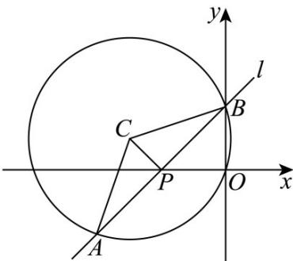

> [!faq]- 《专题2.5 直线与圆、圆与圆的位置关系（高效培优讲义）》官方解析
>
> > [!success]- **【答案】** B
>
> > [!note]- **【解析】**
> > 直线 $l: mx + y + 2m = 0$ 过定点 $P(-2,0)$ ，圆 $C:(x+3)^{2}+(y-1)^{2}=10$ ，
> > 易知 $C(-3,1), |CP| = \sqrt{2},$
> >
> > 
> >
> > 设 $C$ 到 $l$ 距离为 $d, \therefore 0 \leq d \leq \sqrt{2}$
> >
> > $S_{\triangle ABC} = \frac{1}{2}\cdot 2\sqrt{10 - d^2}\cdot d = \sqrt{-d^4 + 10d^2}$
> >
> > 当 $d = \sqrt{2}$ 时， $\left(S_{\triangle ABC}\right)_{\max} = \sqrt{-4 + 20} = 4$ .
> >
> > 故选 **B**
