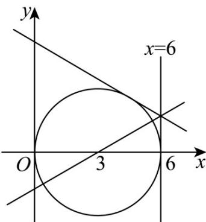

> [!faq]- 《专题2.5 直线与圆、圆与圆的位置关系（高效培优讲义）》官方解析
>
> > [!success]- **【答案】** 3
>
> > [!note]- **【解析】**
> > 因为一条过点 $\left(0, -\sqrt{3}\right)$ 的直线将圆分成面积相等的两部分，
> >
> > 所以该直线经过圆心 $(3,0)$ .
> >
> > 所以该直线的斜率为 $k=\frac{-\sqrt{3}-0}{0-3}=\frac{\sqrt{3}}{3}$
> >
> > 所以该直线的方程为 $y=\frac{\sqrt{3}}{3}x-\sqrt{3}$ ，倾斜角为 $30^{\circ}$
> >
> > 因为该直线碰到直线 $x = 6$ 后反射，那么射出的直线与 $x$ 轴的夹角为 $150^{\circ}$
> >
> > $y=\frac{\sqrt{3}}{3}x-\sqrt{3}$ 中，当 x=6 时， $y=\sqrt{3}$
> >
> > 从而射出的直线的斜率为 $-\frac{\sqrt{3}}{3}$ ，且射出的直线经过点 $(6,\sqrt{3})$ .
> >
> > 所以射出的直线方程为 $y-\sqrt{3}=-\frac{\sqrt{3}}{3}(x-6)$ ，即 $x+\sqrt{3}y-9=0$ 。
> >
> > 又该射出的直线恰好与圆相切，所以圆心 $(3,0)$ 到该直线的距离为圆的半径，
> >
> > 即 $r=\frac{\left|3-9\right|}{\sqrt{3+1}}=3$
> >
> > 故答案为：3·
> >
> > 
