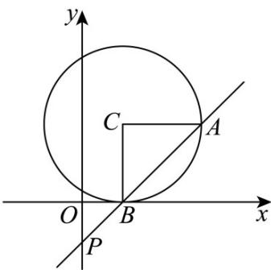

> [!faq]- 《专题2.5 直线与圆、圆与圆的位置关系（高效培优讲义）》官方解析
>
> > [!success]- **【答案】** A. -6 B. 6 C. 3 D. -3
>
> > [!note]- **【解析】**
> > 如图，由题意得，圆心 $C(1,2)$ ，半径 $r = 2$
> >
> > 因为 $\overline{CA} \cdot \overline{CB} = |\overline{CA}| |\overline{CB}| \cos \angle ACB = 2$
> >
> > 且 $|\overline{CA}| = |\overline{CB}| = r = 2$
> >
> > 所以 $2 \times 2 \times \cos \angle ACB = 2$ ，解得 $\cos \angle ACB = \frac{1}{2}$
> >
> > 所以 $\angle ACB = 60^{\circ}$
> >
> > 设圆心 C 到直线 AB 的距离为 d，由垂径定理可得
> >
> > $\cos \frac{\angle ACB}{2} = \frac{d}{r}$ 即 $\cos 30^{\circ} = \frac{d}{2}$ 所以 $d = \sqrt{3}$
> >
> > 由题意知直线 l 的方程为 kx - y - 1 = 0
> >
> > 所以圆心 $C$ 到直线 $l$ 的距离 $\left(d = \frac{\left|Ax_0 + By_0 + C\right|}{\sqrt{A^2 + B^2}}\right)d = \frac{|k - 2 - 1|}{\sqrt{k^2 + 1}} = \sqrt{3}$
> >
> > 即 $|k - 3| = \sqrt{3}\sqrt{k^2 + 1}$
> >
> > 两边平方，得 $\left(k - 3\right)^2 = 3\left(k^2 +1\right)$
> >
> > 化简得 $k^2 + 3k - 3 = 0 \Rightarrow \Delta = 3^2 - 4 \times 1 \times (-3) > 0$
> >
> > 设方程的两根分别为 $k_{1}, k_{2}$
> >
> > 由根与系数关系，得 $k_{1}k_{2} = -3$
> >
> > <!-- source-part:2 pages:51-63 -->
> >
> > 
> >
> > 故选 **D**.
