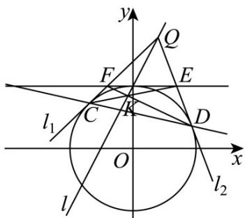

> [!faq]- 《专题2.5 直线与圆、圆与圆的位置关系（高效培优讲义）》官方解析
>
> > [!success]- **【答案】** (1) $x^{2}+y^{2}=4$ ； (2) (i) 过定点，定点坐标为 $(-4,2)$ ; (ii) $\frac{2\sqrt{5}}{5}$ .
>
> > [!note]- **【解析】**
> > （1）由题意得 $PB = 2PA$ ，则 $PB^{2} = 4PA^{2}$ ，设 $P(x,y)$
> >
> > 则 $\left(x - 4\right)^2 +y^2 = 4(x - 1)^2 +4y^2$
> >
> > 化简得 $\Gamma : x^{2} + y^{2} = 4$
> >
> > (2) (i) 设 $Q(t,2t+2)$ ,
> >
> > 则以 $OQ$ 为直径的圆为： $x(x - t) + y(y - 2t - 2) = 0$ .
> >
> > 与 $\Gamma$ 方程作差可得直线CD为： $4-tx-(2t+2)y=0$
> >
> > 即 $t(-x - 2y) + 4 - 2y = 0$ ，则 $\left\{ \begin{array}{l} -x - 2y = 0\\ 4 - 2y = 0 \end{array} \right.$ ，解得 $\left\{ \begin{array}{l}x = -4\\ y = 2 \end{array} \right.$
> >
> > 则过定点 $(-4,2)$ .
> >
> > (ii) 首先证明一个结论，标准圆 $x^{2} + y^{2} = r^{2}(r > 0)$
> >
> > 其圆上任意一点 $M(x_{1},y_{2})$ ，在该点处的切线 l 方程为 $x_{1}x + y_{1}y = r^{2}$ ，
> >
> > 证明如下，当直线 $OM$ 的斜率和直线 $l$ 的斜率均存在且不为0时，则 $k_{OM} = \frac{y_1}{x_1}$ ， $k_l = -\frac{x_1}{y_1}$
> >
> > 则切线 l 方程为 $y - y_{1} = -\frac{x_{1}}{y_{1}}(x - x_{1})$ ，即 $x_{1}x + y_{1}y = x_{1}^{2} + y_{1}^{2} = r^{2}$ 。
> >
> > 当直线 $OM$ 的斜率不存在时，此时 $x_{1} = 0$ ， $y_{1} = \pm r$ ，易得切线方程为 $y \pm y_{1} = 0$ ，适合 $x_{1}x + y_{1}y = r^{2}$
> >
> > 当直线 $OM$ 的斜率为 ${}^{0}$ 时，此时 $x_{1} = \pm r$ ， $y_{1} = 0$ ，易得切线方程为 $x \pm x_{1} = 0$ ，适合 $x_{1}x + y_{1}y = r^{2}$
> >
> > 综上圆上任意一点 $M(x_{1},y_{2})$ ，在该点处的切线 l 方程为 $x_{1}x + y_{1}y = r^{2}$
> >
> > $$
> > C \left(x _ {1}, y _ {1}\right) \quad , D \left(x _ {2}, y _ {2}\right)
> > $$
> >
> > 则化简直线 CD 为： $\left(x_{1}-x_{2}\right)y+\left(y_{2}-y_{1}\right)x=x_{1}y_{2}-x_{2}y_{1}$
> >
> > 过定点 $(-4,2)$ ，所以有 $2(x_{1}-x_{2})-4(y_{2}-y_{1})=x_{1}y_{2}-x_{2}y_{1}$ （\*）
> >
> > 直线 CQ 为： $x_{1}x + y_{1}y = 4$ ，令 y = 2，则 $x = \frac{4 - 2y_{1}}{x_{1}}$ ，则 $E\left(\frac{4 - 2y_{1}}{x_{1}}, 2\right)$
> >
> > 同理，直线 $DQ$ 为： $x_{2}x + y_{2}y = 4$ ，则同理得 $F\left(\frac{4 - 2y_2}{x_2},2\right)$
> >
> > 则直线 $DE$ 为： $\left(\frac{4 - 2y_1}{x_1} -x_2\right)y + (y_2 - 2)x = \frac{4 - 2y_1}{x_1} y_2 - 2x_2$
> >
> > 即 $\left(4 - 2y_{1} - x_{1}x_{2}\right)y + \left(x_{1}y_{2} - 2x_{1}\right)x = 4y_{2} - 2y_{1}y_{2} - 2x_{1}x_{2}$
> >
> > 同理直线 $CF$ 为： $\left(4 - 2y_{2} - x_{1}x_{2}\right)y + \left(x_{2}y_{1} - 2x_{2}\right)x = 4y_{1} - 2y_{1}y_{2} - 2x_{1}x_{2}$
> >
> > 由 $CF$ ， $DE$ 交于 $K$ 可知
> >
> > $$
> > \left\{ \begin{array}{l} \left(4 - 2 y _ {1} - x _ {1} x _ {2}\right) y _ {K} + \left(x _ {1} y _ {2} - 2 x _ {1}\right) x _ {K} = 4 y _ {2} - 2 y _ {1} y _ {2} - 2 x _ {1} x _ {2} \\ \left(4 - 2 y _ {2} - x _ {1} x _ {2}\right) y _ {K} + \left(x _ {2} y _ {1} - 2 x _ {2}\right) x _ {K} = 4 y _ {1} - 2 y _ {1} y _ {2} - 2 x _ {1} x _ {2} \end{array} \right.
> > $$
> >
> > 两式作差可得 $2x_{K}(x_{1}-x_{2})+(4-2y_{K})(y_{2}-y_{1})=x_{K}(x_{1}y_{2}-x_{2}y_{1})$
> >
> > 对比（ $^{*}$ ）式可得 $\frac{2x_{K}}{2}=\frac{4-2y_{K}}{-4}=\frac{x_{K}}{1}$
> >
> > 即 $2x_{K} - y_{K} + 2 = 0$ ，即 $K$ 也在直线 $l$ 上.
> >
> > 则 $\left|OK\right|\quad\frac{\left|0-0+2\right|}{\sqrt{2^{2}+1}}=\frac{2\sqrt{5}}{5}$
> >
> > 
