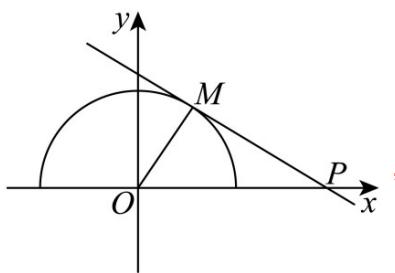

> [!faq]- 《专题2.5 直线与圆、圆与圆的位置关系（高效培优讲义）》官方解析
>
> > [!success]- **【答案】** D
>
> > [!note]- **【解析】**
> > 由 $y=\sqrt{1-x^{2}}$ 得 $x^{2}+y^{2}=1(y\quad0)$
> >
> > 直线 $y = k(x - 2)$ 经过定点 $P(2,0)$ ，如图，
> >
> > 
> >
> > 当直线与半圆相切时， $k=\tan\angle MPx=-\tan\angle MPO=-\frac{1}{\sqrt{2^{2}-1^{2}}}=-\frac{\sqrt{3}}{3}$
> >
> > 所以恰有两个公共点时，由图可知， $k\in\left(-\frac{\sqrt{3}}{3},0\right]$
> >
> > 故选 **D**.
