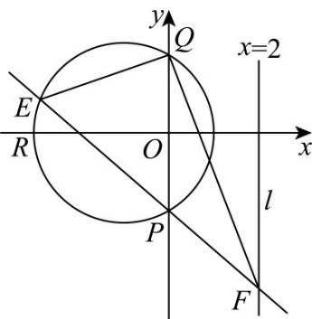

> [!faq]- 《专题2.5 直线与圆、圆与圆的位置关系（高效培优讲义）》官方解析
>
> > [!success]- **【答案】** (1) $(x+1)^{2}+y^{2}=4$ ； (2) $\frac{34\sqrt{3}}{7}$ .
>
> > [!note]- **【解析】**
> > （1）设圆 $\Gamma$ 的标准方程为 $(x + a)^2 +(y - b)^2 = r^2 (r > 0)$
> >
> > 由圆过，得 $\left\{ \begin{array}{l} (0 + a)^2 + (-\sqrt{3} - b)^2 = r^2 \\ (0 + a)^2 + (\sqrt{3} - b)^2 = r^2 \\ (-3 + a)^2 + (0 - b)^2 = r^2 \end{array} \right.$ ，解得 $\left\{ \begin{array}{l} a = -1 \\ b = 0 \\ r = 2 \end{array} \right.$ ，
> >
> > 所以圆 $\Gamma$ 的方程为 $(x+1)^{2} + y^{2} = 4$ .
> >
> > (2) 依题意，设直线 $PE$ 的方程为 $y = kx - \sqrt{3}$ ，点 $F$ 在直线 $x = 2$ 上，
> >
> > 由 $\left|PF\right|=\sqrt{7}$ ，得 $\sqrt{1+k^{2}}\cdot\left|2-0\right|=\sqrt{7}$ ，又k<0，则 $k=-\frac{\sqrt{3}}{2}$
> >
> > 于是直线 $PE$ 的方程为 $\sqrt{3} x + 2y + 2\sqrt{3} = 0$
> >
> > 由 $\left\{ \begin{array}{l} \sqrt{3} x + 2y + 2\sqrt{3} = 0 \\ (x + 1)^2 + y^2 = 4 \end{array} \right.$ 消去 $y$ 得 $7x^{2} + 20x = 0$ ，解得点 $E$ 的横坐标 $x_{E} = -\frac{20}{7}$
> >
> > 于是 $\left|EF\right| = \sqrt{1 + k^2}\cdot \left|2 - x_E\right| = \frac{\sqrt{7}}{2} [2 - (-\frac{20}{7})] = \frac{17\sqrt{7}}{7}$
> >
> > 而点 $Q(0, \sqrt{3})$ 到直线 $PE: \sqrt{3} x + 2y + 2\sqrt{3} = 0$ 的距离 $d = \frac{4\sqrt{3}}{\sqrt{7}}$
> >
> > 所以 $\triangle QEF$ 的面积为 $S = \frac{1}{2}|EF|\cdot d = \frac{1}{2}\times \frac{17\sqrt{7}}{7}\times \frac{4\sqrt{3}}{\sqrt{7}} = \frac{34\sqrt{3}}{7}$
> >
> > 
