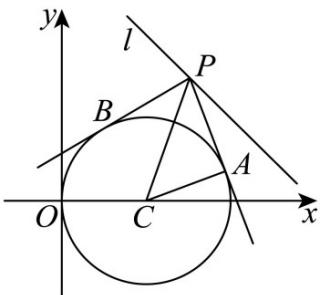

> [!faq]- 《专题2.5 直线与圆、圆与圆的位置关系（高效培优讲义）》官方解析
>
> > [!success]- **【答案】** 1
>
> > [!note]- **【解析】**
> > 圆 $C:(x-1)^{2}+y^{2}=1$ 的圆心 $C(1,0)$ ，半径 r=1，
> >
> > 点 C 到直线 $l: x + y - 3 = 0$ 的距离 $d = \frac{|1 + 0 - 3|}{\sqrt{1^{2} + 1^{2}}} = \sqrt{2}$ ，又 $AC \perp PA$ ，
> >
> > 因此 $\overline{PA} \cdot \overline{PC} = \overline{PA} \cdot (\overline{PA} + \overline{AC}) = \overline{PA}^{2} = |\overline{PC}|^{2} - r^{2} \quad d^{2} - 1 = 1$ ，当且仅当 $PC \perp l$ 时取等号，
> >
> > 所以 $PA \cdot PC$ 的最小值为 1.
> >
> > 故答案为：1
> >
> > 
> >
> > ## 方法技巧
> >
> > 求圆的切线方程一般有三种方法：
> >
> > （1）直接法：应用常见结论，直接写出切线方程；（2）待定系数法；（3）定义法.
> >
> > 一般地，过圆外一点可向圆作两条切线，在后两种方法中，应注意斜率不存在的情况。
