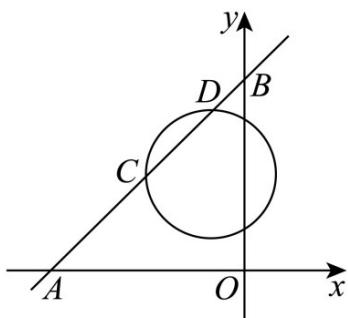

> [!faq]- 《专题2.5 直线与圆、圆与圆的位置关系（高效培优讲义）》官方解析
>
> > [!success]- **【答案】** 2
>
> > [!note]- **【解析】**
> > 因为直线 $l_{1}: x - y + 6 = 0$ 与 x 轴交于 $A(-6, 0)$ ，与 y 轴交于 $B(0, 6)$ ，所以 $|AB| = \sqrt{6^{2} + 6^{2}} = 6\sqrt{2}$ ，所以 $|CD| = 2\sqrt{2}$ ，
> >
> > 圆 $(x + 1)^2 + (y - 3)^2 = r^2$ 的半径为 $r$ ，圆心 $(-1,3)$ 到直线 $l_1: x - y + 6 = 0$ 的距离为 $d = \frac{|-1 - 3 + 6|}{\sqrt{2}} = \sqrt{2}$ ，
> >
> > 故 $\left|CD\right|=2\sqrt{r^{2}-d^{2}}=2\sqrt{r^{2}-\left(\sqrt{2}\right)^{2}}=2\sqrt{2}$ ，解得r=2；
> >
> > 故答案为：2.
> >
> > 
