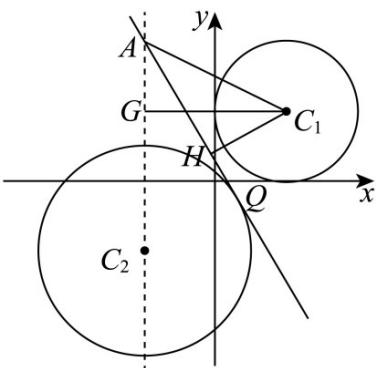
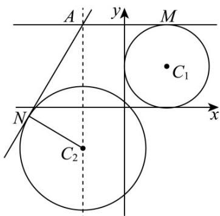

> [!faq]- 《专题2.5 直线与圆、圆与圆的位置关系（高效培优讲义）》官方解析
>
> > [!success]- **【答案】** BCD
>
> > [!note]- **【解析】**
> > 对于选项 A：圆 $C_{1}$ 的圆心为 $(2,2)$ ，半径 $r_{1}=2$ ；
> >
> > 圆 $C_2$ 的圆心为 $(-2, - 2)$ ，半径 $r_2 = 3$
> >
> > 两圆心间距离： $d = \sqrt{(2 - (-2))^2 + (2 - (-2))^2} = \sqrt{4^2 + 4^2} = \sqrt{32} = 4\sqrt{2}$
> >
> > $r_{1}+r_{2}=2+3=5$ ，因为 $d=4\sqrt{2}>5=r_{1}+r_{2}$ ，所以两圆外离，不相交；故 A 错误；
> >
> > 对于选项 B：点 P 在 $C_{1}$ 上，点 Q 在 $C_{2}$ 上，两圆外离，
> >
> > $PQ_{\max} = d + r_1 + r_2 = 4\sqrt{2} + 2 + 3 = 5 + 4\sqrt{2}$ ，故B正确；
> >
> > 对于选项 C：过点 A 作圆 $C_{2}$ 的切线（取靠近圆 $C_{1}$ 的一条），
> >
> > 过点 $C_{1}$ 作切线的垂线垂足为 H ，过点 $C_{1}$ 作 $AC_{2}$ 垂线，垂足为 G ，
> >
> > 此时 $\left|C_{1}H\right|$ 的长即为点 $C_{1}$ 到直线AQ距离的最小值.
> >
> > 易知，在 $\mathrm{Rt}\triangle AGC_1$ 中 $AG = 2, GC_1 = 4$ ， $\therefore \cos \angle GAC_1 = \frac{\sqrt{5}}{5}, \sin \angle GAC_1 = \frac{2\sqrt{5}}{5}$ ；
> >
> > 因为 AQ 为圆 $C_{2}$ 的切线，所以易得 $\angle HAC_{2} = \frac{\pi}{6}$ ;
> >
> > $$
> > \angle H A C _ {1} = \angle G A C _ {1} - \angle H A C _ {2} = \angle G A C _ {1} - \frac {\pi}{6},
> > $$
> >
> > $$
> > \therefore \sin \angle G A C _ {1} = \sin \left(\angle G A C _ {1} - \frac {\pi}{6}\right) = \frac {2 \sqrt {5}}{5} \times \frac {\sqrt {3}}{2} - \frac {\sqrt {5}}{5} \times \frac {1}{2} = \frac {2 \sqrt {1 5} - \sqrt {5}}{1 0}
> > $$
> >
> > $\left|C_{1}H\right| = \left|C_{1}A\right|\cdot \sin \angle GAC_{1} = 2\sqrt{5}\times \frac{2\sqrt{15} - \sqrt{5}}{10} = 2\sqrt{3} -1 > \frac{12}{5}$ ，故C正确；
> >
> > 
> >
> > 对于选项 D: 过点 A 分别作两圆的切线，切点分别为 M，N，如下图所示：
> >
> > 
> >
> > 由图易得 $\left(\angle PAQ\right)_{\max} = \angle MAN = \frac{\pi}{2} + \frac{\pi}{6}$ ，此时 $\tan \angle MAN = \tan \left(\frac{\pi}{2} + \frac{\pi}{6}\right) = -\sqrt{3}$ 故 D 正确.
> >
> > 故选 **BCD**
