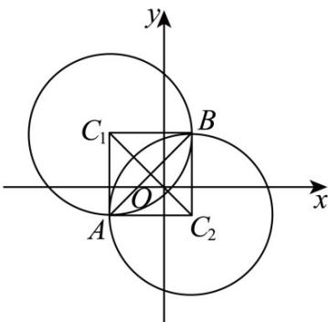

> [!faq]- 《专题2.5 直线与圆、圆与圆的位置关系（高效培优讲义）》官方解析
>
> > [!success]- **【答案】** 9
>
> > [!note]- **【解析】**
> > 由已知，圆 $C_1:(x + 2)^2 +(y - 2)^2 = 9$ ，圆 $C_2:(x - 1)^2 +(y + 1)^2 = 9$
> >
> > 圆心 $C_{1}:(-2,2)$ ，半径 $r_{1}=3$ ，圆心 $C_{2}:(1,-1)$ ，半径 $r_{2}=3$ ，
> >
> > 
> >
> > 法一：如图，准确画图，容易发现四边形 $AC_{1}BC_{2}$ 是边长为 $^{3}$ 正方形，其面积为 $^{9}$ ；
> >
> > 法二：将两圆方程相减，可得公共弦 AB 所在直线的方程为：
> >
> > $x - y + 1 = 0, C_{1}$ 到 $AB$ 距离为 $d = \frac{|-2 - 2 + 1|}{\sqrt{1 + 1}} = \frac{3\sqrt{2}}{2}$ ，所以 $\frac{|AB|}{2} = \frac{3\sqrt{2}}{2}$ ，即 $|AB| = 3\sqrt{2}$
> >
> > 又 $\left|C_1C_2\right| = \sqrt{(-2 - 1)^2 + [2 - (-1)]^2} = 3\sqrt{2}$
> >
> > 所以，四边形 $AC_{1}BC_{2}$ 的面积 $S = \frac{1}{2}|AB|\cdot |C_1C_2| = 9$
> >
> > 故答案为：9.
