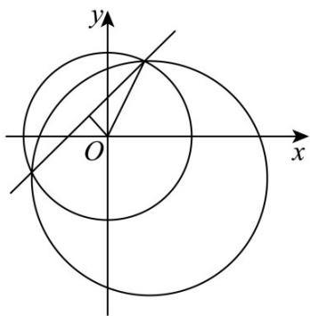

> [!faq]- 《专题2.5 直线与圆、圆与圆的位置关系（高效培优讲义）》官方解析
>
> > [!success]- **【答案】** C
>
> > [!note]- **【解析】**
> > 
> >
> > 圆 $x^{2} + y^{2} - 4 = 0$ 的圆心为 $(0,0)$ ，半径为 $r = 2$
> >
> > 联立 $x^{2} + y^{2} - 4 = 0$ 与 $x^{2} + y^{2} - 2x + 2y - 6 = 0$ 得公共弦所在直线为 $x - y + 1 = 0$
> >
> > 圆心 $\left(0,0\right)$ 到直线 $x - y + 1 = 0$ 的距离为 $d = \frac{\left|0 - 0 + 1\right|}{\sqrt{1^2 + (-1)^2}} = \frac{\sqrt{2}}{2}$
> >
> > 故弦长为 $2\sqrt{r^2 - d^2} = 2\sqrt{2^2 - \left(\frac{\sqrt{2}}{2}\right)^2} = \sqrt{14}$
> >
> > 故选 **C**
