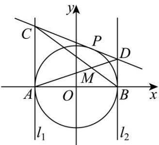

<!-- question-source:start -->
7．如图，圆 $O:x^{2} + y^{2} = 4$ 与 $x$ 轴交于A、 $B$ 两点， $l_{1}$ 、 $l_{2}$ 是分别过A、 $B$ 的圆 $O$ 的切线，过圆 $O$ 上任意一

点 $P$ 作圆 $O$ 的切线，分别交 $l_{1}$ 、 $l_{2}$ 于点 $C$ 、 $D$ 两点，记直线 $AD$ 与 $BC$ 交于点 $M$ ，则点 $M$ 的轨迹方程为

( )

A. $x^{2} + y^{2} = 1(y\neq 0)$ B. $\frac{x^2}{4} +y^2 = 1(y\neq 0)$ C. $x^{2} + y^{2} = 2(y\neq 0)$ D.

$$
\frac {x ^ {2}}{4} + \frac {y ^ {2}}{2} = 1 (y \neq 0)
$$
<!-- question-source:end -->

![[高中/课堂同步/题库/人教A版高中数学同步讲义(2026)/03_选择性必修第一册/第二章 直线和圆的方程/第二章 直线和圆的方程（高效培优单元测试·强化卷）/一_选择题/questions/answers/Q00080747A1.md]]
