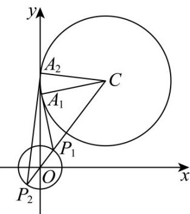

> [!faq]- 《第二章 直线和圆的方程（高效培优单元测试·强化卷）》官方解析
>
> > [!success]- **【答案】** ( ) A．若直线 l 与圆 O 相切，则 $k = \pm \sqrt{3}$ B．若 $k=\sqrt{15}$ ，则圆O上到直线l的距离等于 $\frac{1}{2}$ 的点恰有3个 C．若圆 O 与圆 C 恰有三条公切线，则 m = 4 D．若 P 为圆 O 上的点，当 m=9 时，过点 P 作圆 C 的两条切线，切点分别为 A, B，则 $\angle APB$ 可能为 $\overline{2}$
>
> > [!note]- **【解析】**
> > 易知圆 $x^{2} + y^{2} = 1$ 的圆心 $O$ 的坐标为 $(0,0)$ ，半径为 $1$ ，圆心 $O$ 到直线 $l$ 的距离 $d = \frac{2}{\sqrt{1 + k^2}}$
> >
> > 对于 $\mathsf{A}$ ，因为直线 $l$ 与圆 $O$ 相切，所以 $d = \frac{2}{\sqrt{1 + k^2}} = 1$ ，解得 $k = \pm \sqrt{3}$ ， $\mathsf{A}$ 正确；
> >
> > 对于 B，当 $k=\sqrt{15}$ 时，圆心 O 到直线 l 的距离 $d'=\frac{1}{2},1-d'=\frac{1}{2}$
> >
> > 故圆 $O$ 上到直线 $l$ 的距离为 $\frac{1}{2}$ 的点恰有3个，B正确；
> >
> > 对于 C，圆 O 与圆 $C:(x-3)^{2}+(y-4)^{2}=m$ 恰有三条公切线，
> >
> > 则两圆外切，即 $\sqrt{(3 - 0)^2 + (4 - 0)^2} = 1 + \sqrt{m}$ ，解得 $m = 16$ ，C 错误；
> >
> > 对于 D，如图，
> >
> > 
> >
> > 点 $P$ 在 $P_{1}$ 位置时， $P_{1}C = 4$ ，此时 $\angle A_{1}P_{1}C > \frac{\pi}{4}$ ，点 $P$ 在 $P_{2}$ 位置时 $P_{2}C = 6$ ，此时 $\angle A_{2}P_{2}C < \frac{\pi}{4}$ ，所以中间必然有位置使得 $\angle APB = \frac{\pi}{2}$ ，故D正确。
> >
> > 故选 **ABD**
