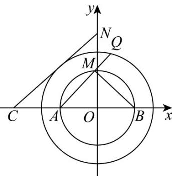

> [!faq]- 《第二章 直线和圆的方程（高效培优单元测试·强化卷）》官方解析
>
> > [!success]- **【答案】** $\frac{3}{2}$ .设点 $A(-2,0)$ ， $B(2,0)$ ， $N(0,4)$ ，点 $Q$ 是圆 $O$ 上的任意一点，过点 $B$ 作 $BM\perp AQ$ 于 $M$ ，则下列说法 正确的是（ ）.  A. $r = 3$ B. 点 $M$ 的轨迹方程为 $x^{2} + y^{2} = 4$ C. $2|QM| + |QA|$ 的最小值为 $2\sqrt{10}$ D．圆 O 上存在唯一点 Q，使得 $\frac{3}{2}|QA| + |QN|$ 取到最小值
>
> > [!note]- **【解析】**
> > 对于 $\mathsf{A}$ ，因为圆心 $O$ 到直线的距离 $d = \frac{3}{2}$
> >
> > 又圆 $O: x^{2} + y^{2} = r^{2}$ 上恰有3个点到直线 $\sqrt{3} x + y + 3 = 0$ 的距离为 $\frac{3}{2}$
> >
> > 所以 $r-d=\frac{3}{2}$ ，即 r=3，故 A 正确；
> >
> > 对于 B，由题知 $BM \perp AM$ ，所以 M 在以 AB 为直径的圆上，
> >
> > 所以点 M 的轨迹方程为 $x^{2} + y^{2} = 4$ ，故 B 正确；
> >
> > 对于 $\mathbb{C}$ ，设 $\angle QAB = \theta ,\theta \in \left[0,\frac{\pi}{2}\right]$ ，则 $\cos \theta = \frac{|MA|}{4}$
> >
> > $$
> > \text {在} \triangle A O Q _ {\text {中}}, \left| O Q \right| ^ {2} = \left| O A \right| ^ {2} + \left| Q A \right| ^ {2} - 2 \left| O A \right| \left| Q A \right| \cos \theta
> > $$
> >
> > $$
> > 9 = 4 + \left| Q A \right| ^ {2} - \left| Q A \right| \left| M A \right| \Rightarrow \left| M A \right| = \left| Q A \right| - \frac {5}{\left| Q A \right|}
> > $$
> >
> > $$
> > 2 \left| Q M \right| + \left| Q A \right| = 2 \left(\left| Q A \right| - \left| M A \right|\right) + \left| Q A \right| = 3 \left| Q A \right| - 2 \left| M A \right|
> > $$
> >
> > $$
> > = 3 | Q A | - 2 \left(\left| Q A \right| - \frac {5}{\left| Q A \right|}\right) = \left| Q A \right| + \frac {1 0}{\left| Q A \right|} \quad 2 \sqrt {1 0},
> > $$
> >
> > 当 $\left|QA\right|=\frac{10}{\left|QA\right|}=\sqrt{10}$ ，即 $\left|MA\right|=\frac{\sqrt{10}}{2},\cos\theta=\frac{\sqrt{10}}{8}$ 时取等，故 C 正确；
> >
> > 对于 D，设在 x 轴上一点 C(a,0)，使 $\left|QC\right|=\frac{3}{2}\left|QA\right|$
> >
> > 所以 $\left(x-a\right)^{2}+y^{2}=\frac{9}{4}\left[\left(x+2\right)^{2}+y^{2}\right]$ ，整理得 $x^{2}+y^{2}+\frac{4(9+2a)}{5}x=\frac{4(a^{2}-9)}{5}$
> >
> > 又点Q在圆 $O:x^{2}+y^{2}=9$ 上，
> >
> > 所以 $\left\{\begin{aligned}\frac{4(9+2a)}{5}&=0\\ \frac{4(a^{2}-9)}{5}&=9\end{aligned}\right.$ ，解得 $a=-\frac{9}{2}$ ，
> >
> > 则 $\frac{3}{2} |QA| + |QN| = |QC| + |QN| \leq |CN|$ ，当 $Q, C, N$ 三点共线时取等，
> >
> > 又 $l_{CN}:8x - 9y + 36 = 0$ ，原点到直线 $l_{CN}$ 的距离 $d = \frac{36}{\sqrt{145}} < 3$
> >
> > 所以，如图符合题意的点 $Q$ 有两个，故 $\mathsf{D}$ 错误；
> >
> > 
> >
> > 故选 **ABC**.
