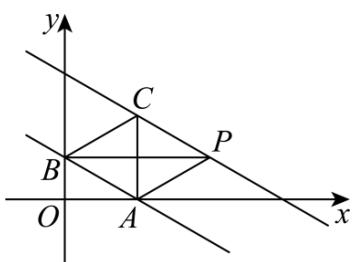

> [!faq]- 《第二章 直线和圆的方程（高效培优单元测试·强化卷）》官方解析
>
> > [!success]- **【答案】** $^{1}$
>
> > [!note]- **【解析】**
> > 如图所示：
> >
> > 
> >
> > 因为直线 $y = -\frac{\sqrt{3}}{3}x + 1$ 与 x 轴，y 轴分别交于点 A，B，
> >
> > 所以 $A\left(\sqrt{3},0\right)$ ， $B(0,1)$ ，所以 AB=2。
> >
> > 又 $\triangle ABP$ 和VABC的面积相等，
> >
> > 所以 $CP \parallel AB$ ，所以可设直线 CP 的方程为 $y = -\frac{\sqrt{3}}{3}x + c(c > 1)$ .
> >
> > 依题意，得点 $B$ 到直线 $CP$ 的距离为 $\sqrt{3}$ ，即 $\frac{|c - 1|}{\sqrt{1 + \frac{1}{3}}} = \sqrt{3}$ ，所以 $c = 3$ 或 $c = -1$ （舍），
> >
> > 所以直线 CP 的方程为 $y = -\frac{\sqrt{3}}{3}x + 3$ 又点 $P(2\sqrt{3}, m)$ 在直线 $y = -\frac{\sqrt{3}}{3}x + 3$ 上，
> >
> > 所以 $m = -\frac{\sqrt{3}}{3} \times 2\sqrt{3} + 3 = 1$ ，即 $m = 1 \cdot$
> >
> > 故答案为：1
> >
> > 14. 平面直角坐标系中，已知圆 $O_{1}$ 与圆 $O_{2}$ 交于点 $P$ 、 $Q$ 两点，其中 $P(3,2)$ 。两圆半径之积为 $\frac{13}{3}$ ，若两圆
> >
> > 均与直线 $l:y = kx$ 和 $x$ 轴相切，则直线 $l$ 的方程为
> >
> > 【答案】 $y = \sqrt{3} x$
> >
> > 【详解】由题意设两个圆的方程为 $\left(x - a_{i}\right)^{2} + \left(y - r_{i}\right)^{2} = r_{i}^{2}(i = 1,2)\left(a_{i} > 0,r_{i} > 0\right)$
> >
> > 依题意可得 $r_{1}r_{2}=\frac{13}{3}$ 且k>0.
> >
> > 因为两圆均过点 $P(3,2)$ ，所以 $\left(3-a_{i}\right)^{2}+\left(2-r_{i}\right)^{2}=r_{i}^{2}\Rightarrow a_{i}^{2}-6a_{i}+13-4r_{i}=0$ ①，
> >
> > 设 $l:y = kx$ 的倾斜角为 $\alpha \left(\alpha \in \left(0,\frac{\pi}{2}\right)\right)$ ，则 $k = \tan \alpha$ ， $\tan \frac{\alpha}{2} = \frac{r_i}{a_i} >0$
> >
> > 令 $t = \tan \frac{\alpha}{2} = \frac{r_{i}}{a_{i}}$ ，则 $a_{i} = \frac{r_{i}}{t}$ ．将其代入式①整理得 $r_{i}^{2} - 6tr_{i} - 4t^{2}r_{i} + 13t^{2} = 0$
> >
> > 由韦达定理可得 $r_{1}r_{2}=\frac{13}{3}=13t^{2}$ ，从而 $t=\frac{\sqrt{3}}{3}$ （负值已舍去），
> >
> > 所以 $k=\tan\alpha=\frac{2\tan\frac{\alpha}{2}}{1-\tan^{2}\frac{\alpha}{2}}=\frac{2t}{1-t^{2}}=\frac{2\times\frac{\sqrt{3}}{3}}{1-\left(\frac{\sqrt{3}}{3}\right)^{2}}=\sqrt{3}$
> >
> > 故直线 $l$ 的方程为 $y = \sqrt{3} x$
> >
> > 故答案为： $y = \sqrt{3} x$
> >
> > 四、解答题：本题共5小题，共77分。解答应写出文字说明、证明过程或演算步骤。
