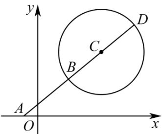

> [!faq]- 《第二章 直线和圆的方程（高效培优单元测试·强化卷）》官方解析
>
> > [!success]- **【答案】** $^{(1)}$ 最大值是 $\frac{9+2\sqrt{14}}{5}$ ，最小值为 $\frac{9-2\sqrt{14}}{5}$ (2)最小值 $6 - 2\sqrt{2}$ ，最大值 $6 + 2\sqrt{2}$
>
> > [!note]- **【解析】**
> > （1）
> >
> > 
> >
> > 圆 $x^{2} + y^{2} - 6x - 6y + 14 = 0$ 即为 $(x - 3)^{2} + (y - 3)^{2} = 4$
> >
> > 可得圆心为 $C(3,3)$ ，半径为 $r = 2$
> >
> > 设 $k=\frac{y}{x}$ ，即kx-y=0，
> >
> > 则圆心到直线的距离 $d \leq r$ ，即 $\frac{|3k - 3|}{\sqrt{1 + k^2}} \leq 2$
> >
> > 平方得 $5k^{2} - 18k + 5 \leq 0$ ，解得： $\frac{9 - 2\sqrt{14}}{5} \leq k \leq \frac{9 + 2\sqrt{14}}{5}$
> >
> > $y$ $9 + 2\sqrt{14}$ $9 - 2\sqrt{14}$
> >
> > 故 $x$ 的最大值是 5，最小值为 5
> >
> > (2) 方法 1: 圆 $x^{2} + y^{2} - 6x - 6y + 14 = 0$ 即为 $(x - 3)^{2} + (y - 3)^{2} = 4$
> >
> > 令 $x-3=2\cos a, y-3=2\sin a$
> >
> > $$
> > x + y = 6 + 2 (\cos a + \sin a) = 6 + 2 \sqrt {2} \sin \left(a + \frac {\pi}{4}\right)
> > $$
> >
> > $$
> > - 1 \leq \sin \left(a + \frac {\pi}{4}\right) \leq 1, \quad 6 - 2 \sqrt {2} \leq 6 + 2 \sqrt {2} \sin \left(a + \frac {\pi}{4}\right) \leq 6 + 2 \sqrt {2}
> > $$
> >
> > $\therefore x + 2$ 的最大值为 $6 + 2\sqrt{2}$ ，最小值为 $6 - 2\sqrt{2}$
> >
> > 方法 $^{2}$ ：设 $x + y = m$ ，则 $\left\{\begin{aligned}x^{2} + y^{2} - 6x - 6y + 14 &= 0 \\ x + y &= m\end{aligned}\right.$
> >
> > 化简整理得到 $2x^{2} - 2mx + m^{2} - 6m + 14 = 0$
> >
> > $\Delta = -4m^{2} + 48m - 112$ 0，解得 $6 - 2\sqrt{2}\leq m\leq 6 + 2\sqrt{2}$
> >
> > 故 $x + y$ 的最小值 $6 - 2\sqrt{2}$ ，最大值 $6 + 2\sqrt{2}$
