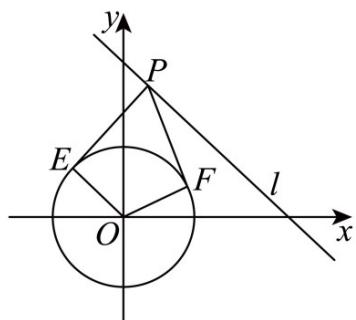

> [!faq]- 《第二章 直线和圆的方程（高效培优单元测试·强化卷）》官方解析
>
> > [!success]- **【答案】** (1) $\left(\sqrt{2},\sqrt{2}\right)$ (2)两圆相离
>
> > [!note]- **【解析】**
> > （1）解：由点 $P$ 在直线 $x + y - 2\sqrt{2} = 0$ 上，可设 $P(x, 2\sqrt{2} - x)$
> >
> > 又由圆 $C_{1}: x^{2} + y^{2} = 1$ 的圆心坐标为 $C(0,0)$ ，半径为 r = 1，
> >
> > 则圆心到直线 $l$ 的距离为 $d = 2$ ，可得 $d > r$ ，则直线 $l$ 与圆 $C_1$ 相离，
> >
> > 因为两条切线的夹角是 $60^{\circ}$ ，所以 $\angle EPF = 60^{\circ}$
> >
> > 则 $|OP|=2r=2$ ，即 $|OP|=2=\sqrt{x^{2}+\left(2\sqrt{2}-x\right)^{2}}$ ，解得 $x=\sqrt{2}$ ，
> >
> > 所以点 P 的坐标为 $\left(\sqrt{2},\sqrt{2}\right)$ .
> >
> > 
> >
> > (2) 解：设 $P(x,y)$ ，且 $A(-2,0)$ ， $B(4,0)$
> >
> > 因为 $\frac{|PA|}{|PB|}=2$ ，可得 $\frac{\sqrt{(x+2)^{2}+y^{2}}}{\sqrt{(x-4)^{2}+y^{2}}}=2$ ，化简得 $C_{2}:(x-6)^{2}+y^{2}=16$ ，
> >
> > 可得圆心距 $\left|C_{1}C_{2}\right|=\sqrt{36+0}=6$ ，此时 $\left|C_{1}C_{2}\right|>4+1$
> >
> > 所以圆 $C_{2}$ 与圆 $C_{1}$ 相离.
