<!-- source-part:1 pages:1-50 -->

## 第二章 直线和圆的方程

## 内容概览

# 教学目标、教学重难点

<table><tr><td>教学目标</td><td>1.在平面直角坐标系中,结合具体图形,探索确定直线位置的几何要素.2.理解直线的倾斜角和斜率的概念,经历用代数方法刻画直线斜率的过程,掌握过两点的直线斜率的计算公式.3.能根据斜率判定两条直线平行或垂直4.根据确定直线位置的几何要素,探索并掌握直线方程的几种形式(点斜式、两点式及一般式),体会斜截式与一次函数的关系.5.能用解方程组的方法求两直线的交点坐标.6.探索并掌握两点间的距离公式.7.探索并掌握点到直线的距离公式.8.会求两条平行直线间的距离.9.能根据给定圆的方程,判断圆与圆的位置关系.</td></tr><tr><td>教学重难点</td><td>1.重点能用直线和圆的方程解决一些简单的问题.体会用代数方法处理几何问题的思想2.难点确定圆的几何要素,在平面直角坐标系中,探索并掌握圆的标准方程与一般方程.</td></tr></table>

## 知识清单

## 知识点 01 直线的倾斜角和斜率

## 1. 倾斜角的定义

当直线 l 与 x 轴相交时，取 x 轴作为基准，x 轴正向与直线 l 向上的方向之间所成的角 $\alpha$ 叫做直线 l 的倾斜角．如图所示，直线 l 的倾斜角是 $\angle APx$ ，直线 $l'$ 的倾斜角是 $\angle BPx$ .

## 2. 倾斜角的范围

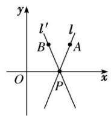

直线的倾斜角 $\alpha$ 的取值范围是 $0^{\circ} \leq \alpha < 180^{\circ}$ ，并规定与 $x$ 轴平行或重合的直线的倾斜

为 $0^{\circ}$

注：①每一条直线都有一个确定的倾斜角

②已知直线上一点和该直线的倾斜角，可以唯一确定该直线

3. 斜率的定义

一条直线的倾斜角 $\alpha$ 的正切值叫做这条直线的斜率．常用小写字母 $k$ 表示，即 $k = \tan \alpha (\alpha \neq 90^{\circ})$

4. 斜率公式

经过两点 $P_{1}(x_{1},y_{1})$ ， $P_{2}(x_{2},y_{2})(x_{1}\neq x_{2})$ 的直线的斜率公式为 $k = .$ 当 $x_{1} = x_{2}$ 时，直线 $P_{1}P_{2}$ 没有斜率.【即学即练】

1. 设直线 $l$ 的方程为 $x - y\cos \theta + 2 = 0$ ，则直线 $l$ 的倾斜角 $\alpha$ 的取值范围是（）A. $[0, \pi]$ B. $\left[\frac{\pi}{4}, \frac{\pi}{2}\right]$ C. $\left[\frac{\pi}{4}, \frac{3\pi}{4}\right]$ D. $\left[\frac{\pi}{4}, \frac{\pi}{2}\right) \cup \left(\frac{\pi}{2}, \frac{3\pi}{4}\right]$

【答案】C

【详解】当 $\cos\theta=0$ 时，直线 l 的方程为 x=-2 ，此时直线 l 的倾斜角 $\alpha=\frac{\pi}{2}$ ；

当 $\cos \theta \neq 0$ 时，直线 $l$ 的斜率为 $\tan \alpha = \frac{1}{\cos \theta}$

因为 $\cos \theta \in [-1,0)\cup (0,1]$

所以 $\frac{1}{\cos\theta}\in (-\infty , - 1]\cup [1, + \infty)$ ，即 $\tan \alpha \in (-\infty , - 1]\cup [1, + \infty)$

又因为 $\alpha \in [0,\pi)$

所以结合正切函数的图象可得： $\alpha \in \left[\frac{\pi}{4},\frac{\pi}{2}\right)\cup \left(\frac{\pi}{2},\frac{3\pi}{4}\right]$

综上可得：直线 $l$ 的倾斜角 $\alpha$ 的取值范围是 $\left[\frac{\pi}{4},\frac{3\pi}{4}\right]$

故选：C.

2. 已知点 $A(2, -3)$ 、 $B(-3, -2)$ ，若过定点 $P(1, 1)$ 的直线 $l$ 与线段 $AB$ 相交，则直线 $l$ 的斜率 $k$ 的取值范围是（）A. $(- \infty, -4] \cup \left[\frac{3}{4}, +\infty\right)$ B. $\left[-4, \frac{3}{4}\right]$ C. $\left(\frac{1}{5}, +\infty\right)$ D. $\left[-\frac{3}{4}, 4\right]$

【答案】A

【详解】设过点 P 且垂直于 x 轴的直线交线段 AB 于点 E，如下图所示：

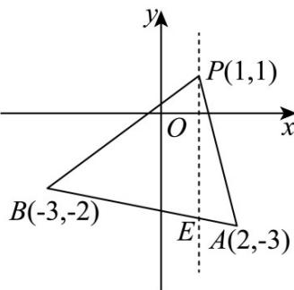

$$
k _ {P A} = \frac {1 + 3}{1 - 2} = - 4
$$

$$
k _ {P B} = \frac {1 + 2}{1 + 3} = \frac {3}{4}
$$

当直线 l 从 PB 的位置旋转至与 PE 的位置靠近时，
此时直线 l 的倾斜角逐渐增大，且为锐角，则 $k \quad k_{PB} = \frac{3}{4}$ ；
当直线 l 从靠近 PE 的位置旋转至 PA 的位置时，
此时直线 l 的倾斜角逐渐增大，且为钝角，则 $k \leq k_{PA} = -4$ .
综上所述，直线 l 的斜率 k 的取值范围是 $(-\infty, -4] \cup \left[\frac{3}{4}, +\infty\right)$

故选：A.

知识点 02 直线的五种方程

<table><tr><td>名称</td><td>条件</td><td>方程</td><td>图形</td><td>适用范围</td></tr><tr><td>点斜式</td><td>直线1过定点 $P(x_0,y_0)$ ,斜率为k</td><td> $y - y_0 = k(x - x_0)$ </td><td>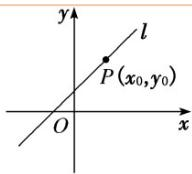</td><td>不表示垂直于x轴的直线</td></tr><tr><td>斜截式</td><td>直线1的斜率为k,且与y轴的交点为(0,b)(直线1与y轴的交点(0,b)的纵坐标b叫做直线1在y轴上的截距)</td><td> $\underline{y = kx + b}$ </td><td>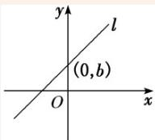</td><td>不表示垂直于x轴的直线</td></tr><tr><td>两点式</td><td> $P_1(x_1,y_1)$ 和 $P_2(x_2,y_2)$ 其中 $x_1 \neq x_2$ , $y_1 \neq y_2$ </td><td>=</td><td></td><td>不表示垂直于坐标轴的直线</td></tr><tr><td>截距式</td><td>在x轴上截距a,在y轴上截距b</td><td>+=1</td><td></td><td>不表示垂直于坐标轴的直线及过原点的直线</td></tr><tr><td>一般式</td><td>A,B,C为系数</td><td>Ax+By+C=0( $A^2+B^2 \neq 0$ )</td><td></td><td>任何位置的直线</td></tr></table>

## 【即学即练】

1. 我们把点 $P$ 到图形 $C$ 上任意一点距离的最小值称为点 $P$ 到图形 $C$ 的距离，记作 $d(P, C)$ . 若图形 $C$ 的方程

是 $\frac{|x|}{4} +\frac{|y|}{4} = 1$ ，则点集 $D = \{P\big|d(P,C)\leq 1\}$ 所表示的图形的面积是

【答案】 $32\sqrt{2} - 4 + \pi$

【详解】图形 C 的方程是 $\frac{|x|}{4} + \frac{|y|}{4} = 1$ ，这是在 x, y 轴上截距的绝对值都为 4 的封闭图形，

则图形 $C$ 为正方形ABCD，边长为 $4\sqrt{2}$

点集 $D = \{P \mid d(P, C) \leq 1\}$ ，其图形是正方形 $ABCD$ 往内外膨胀 1 个单位，可得到图形如下：

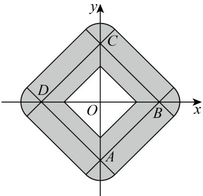

则其面积 $S = \left(4\sqrt{2}\right)^{2} - 4 \times \frac{1}{2} \times \left(4 - \sqrt{2}\right)^{2} + 4 \times 4\sqrt{2} \times 1 + 4 \times \frac{1}{4} \pi \times 1^{2} = 32\sqrt{2} - 4 + \pi$

故答案为： $32\sqrt{2} - 4 + \pi$

2．已知直线 l 倾斜角的余弦值为 $-\frac{\sqrt{5}}{5}$ ，且经过点 $(2,1)$ ，则直线 l 的方程为 \_\_\_\_。

【答案】 $2x + y - 5 = 0$

【详解】设直线的倾斜角为 $\alpha$ ，由题意知 $\cos \alpha = -\frac{\sqrt{5}}{5}$

则 $\sin \alpha = \sqrt{1 - \cos^2\alpha} = \frac{2\sqrt{5}}{5}$

所以 $k = \tan \alpha = \frac{\sin\alpha}{\cos\alpha} = -2$

又直线过点 $(2,1)$

所以直线方程为 $y - 1 = -2(x - 2)$

即直线方程为 $2x + y - 5 = 0$

故答案为： $2x + y - 5 = 0$

## 知识点 03 两条直线平行和垂直

1. 对于两条不重合的直线 $l_{1}, l_{2}$ ，其斜率分别为 $k_{1}, k_{2}$ ，有 $l_{1} \| l_{2} \Leftrightarrow k_{1} = k_{2}$ .

注：（1） $l_{1}\|l_{2}\Leftrightarrow k_{1}=k_{2}$ 成立的前提条件是：①两条直线的斜率都存在．② $l_{1}$ 与 $l_{2}$ 不重合．

(2) 当两条直线不重合且斜率都不存在时， $l_{1}$ 与 $l_{2}$ 的倾斜角都是 $90^{\circ}$ ，则 $l_{1} \parallel l_{2}$ .

(3) 两条不重合直线平行的判定的一般结论是： $l_{1} \parallel l_{2} \Leftrightarrow k_{1} = k_{2}$ 或 $l_{1}$ ， $l_{2}$ 斜率都不存在.

2．如果两条直线都有斜率，且它们互相垂直，那么它们的斜率之积等于-1；反之，如果它们的斜率之积等于-1，那么它们互相垂直，即 $l_{1}\perp l_{2}\Leftrightarrow k_{1}\cdot k_{2}=-1$ .

注：（1） $l_{1}\bot l_{2}\Leftrightarrow k_{1}\cdot k_{2} = -1$ 成立的前提条件是：①两条直线的斜率都存在．② $k_{1}\neq 0$ 且 $k_{2}\neq 0$

(2) 两条直线中，一条直线的斜率不存在，同时另一条直线的斜率等于零，则两条直线垂直。

(3) 判定两条直线垂直的一般结论为：

$l_{1} \perp l_{2} \Leftrightarrow k_{1} \cdot k_{2} = -1$ 或一条直线的斜率不存在，同时另一条直线的斜率等于零.

## 3. 利用直线的斜截式方程解决直线平行与垂直问题的策略

已知直线 $l_{1}:y = k_{1}x + b_{1}$ 与直线 $l_{2}:y = k_{2}x + b_{2}$

(1) 若 $l_{1} \| l_{2}$ ，则 $k_{1} = k_{2}$ ，此时两直线与 $y$ 轴的交点不同，即 $b_{1} \neq b_{2}$ ；反之 $k_{1} = k_{2}$ ，且 $b_{1} \neq b_{2}$ 时， $l_{1} \| l_{2}$ . 所以有 $l_{1} \| l_{2} \Leftrightarrow k_{1} = k_{2}$ ，且 $b_{1} \neq b_{2}$ .

(2)若 $l_{1} \perp l_{2}$ , 则 $k_{1} \cdot k_{2} = -1$ ; 反之 $k_{1} \cdot k_{2} = -1$ 时, $l_{1} \perp l_{2}$ . 所以有 $l_{1} \perp l_{2} \Leftrightarrow k_{1} \cdot k_{2} = -1$ .

4．若已知含参数的两条直线平行或垂直，求参数的值时，要注意讨论斜率是否存在，若是平行关系注意考虑 $b_{1}\neq b_{2}$ 这个条件．

## 5. 利用一般式解决直线平行与垂直问题的策略

直线 $l_{1}: A_{1}x + B_{1}y + C_{1} = 0$ ，直线 $l_{2}: A_{2}x + B_{2}y + C_{2} = 0$ ，

(1) 若 $l_{1} \| l_{2} \Leftrightarrow A_{1} B_{2} - A_{2} B_{1} = 0$ 且 $B_{1} C_{2} - B_{2} C_{1} \neq 0$ (或 $A_{1} C_{2} - A_{2} C_{1} \neq 0$ ).

(2) 若 $l_{1} \perp l_{2} \Leftrightarrow A_{1}A_{2} + B_{1}B_{2} = 0.$

## 6. 与已知直线平行(垂直)的直线方程的求法

（1）由已知直线求出斜率，再利用平行(垂直)的直线斜率之间的关系确定所求直线的斜率，由点斜式写方程.

（2）①可利用如下待定系数法：与直线 $Ax + By + C = 0(A, B$ 不同时为0)平行的直线方程可设为 $Ax + By + C_1 = 0(C_1 \neq C)$ ，再由直线所过的点确定 $C_1$ ；

②与直线 $Ax + By + C = 0 (A, B$ 不同时为0)垂直的直线方程可设为 $Bx - Ay + C_2 = 0$ ，再由直线所过的点确定

$C_{2}.$

【即学即练】

1. 已知关于 $x, y$ 的方程组 $\left\{ \begin{array}{l} mx - 2y + 1 = 0 \\ x - (m + 1)y + 1 = 0 \end{array} \right.$ 无解，则实数 $m$ 的值为

【答案】-2

【详解】方程组 $\left\{ \begin{array}{l}mx - 2y + 1 = 0\\ x - (m + 1)y + 1 = 0 \end{array} \right.$ 无解，

等价于直线 $mx - 2y + 1 = 0$ 与直线 $x - (m + 1)y + 1 = 0$ 平行，

可得： $-m(m+1)=-2$

解得：m = -2 或 m = 1 ，

当 $m = 1$ 时，直线方程分别为： $x - 2y + 1 = 0$ 和 $x - 2y + 1 = 0$ 重合舍去，

当 $m = -2$ 时，直线方程分别为： $-2x - 2y + 1 = 0$ 和 $x + y + 1 = 0$ ，平行，

故 m = -2 ，

故答案为：-2

2. 若直线 $l_{1}: 2x + y + a = 0$ 与直线 $l_{2}: x - by + 3 = 0$ 垂直，则 $b =$ \_\_\_\_.

【答案】2

【详解】直线 $l_{1}:2x+y+a=0$ 与直线 $l_{2}:x-by+3=0$ 垂直，则 $2\times1+1\times(-b)=0$ ，解得 b=2

故答案为：2.

知识点 04 两直线的交点坐标及两点间的距离公式

1、已知两条直线的方程是 $l_{1}: A_{1}x + B_{1}y + C_{1} = 0, l_{2}: A_{2}x + B_{2}y + C_{2} = 0$ ，设这两条直线的交点为 $P$ ，则点 $P$ 既在直线 $l_{1}$ 上，也在直线 $l_{2}$ 上．所以点 $P$ 的坐标既满足直线 $l_{1}$ 的方程 $A_{1}x + B_{1}y + C_{1} = 0$ ，也满足直线 $l_{2}$ 的方程 $A_{2}x + B_{2}y + C_{2} = 0$ ，即点 $P$ 的坐标就是方程组的解．

2、直线 $l_{1}:A_{1}x + B_{1}y + C_{1} = 0$ 和直线 $l_{2}:A_{2}x + B_{2}y + C_{2} = 0$ 的位置关系如表所示：

<table><tr><td>方程组的解</td><td>一组</td><td>无数组</td><td>无解</td></tr><tr><td>直线 $I_1$ 与 $I_2$ 的公共点个数</td><td>一个</td><td>无数个</td><td>零个</td></tr><tr><td>直线 $I_1$ 与 $I_2$ 的位置关系</td><td>相交</td><td>重合</td><td>平行</td></tr></table>

3．公式：点 $P_{1}(x_{1},y_{1})$ ， $P_{2}(x_{2},y_{2})$ 间的距离公式 $\left|P_1P_2\right| =$

原点 $O(0,0)$ 与任一点 $P(x,y)$ 的距离 $|OP| =$

【即学即练】

1. 在 $\mathrm{VABC}$ 中，已知 $C(2,6)$ ， $\angle A$ 的平分线所在直线方程是 $x - y = 0$ ， $BC$ 边上的高所在直线是

【答案】

$2x - y + 1 = 0$ ，则点 B 的坐标为 \_\_\_\_。

【答案】 $\left(\frac{106}{13},\frac{38}{13}\right)$

【详解】由 $\left\{\begin{aligned}x-y=0\\ 2x-y+1=0\end{aligned}\right.$ 解得 $\left\{\begin{aligned}x=-1\\ y=-1\end{aligned}\right.$ ，所以 $A(-1,-1)$ .

因为 $\angle A$ 的平分线所在直线方程是 $x - y = 0$ ，所以点 $C(2,6)$ 关于直线 $x - y = 0$ 的对称点 $C'(6,2)$ 在 $AB$ 所在直

线上，

所以直线 AB 的方程为 $y+1=\frac{2-(-1)}{6-(-1)}(x+1)$ ，整理得 3x-7y-4=0。

又 $BC$ 边上的高所在直线是 $2x - y + 1 = 0$ ，其斜率为 $2$ ，所以直线 $BC$ 的斜率为 $-\frac{1}{2}$

所以直线 BC 的方程为 $y-6=-\frac{1}{2}(x-2)$ ，整理得 $x+2y-14=0$ 。

由 $\left\{\begin{aligned}3x-7y-4=0\\ x+2y-14=0\end{aligned}\right.$ ，解得 $\left\{\begin{aligned}x=\frac{106}{13}\\ y=\frac{38}{13}\end{aligned}\right.$ ，所以则点 的坐标为 $\left(\frac{106}{13},\frac{38}{13}\right)$ .

故答案为： $\left(\frac{106}{13},\frac{38}{13}\right)$ .

2．已知直线 $l_{1}$ ： $x+my-2=0$ 与直线 $l_{2}$ ： $mx+y+2=0$ 平行，其中 $m\in R$ ，则直线 $l_{1}$ 与 $l_{2}$ 之间的距离等于\_\_\_\_。

【答案】 $2 \sqrt{2}$

【详解】由题意，直线 $l_{1}//l_{2}$ ，则 $m^{2}=1$ 且 $-2m\neq2$ ，所以m=1。

所以 $l_{1}: x + y - 2 = 0$ 与直线 $l_{2}: x + y + 2 = 0$ 之间的距离 $d = \frac{|2 - (-2)|}{\sqrt{1 + 1}} = 2\sqrt{2}$ .

故答案为： $2\sqrt{2}$

## 知识点 05 直线系过定点问题

1. 平行于直线 $Ax + By + C = 0$ 的直线系方程为 $Ax + By + \lambda = 0 (\lambda \neq C)$ .

2. 垂直于直线 $Ax + By + C = 0$ 的直线系方程为 $Bx - Ay + \lambda = 0$ .

3. 过两条已知直线 $A_{1}x + B_{1}y + C_{1} = 0$ ， $A_{2}x + B_{2}y + C_{2} = 0$ 交点的直线系方程为 $A_{1}x + B_{1}y + C_{1} + \lambda (A_{2}x + B_{2}y + C_{2}) = 0$ （不包括直线 $A_{2}x + B_{2}y + C_{2} = 0$ ）.

【即学即练】

1．已知：直线 $l: mx + y - 1 = 0$ ，圆 $C: x^{2} + y^{2} = n (m, n \in R)$ ，则直线 l 过定点 \_\_\_\_；若直线 l 与圆 C 恒有公

共点，则 $n$ 的取值范围是

【答案】(0,1) [1,+∞)

【详解】根据 $l: mx + y - 1 = 0$ ，令 x = 0，得 y = 1，所以直线 l 过定点 $(0, 1)$ ；

直线 l 与圆 $C: x^{2} + y^{2} = n$ 恒有公共点，等价于点 $(0, 1)$ 在圆内或圆上，

所以有 $0^{2} + 1^{2}\leq n$ ，即 $n = 1$

故答案为：①(0,1)；② $[1,+\infty)$ .

2．已知直线 $l:(3k+1)x+(1-k)y-4k-4=0$ ，圆 C 的方程为： $x^{2}+y^{2}-6x-8y=0$ ，则直线 l 恒过定点 \_\_\_\_

【答案】

；若直线与圆相较于A，B两点，则弦 $\left|AB\right|$ 长度的最小值=\_\_\_\_；

【答案】 (2,2) $4\sqrt{5}$

【详解】∵ $(3k+1)x+(1-k)y-4k-4=0$

$$
\therefore (3 x - y - 4) k + x + y - 4 = 0
$$

$$
\text {则} \left\{ \begin{array}{l l} 3 x - y - 4 = 0 \\ x + y - 4 = 0 \end{array} \right. \Rightarrow \left\{ \begin{array}{l l} x = 2 \\ y = 2 \end{array} \right.
$$

所以直线 l 恒过定点 $M(2,2)$ .

$$
Q x ^ {2} + y ^ {2} - 6 x - 8 y = 0 \therefore (x - 3) ^ {2} + (y - 4) ^ {2} = 2 5 \therefore C (3, 4), r = 5
$$

当直线与CM垂直时，

弦 $\left|AB\right|$ 最短， $\left|AB\right|$ 最小值 $2\sqrt{r^{2}-CM^{2}}=2\sqrt{25-5}=4\sqrt{5}$

故答案为： $(2,2)$ ， $4\sqrt{5}$ .

## 知识点 06 圆的方程

## 一、圆的标准方程

1. 圆的定义：平面上到定点的距离等于定长的点的集合叫做圆，定点称为圆心，定长称为圆的半径。

2．圆的要素：是圆心和半径，圆心确定圆的位置，半径确定圆的大小．如图所示．

3. 圆的标准方程：圆心为 $A(a, b)$ ，半径长为 $r$ 的圆的标准方程是 $(x - a)^2 + (y - b)^2 = r^2$ . 当 $a = b = 0$ 时，方程为 $x^2 + y^2 = r^2$ ，表示以原点为圆心、半径为 $r$ 的圆。

## 二、圆的标准方程

## 1. 圆的一般方程的概念

当 $D^2 + E^2 - 4F > 0$ 时，二元二次方程 $x^2 + y^2 + Dx + Ey + F = 0$ 叫做圆的一般方程。

注：将方程 $x^{2} + y^{2} + Dx + Ey + F = 0$ ，配方可得 ${ }^{2} + { }^{2} =$ ，当 $D^2 + E^2 - 4F > 0$ 时，方程 $x^{2} + y^{2} + Dx + Ey + F = 0$ 表示圆．当 $D^2 + E^2 - 4F = 0$ 时，方程 $x^{2} + y^{2} + Dx + Ey + F = 0$ ，表示一个点.

## 2. 圆的一般方程对应的圆心和半径

圆的一般方程 $x^{2} + y^{2} + Dx + Ey + F = 0(D^{2} + E^{2} - 4F > 0)$ 表示的圆的圆心为，半径长为。

注：圆的一般方程表现出明显的代数结构形式，其方程是一种特殊的二元二次方程，圆心和半径长需要代数运算才能得出，且圆的一般方程 $x^{2} + y^{2} + Dx + Ey + F = 0$ （其中 $D, E, F$ 为常数)具有以下特点：

(1) $x^{2}$ ， $y^{2}$ 项的系数均为1；

(2)没有 $xy$ 项；

(3) $D^{2}+E^{2}-4F>0.$

## 3. 常见圆的方程的设法

<table><tr><td></td><td>标准方程的设法</td><td>一般方程的设法</td></tr><tr><td>圆心在原点</td><td> $x^{2} + y^{2} = r^{2}$ </td><td> $x^{2} + y^{2} - r^{2} = 0$ </td></tr><tr><td>过原点</td><td> $(x - a)^{2} + (y - b)^{2} = a^{2} + b^{2}$ </td><td> $x^{2} + y^{2} + Dx + Ey = 0$ </td></tr><tr><td>圆心在x轴上</td><td> $(x - a)^{2} + y^{2} = r^{2}$ </td><td> $x^{2} + y^{2} + Dx + F = 0$ </td></tr><tr><td>圆心在y轴上</td><td> $x^{2} + (y - b)^{2} = r^{2}$ </td><td> $x^{2} + y^{2} + Ey + F = 0$ </td></tr><tr><td>与x轴相切</td><td> $(x - a)^{2} + (y - b)^{2} = b^{2}$ </td><td> $x^{2} + y^{2} + Dx + Ey + D^{2} = 0$ </td></tr><tr><td>与y轴相切</td><td> $(x - a)^{2} + (y - b)^{2} = a^{2}$ </td><td> $x^{2} + y^{2} + Dx + Ey + E^{2} = 0$ </td></tr></table>

4. 二元二次方程 $Ax^2 + Bxy + Cy^2 + Dx + Ey + F = 0$ 表示圆，则

5. 以 $A(x_{1}, y_{1}), B(x_{2}, y_{2})$ 为直径端点的圆的方程为 $(x - x_{1})(x - x_{2}) + (y - y_{1})(y - y_{2}) = 0$ .

## 【即学即练】

1. VABC 三个顶点的坐标分别是 $A(1,1)$ ， $B(4,2)$ ， $C(3,0)$ ，则 VABC 外接圆方程是（）

【答案】
A. $x^{2} + y^{2} - 5x - 3y + 6 = 0$ B. $x^{2} + y^{2} - 3x - 5y + 6 = 0$ C. $x^{2} + y^{2} - 3x - 5y - 6 = 0$ D. $x^{2} + y^{2} - 5x - 3y - 6 = 0$

【答案】A

【详解】依题意，直线 $AC$ 斜率 $k_{AC} = \frac{0 - 1}{3 - 1} = -\frac{1}{2}$ ，直线 $BC$ 斜率 $k_{BC} = \frac{0 - 2}{3 - 4} = 2$ ，有 $k_{AC} \cdot k_{BC} = -1$ ，即 $AC \perp BC$ ，因此VABC外接圆是以线段 $AB$ 为直径的圆， $AB$ 的中点为 $\left(\frac{5}{2}, \frac{3}{2}\right)$ ，半径 $r = \frac{1}{2} |AB| = \frac{\sqrt{10}}{2}$ ，所以VABC外接圆方程是 $\left(x - \frac{5}{2}\right)^2 + \left(y - \frac{3}{2}\right)^2 = \left(\frac{\sqrt{10}}{2}\right)^2$ ，即 $x^2 + y^2 - 5x - 3y + 6 = 0$ 。

故选：A

2．平面几何中有一个著名的定理：VABC 的三条高线的垂足、三边中点及三个顶点与垂心连线段的中点共圆，
该圆称为 VABC 的九点圆或欧拉圆，若 $A(-2,1)$ 、 $B(4,1)$ ，VABC 的垂心为 $G(3,3)$ ，则 VABC 的九点圆的标准方程为（）

A. $(x-2)^{2}+\left(y+\frac{17}{8}\right)^{2}=\frac{145}{64}$ B. $(x+2)^{2}+\left(y+\frac{17}{8}\right)^{2}=\frac{145}{64}$ C. $(x-2)^{2}+\left(y-\frac{17}{8}\right)^{2}=\frac{145}{64}$ D. $(x+2)^{2}+\left(y-\frac{17}{8}\right)^{2}=\frac{145}{64}$

【答案】C

【详解】由 $A(-2,1)$ ， $B(4,1)$ ， $G(3,3)$ ，可得 $AB$ 中点为 $D(1,1)$ ， $AG$ 中点为 $E\left(\frac{1}{2},2\right)$ ， $BG$ 中点为 $F\left(\frac{7}{2},2\right)$ ，设VABC的九点圆方程为 $x^{2} + y^{2} + mx + ny + t = 0$ ，

代入 、 、 三点坐标，可得 $\left\{ \begin{array}{l}1 + 1 + m + n + t = 0\\ \frac{1}{4} +4 + \frac{1}{2} m + 2n + t = 0\\ \frac{49}{4} +4 + \frac{7}{2} m + 2n + t = 0 \end{array} \right.$

解得 $m = -4$ ， $n = -\frac{17}{4}$ ， $t = \frac{25}{4}$ ，即 $x^{2} + y^{2} - 4x - \frac{17}{4} y + \frac{25}{4} = 0$

化简可得圆的标准方程为 $\left(x - 2\right)^2 +\left(y - \frac{17}{8}\right)^2 = \frac{145}{64}$

故选：C.

## 知识点 07 直线与圆的位置关系

## 一、直线与圆的位置关系及判断

<table><tr><td colspan="2">位置关系</td><td>相交</td><td>相切</td><td>相离</td></tr><tr><td rowspan="2">判定方法</td><td>几何法:设圆心到直线的距离d=</td><td> $d < r$ </td><td>d=r</td><td>d&gt;r</td></tr><tr><td>代数法:由消元得到一元二次方程的判别式Δ</td><td>Δ&gt;0</td><td>Δ=0</td><td>Δ&lt;0</td></tr></table>

## 二、直线与圆相交的相关问题

## 1. 解决圆的弦长问题的方法

<table><tr><td>几何法(常用)</td><td>如图所示,设直线l被圆C截得的弦为AB,圆的半径为r,圆心到直线的距离为d,则有关系式: |AB| = 2</td></tr><tr><td>代数法</td><td>若斜率为k的直线与圆相交于A(xA,yA),B(xB,yB)两点,则|AB|=·=·|yA-yB|(其中k≠0).特别地,当k=0时,|AB|=|xA-xB|;当斜率不存在时,|AB|=|yA-yB|注:直线l: Ax+By+C=0;圆Mx2+y2+Dx+Ey+F=0联立{Ax+By+C=0x2+y2+Dx+Ey+F=0消去“”得到关于“”的一元二次函数ax2+bx+c=0,结合韦达定理可得到xA+xB,xAXB</td></tr></table>

2．当直线与圆相交时，半径、半弦、弦心距所构成的直角三角形(如图中的 Rt△ADC)，在解题时要注意把它和点到直线的距离公式结合起来使用．

3. 设圆心到直线的距离为 $d$ ，圆的半径为 $r$ ；当直线与圆相交时，圆上的点到直线的最大距离为 $d + r$ ，最小距离为 0

## 三、直线与圆相切的相关问题

1. 求过某点的圆的切线问题时，应首先确定点与圆的位置关系，再求切线方程。若点在圆上（即为切点），则过该点的切线只有一条；若点在圆外，则过该点的切线有两条，此时应注意切线斜率不存在的情况。（注：过圆内一点，不能作圆的切线）

## 2. 求过圆上的一点 $(x_0, y_0)$ 的切线方程的方法

先求切点与圆心连线的斜率 $k$ ，若 $k$ 不存在，则结合图形可直接写出切线方程为 $y = y_0$ ；若 $k = 0$ ，则结合图形可直接写出切线方程为 $x = x_0$ ；若 $k$ 存在且 $k \neq 0$ ，则由垂直关系知切线的斜率为 -，由点斜式可写出切线方程。

## 3. 求过圆外一点 $(x_0, y_0)$ 的圆的切线方程的方法

<table><tr><td>几何法</td><td>当斜率存在时,设为k,则切线方程为 $y - y_0 = k(x - x_0)$ ,即 $kx - y + y_0 - kx_0 = 0$ .由圆心到直线的距离等于半径,即可求出k的值,进而写出切线方程</td></tr><tr><td>代数法</td><td>当斜率存在时,设为k,则切线方程为 $y - y_0 = k(x - x_0)$ ,即 $y = kx - kx_0 + y_0$ ,代入圆的方程,得到一个关于x的一元二次方程,由 $\Delta = 0$ ,求得k,切线方程即可求出</td></tr></table>

## 4. 圆的切线方程常用结论

(1)过圆 $x^{2} + y^{2} = r^{2}$ 上一点 $P(x_{0}, y_{0})$ 的圆的切线方程为 $x_{0}x + y_{0}y = r^{2}$ .

(2)过圆 $(x - a)^{2} + (y - b)^{2} = r^{2}$ 上一点 $P(x_0, y_0)$ 的圆的切线方程为 $\underline{(x_0 - a)(x - a)} + (y_0 - b)(y - b) = r^2$ .

(3)过圆 $x^{2} + y^{2} = r^{2}$ 外一点 $M(x_0,y_0)$ 作圆的两条切线，则两切点所在直线方程为 $\underline{x_0x + y_0y = r^2}$

5.切线长公式

记圆 $C:(x - a)^2 +(y - b)^2 = r^2$ ；过圆外一点 $P$ 做圆 $C$ 的切线，切点为 $H$ ，利用勾股定理求 $PH$ ； $PH = \sqrt{PC^2 - CH^2}$

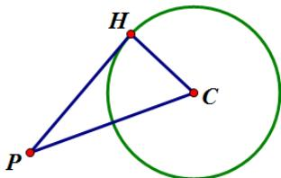

6. 设圆心到直线的距离为 $d$ ，圆的半径为 $r$ ；当直线与圆相切时，圆上的点到直线的最大距离为 $2r$ ，最小距离为 0

## 四、直线与圆相离的相关问题

设圆心到直线的距离为 $d$ ，圆的半径为 $r$ ；当直线与圆相离时，圆上的点到直线的最大距离为 $d + r$ ，最小距离为 $d - r$ ；

【即学即练】

1. 已知圆 $C: x^2 + y^2 - 2x + 4y + 1 = 0$ 的圆心在直线 $ax - by - 1 = 0$ 上，则 $ab$ 的取值范围是（）A. $\left(-\infty, \frac{1}{4}\right]$ B. $\left(-\infty, \frac{1}{8}\right]$ C. $\left(0, \frac{1}{4}\right]$ D. $\left(0, \frac{1}{8}\right]$

【答案】B

【详解】法一：由题设 $C:(x-1)^{2}+(y+2)^{2}=4$ ，故圆心 $C(1,-2)$

因为圆心 $C$ 在直线 $ax - by - 1 = 0$ 上，所以 $a + 2b - 1 = 0$ ，即 $a = 1 - 2b$

因为 $ab=(1-2b)b=-2b^{2}+b=-2\left(b-\frac{1}{4}\right)^{2}+\frac{1}{8}$

所以当 $b=\frac{1}{4}$ 时，ab 有最大值 $\frac{1}{8}$ ，即 ab 的取值范围为 $\left(-\infty,\frac{1}{8}\right]$ ;

法二：因为圆心 $C$ 在直线 $ax - by - 1 = 0$ 上，所以 $a + 2b - 1 = 0$ ，即 $a + 2b = 1$

又因为 $ab = \frac{1}{2} a\cdot (2b)\leq \frac{1}{2}\cdot \left(\frac{a + 2b}{2}\right)^2 = \frac{1}{8}$ ，当且仅当 $\left\{ \begin{array}{ll}a = 2b\\ a + 2b = 1 \end{array} \right.$ ，即 $\left\{ \begin{array}{ll}a = \frac{1}{2}\\ b = \frac{1}{4} \end{array} \right.$ 时取等号.

故选：B

2. 经过点 $\left(0,0\right)$ ，半径为 2 的圆的圆心为 $A$ ，则点 $A$ 到直线 $x-y+2=0$ 的距离最大值为（）

【答案】
A. $\sqrt{2}$ B. $2+\sqrt{2}$ C. $2-\sqrt{2}$ D. $3\sqrt{2}$

【答案】B

【详解】已知圆经过点 $(0,0)$ ，半径为2，设圆心A的坐标为 $(x,y)$

可得圆心A到点 $(0,0)$ 的距离为2，

即 $\sqrt{(x - 0)^2 + (y - 0)^2} = 2$ ，化简可得 $x^{2} + y^{2} = 4$

所以圆心A的轨迹是以原点 $(0,0)$ 为圆心，2为半径的圆.

可得原点 $(0,0)$ 到直线 $x - y + 2 = 0$ 的距离为： $d_0 = \frac{|0 - 0 + 2|}{\sqrt{1^2 + (-1)^2}} = \sqrt{2}$

所以点A到直线 $x - y + 2 = 0$ 的距离最大值为原点到直线的距离加上圆的半径，即 $d_{\mathrm{max}} = \sqrt{2} + 2$

## 知识点 08 圆与圆的位置关系

## 一、圆与圆位置关系的判定

1. 种类：圆与圆的位置关系有五种，分别为外离、外切、相交、内切、内含。

2. 判定方法

(1)几何法：若两圆的半径分别为 $r_1, r_2$ ，两圆连心线的长为 $d$ ，则两圆的位置关系的判断方法如下：

<table><tr><td>位置关系</td><td>外离</td><td>外切</td><td>相交</td><td>内切</td><td>内含</td></tr><tr><td>图示</td><td>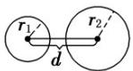</td><td></td><td>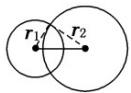</td><td>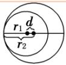</td><td></td></tr><tr><td>d与r1,r2的关系</td><td>d&gt;r1+r2</td><td>d=r1+r2</td><td>|r1-r2| &lt; d &lt; r1+r2</td><td>d=|r1-r2|</td><td>d&lt;|r1-r2|</td></tr></table>

(2)代数法：设两圆的一般方程为

$$
C _ {1}: x ^ {2} + y ^ {2} + D _ {1} x + E _ {1} y + F _ {1} = 0 (D + E - 4 F _ {1} > 0),
$$

$$
C _ {2}: x ^ {2} + y ^ {2} + D _ {2} x + E _ {2} y + F _ {2} = 0 (D + E - 4 F _ {2} > 0),
$$

联立方程得则方程组解的个数与两圆的位置关系如下：

<table><tr><td>方程组解的个数</td><td>2 组</td><td>1 组</td><td>0 组</td></tr><tr><td>两圆的公共点个数</td><td>2 个</td><td>1 个</td><td>0 个</td></tr><tr><td>两圆的位置关系</td><td>相交</td><td>内切或外切</td><td>外离或内含</td></tr></table>

## 二、圆与圆位置关系的应用

设圆 $C_1: x^2 + y^2 + D_1x + E_1y + F_1 = 0$ ，①

圆 $C_2: x^2 + y^2 + D_2x + E_2y + F_2 = 0$ ，②

若两圆相交，则有一条公共弦，由①-②，得

$$
(D _ {1} - D _ {2}) x + (E _ {1} - E _ {2}) y + F _ {1} - F _ {2} = 0. \tag {③}
$$

方程③表示圆 $C_1$ 与 $C_2$ 的公共弦所在直线的方程.

(1)当两圆相交时，两圆方程相减，所得的直线方程即两圆公共弦所在的直线方程，这一结论的前提是两圆相交，如果不确定两圆是否相交，两圆方程相减得到的方程不一定是两圆的公共弦所在的直线方程。

(2)两圆公共弦的垂直平分线过两圆的圆心.

(3)求公共弦长时，几何法比代数法简单易求.

## 两圆公共弦长的求法

两圆公共弦长，在其中一圆中，由弦心距 $d$ ，半弦长，半径 $r$ 所在线段构成直角三角形，利用勾股定理求解.

## 三、圆与圆的公切线

## 1、公切线的条数

与两个圆都相切的直线叫做两圆的公切线，圆的公切线包括外公切线和内公切线两种。

<table><tr><td>两圆外离</td><td>两圆外切</td><td>两圆相交</td><td>两圆内切</td><td>两圆内含</td></tr><tr><td>有2条外公切线和2条内公切线,共4条</td><td>有2条外公切线和1条内公切线,共3条;</td><td>只有2条外公切线</td><td>只有1条外公切线</td><td>无公切线</td></tr><tr><td>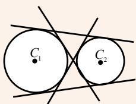</td><td></td><td></td><td>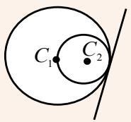</td><td></td></tr></table>

## 2、公切线的方程

核心技巧：利用圆心到切线的距离 $d = r$ 求解

【即学即练】

1．已知点 $A(-3,0)$ ， $B(3,0)$ ，若圆 $(x-a+1)^{2}+(y-a-2)^{2}=1$ 上存在点 M 满足 $MA \cdot MB = -5$ ，则实数 a 的值
不可能为（）A.2 B.1 C.0 D.-2

【答案】A

【详解】设 $M(x,y)$ ，因为 $\overline{MA} \cdot \overline{MB} = -5$ ， $\overline{MA} = (-3 - x, -y)$ ， $\overline{MB} = (3 - x, -y)$

所以 $\stackrel{\square\square\square\square}{MA}\cdot\stackrel{\square\square\square\square}{MB}=\left(-3-x\right)\times\left(3-x\right)+\left(-y\right)^{2}=x^{2}-9+y^{2}=-5$ ，即 $x^{2}+y^{2}=4$

所以点 M 的轨迹是圆，方程为 $x^{2} + y^{2} = 4$ .

由题意知，圆 $x^{2} + y^{2} = 4$ 与圆 $(x - a + 1)^{2} + (y - a - 2)^{2} = 1$ 有公共点，

所以 $2 - 1 \leq \sqrt{(a - 1)^2 + (a + 2)^2} \leq 2 + 1$ ，解得 $-2 \leq a \leq 1$

故A不满足.

故选：A.

2．若圆 $O_{1}:x^{2}+y^{2}-4y=0$ ，圆 $O_{2}:x^{2}+y^{2}-6x-4y+4=0$ 的两交点分别为 A，B，则 $|AB|=(\quad)$ A. $\frac{2\sqrt{5}}{3}$ B. $\frac{8\sqrt{2}}{3}$ C. $\frac{2\sqrt{2}}{3}$ D. $\frac{8\sqrt{5}}{3}$

【答案】B

【详解】方法一 将两圆的方程作差，可得 $x=\frac{2}{3}$ ，即直线 AB 的方程为 $x=\frac{2}{3}$ ，圆 $O_{1}$ 的圆心为 $O_{1}(0,2)$ ，半径为 2，
则 $O_{1}$ 到直线 $x=\frac{2}{3}$ 的距离为 $\frac{2}{3}$ ，故 $\left|AB\right|=2\sqrt{2^{2}-\left(\frac{2}{3}\right)^{2}}=\frac{8\sqrt{2}}{3}$ 方法二 联立 $\left\{\begin{aligned}x^{2}+y^{2}-4y=0,\\ x^{2}+y^{2}-6x-4y+4=0,\end{aligned}\right.$ 解得 $\left\{\begin{aligned}x=\frac{2}{3},\\ y=\frac{6+4\sqrt{2}}{3}\end{aligned}\right.$ 或 $\left\{\begin{aligned}x=\frac{2}{3},\\ y=\frac{6-4\sqrt{2}}{3},\end{aligned}\right.$ 所以 $\left|AB\right|=\frac{6+4\sqrt{2}}{3}-\frac{6-4\sqrt{2}}{3}=\frac{8\sqrt{2}}{3}$

故选：B.

## 题型精讲

![[高中/课堂同步/题库/人教A版高中数学同步讲义(2026)/03_选择性必修第一册/第二章 直线和圆的方程/第二章 直线和圆的方程（高效培优讲义）/题型01_直线的倾斜角与斜率/题型01_直线的倾斜角与斜率.md]]
![[高中/课堂同步/题库/人教A版高中数学同步讲义(2026)/03_选择性必修第一册/第二章 直线和圆的方程/第二章 直线和圆的方程（高效培优讲义）/题型02_两条直线的平行和垂直/题型02_两条直线的平行和垂直.md]]
![[高中/课堂同步/题库/人教A版高中数学同步讲义(2026)/03_选择性必修第一册/第二章 直线和圆的方程/第二章 直线和圆的方程（高效培优讲义）/题型03_求直线的方程/题型03_求直线的方程.md]]
![[高中/课堂同步/题库/人教A版高中数学同步讲义(2026)/03_选择性必修第一册/第二章 直线和圆的方程/第二章 直线和圆的方程（高效培优讲义）/题型04_直线的交点坐标和距离问题/题型04_直线的交点坐标和距离问题.md]]
![[高中/课堂同步/题库/人教A版高中数学同步讲义(2026)/03_选择性必修第一册/第二章 直线和圆的方程/第二章 直线和圆的方程（高效培优讲义）/题型05_求圆的方程/题型05_求圆的方程.md]]
![[高中/课堂同步/题库/人教A版高中数学同步讲义(2026)/03_选择性必修第一册/第二章 直线和圆的方程/第二章 直线和圆的方程（高效培优讲义）/题型06_直线和圆的位置关系/题型06_直线和圆的位置关系.md]]
![[高中/课堂同步/题库/人教A版高中数学同步讲义(2026)/03_选择性必修第一册/第二章 直线和圆的方程/第二章 直线和圆的方程（高效培优讲义）/题型07_圆的切线问题/题型07_圆的切线问题.md]]
![[高中/课堂同步/题库/人教A版高中数学同步讲义(2026)/03_选择性必修第一册/第二章 直线和圆的方程/第二章 直线和圆的方程（高效培优讲义）/题型08_圆的弦长问题/题型08_圆的弦长问题.md]]
![[高中/课堂同步/题库/人教A版高中数学同步讲义(2026)/03_选择性必修第一册/第二章 直线和圆的方程/第二章 直线和圆的方程（高效培优讲义）/题型09_圆与圆的位置关系/题型09_圆与圆的位置关系.md]]
![[高中/课堂同步/题库/人教A版高中数学同步讲义(2026)/03_选择性必修第一册/第二章 直线和圆的方程/第二章 直线和圆的方程（高效培优讲义）/题型10_与圆有关的轨迹问题/题型10_与圆有关的轨迹问题.md]]
![[高中/课堂同步/题库/人教A版高中数学同步讲义(2026)/03_选择性必修第一册/第二章 直线和圆的方程/第二章 直线和圆的方程（高效培优讲义）/题型11_与圆有关的最值问题/题型11_与圆有关的最值问题.md]]
![[高中/课堂同步/题库/人教A版高中数学同步讲义(2026)/03_选择性必修第一册/第二章 直线和圆的方程/第二章 直线和圆的方程（高效培优讲义）/题型12_公切线问题/题型12_公切线问题.md]]
![[高中/课堂同步/题库/人教A版高中数学同步讲义(2026)/03_选择性必修第一册/第二章 直线和圆的方程/第二章 直线和圆的方程（高效培优讲义）/强化训练/强化训练.md]]
