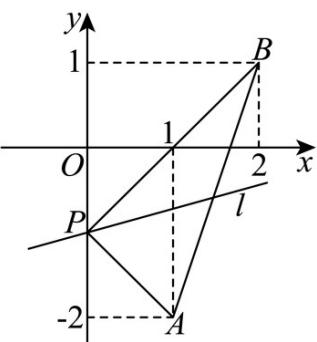
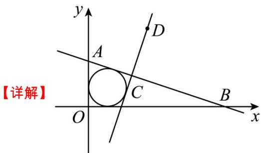

> [!faq]- 《第二章 直线和圆的方程（高效培优讲义）》官方解析
>
> > [!success]- **【答案】** D
>
> > [!note]- **【解析】**
> > 直线 $l$ 的方程可化为 $m(x + y + 1) + (2x - y - 1) = 0$ ，由 $\left\{ \begin{array}{ll}x + y + 1 = 0 & x = 0\\ 2x - y - 1 = 0 & y = -1 \end{array} \right.$ ，可得
> >
> > 所以，直线 $l$ 过定点 $P(0, - 1)$
> >
> > 设直线 $l$ 的斜率为 $k$ ，直线 $l$ 的倾斜角为 $\alpha$ ，则 $0 \leq \alpha < \pi$
> >
> > 因为直线 $PA$ 的斜率为 $\frac{-1 - (-2)}{0 - 1} = -1$ ，直线 $PB$ 的斜率为 $\frac{-1 - 1}{0 - 2} = 1$
> >
> > 因为直线 l 经过点 $P(0,-1)$ ，且与线段 AB 总有公共点，
> >
> > 
> >
> > 将 $A(1, -2)$ 代入方程： $(m + 2)x + (m - 1)y + m - 1 = 0$
> >
> > 可得： $3 = 0$ 不成立， $A(1, - 2)$ 不在直线 $l$ 上，
> >
> > 所以 $-1 < k \leq 1$ ，即 $-1 < \tan \alpha \leq 1$
> >
> > 因为 $0 \leq \alpha < \pi$ 所以 $0 \leq \alpha \leq \frac{\pi}{4}$ 或 $\frac{3\pi}{4} < \alpha < \pi$
> >
> > 故直线 $l$ 的倾斜角的取值范围是 $\left[0, \frac{\pi}{4}\right] \cup \left(\frac{3\pi}{4}, \pi\right)$
> >
> > 故选：D.
> >
> > 4. 直线 $l_{1}:(a+1)x+y-1=0, l_{2}:2x+ay+a-2=0$ ，则 “ $l_{1}//l_{2}$ ” 的充要条件是（）
> >
> > 【答案】
> > A. a = 1
> > B. a = -2
> > C. a = 1 或 -2
> > D. 以上均不对
> >
> > 【答案】B
> >
> > 【详解】因为直线 $l_{1}:(a + 1)x + y - 1 = 0,l_{2}:2x + ay + a - 2 = 0$
> >
> > 当 $l_{1} / / l_{2}$ 时， $(a + 1)a = 2$ ，解得 $a = 1$ 或-2
> >
> > 当 $a = 1$ 时， $l_{1}:2x + y - 1 = 0, l_{2}:2x + y - 1 = 0$ ，此时两直线重合，舍去，
> >
> > 又 $a = -2$ 时， $l_{1}: x - y + 1 = 0, l_{2}: x - y - 2 = 0$ ，此时 $l_{1} // l_{2}$
> >
> > 所以“ $l_1//l_2$ ”的充要条件是“ $a = -2$ ”.
> >
> > 故选：B.
> >
> > 5．过点 $(0,\frac{7}{3})$ 与点 $(7,0)$ 的直线 $l_{1}$ ，过点 $(2,1)$ 与点 $(3,k+1)$ 的直线 $l_{2}$ 与两坐标轴围成的四边形内接于一个圆，
> > 则实数 k 为( )
> > A. -3
> > B. 3
> > C. -6
> > D. 6
> >
> > 【答案】B
> >
> > 
> >
> > 根据四点共圆的条件可知11与12是相互垂直， $k_{l_{1}}=\frac{0-\frac{7}{3}}{7-0}=-\frac{1}{3},k_{l_{2}}=\frac{k+1-1}{3-2}=k$ 由已知得 $l_{1}\perp l_{2}$ ，∴ $\left(-\frac{1}{3}\right)\times k=-1$
