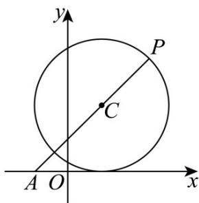

> [!faq]- 《第二章 直线和圆的方程（高效培优讲义）》官方解析
>
> > [!success]- **【答案】** (1) $(x-1)^{2}+(y-2)^{2}=4$ (2)最小值为 $14-8\sqrt{2}$ ，最大值为 $14+8\sqrt{2}$ 。
>
> > [!note]- **【解析】**
> > （1） $M:(x + 1)^2 +(y + 2)^2 = 4$ 的圆心为 $M(-1, - 2)$ ，半径为2，
> >
> > 因为圆 C 与圆 $M:(x+1)^{2}+(y+2)^{2}=4$ 关于原点对称，
> >
> > 所以圆 C 的圆心为 $C(1,2)$ ，半径为 2，
> >
> > 所以圆 C 的标准方程为 $(x-1)^{2}+(y-2)^{2}=4$ ；
> >
> > (2) 方法一：由（1）知，圆 $C$ 的圆心 $C(1,2)$ ，半径 $r = 2$ ， $x^2 + y^2 + 2x + 3 = (x + 1)^2 + y^2 + 2$
> >
> > 因为 $\sqrt{(x + 1)^2 + y^2}$ 表示点 $P(x,y)$ 与 $A(-1,0)$ 之间的距离，即 $|PA|$
> >
> > 
> >
> > 所以 $x^{2} + y^{2} + 2x + 3 = |PA|^{2} + 2$
> >
> > 又 $|AC| = \sqrt{(-1 - 1)^2 + (0 - 2)^2} = 2\sqrt{2} > r$
> >
> > 所以点A在圆 $C$ 外，所以 $\left|PA\right|_{\min} = \left|AC\right| - r = 2\sqrt{2} -2,\left|PA\right|_{\max} = \left|AC\right| + r = 2\sqrt{2} +2$
> >
> > 则 $x^{2} + y^{2} + 2x + 3$ 的最小值为 $(2\sqrt{2} - 2)^{2} + 2 = 14 - 8\sqrt{2}$
> >
> > 最大值为 $(2\sqrt{2} + 2)^{2} + 2 = 14 + 8\sqrt{2}$
> >
> > 方法二：由点 $P(x,y)$ 为圆 $C$ 上任意一点，
> >
> > 且圆 C 的标准方程为 $(x-1)^{2}+(y-2)^{2}=4$ ，可设 $\left\{\begin{aligned}x=1+2\cos\theta,\\ y=2+2\sin\theta,\end{aligned}\right.$
> >
> > 则 $x^{2} + y^{2} + 2x + 3 = (1 + 2\cos \theta)^{2} + (2 + 2\sin \theta)^{2} + 2(1 + 2\cos \theta) + 3 = 14 + 8(\sin \theta +\cos \theta) = 14 + 8\sqrt{2}\sin \left(\theta +\frac{\pi}{4}\right)$
> >
> > 因为 $-1\leq \sin \left(\theta +\frac{\pi}{4}\right)\leq 1$
> >
> > 所以 $x^{2} + y^{2} + 2x + 3$ 的最小值为 $14 - 8\sqrt{2}$ ，最大值为 $14 + 8\sqrt{2}$
