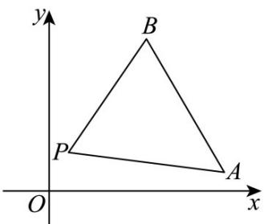

> [!faq]- 《第二章 直线和圆的方程（高效培优讲义）》官方解析
>
> > [!success]- **【答案】** C
>
> > [!note]- **【解析】**
> > 
> >
> > 由题得 $k_{PA}=\frac{2-1}{1-9}=-\frac{1}{8}$ ， $k_{PB}=\frac{2-8}{1-5}=\frac{3}{2}$ ，
> >
> > 因为直线 l 与连接 $A(91)$ ， $B(58)$ 两点的线段总有公共点，
> >
> > 结合图可知， $k \in \left[-\frac{1}{8}, \frac{3}{2}\right]$ .
> >
> > 故选 **C**
