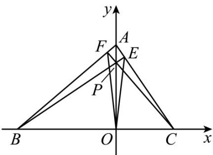

<!-- question-source:start -->
【变式3】在平面直角坐标系 $xOy$ 中，设三角形 $ABC$ 的顶点分别为 $A(0,a)$ ， $B(b,0)$ ， $C(c,0)$ ，点 $P(0,p)$ 是线段 $AO$ 上的一点（异于端点），设 $a,b,c,p$ 均为非零实数，直线 $BP,CP$ 分别交 $AC,AB$ 于点 $E,F$ ，若 $BE \perp AC$ ，求证： $CF \perp AB$ .

<!-- question-source:end -->

![[高中/课堂同步/题库/人教A版高中数学同步讲义(2026)/03_选择性必修第一册/第二章 直线和圆的方程/第二章 直线和圆的方程（高效培优讲义）/题型02_两条直线的平行和垂直/questions/answers/Q00080768A1.md]]
