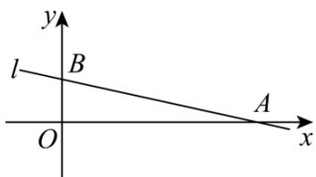

> [!faq]- 《第二章 直线和圆的方程（高效培优讲义）》官方解析
>
> > [!success]- **【答案】** (1) $x+y-5=0$ 或 2x-3y=0 (2) $a = -3$ 或 $a = -\frac{11}{9}$
>
> > [!note]- **【解析】**
> > （1）当 $a+1=0$ 即a=-1时，直线l的方程为y=2，不满足题意；
> >
> > 当 $a + 1 \neq 0$ ，即 $a \neq -1$ 时，令 $x = 0$ 得 $y = -3a - 1$ ，令 $y = 0$ ，得 $x = \frac{3a + 1}{a + 1}$
> >
> > 由截距相等得 $\frac{3a + 1}{a + 1} = -3a - 1$ ，解得 $a = -2$ 或 $a = -\frac{1}{3}$
> >
> > 当 $a = -2$ 时，直线 $l$ 的方程为 $x + y - 5 = 0$ ，当 $a = -\frac{1}{3}$ 时，直线 $l$ 的方程为 $2x - 3y = 0$ ，
> >
> > 故综上所述，所求直线 $l$ 的方程为 $x + y - 5 = 0$ 或 $2x - 3y = 0$
> >
> > (2) 由题意知， $a+1 \neq 0$ ， $-3a-1 \neq 0$ ，且 l 在 x 轴、y 轴上的截距分别为 $\frac{3a+1}{a+1}$ 、-3a-1，
> >
> > 所以 $\left\{\begin{aligned}\frac{3a+1}{a+1}&>0\\ -3a-1&>0\end{aligned}\right.$ ，解得 a<-1，
> >
> > 所以 $\mathrm{V}_{AOB}$ 的面积 $S = \frac{1}{2}\left(\frac{3a + 1}{a + 1}\right)(-3a - 1) = -\frac{(3a + 1)^2}{2(a + 1)}$
> >
> > 
> >
> > 由题意知 $-\frac{(3a + 1)^2}{2(a + 1)} = 16$ ，化简得 $9a^2 + 38a + 11 = 0$ ，解得 $a = -3$ 或 $a = -\frac{11}{9}$ ，均满足条件，所以 $a = -3$ 或 $a = -\frac{11}{9}$ 。
