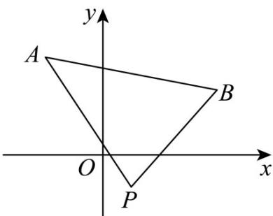

> [!faq]- 《第二章 直线和圆的方程（高效培优讲义）》官方解析
>
> > [!success]- **【答案】** C
>
> > [!note]- **【解析】**
> > 直线 $l: x + my + m - 1 = 0$ 恒过的定点 $P(1, -1)$ ， $k_{AP} = -\frac{4}{3}, k_{BP} = 1$ 当 $m = 0$ 时，直线 $l$ 方程为 $x = 1$ ，与线段 $AB$ 有交点，符合题意。当 $m \neq 0$ 时，直线 $l$ 的斜率为 $-\frac{1}{m}$ ，则 $-\frac{1}{m} \in \left(-\infty, -\frac{4}{3}\right] \cup [1, +\infty)$ ，解得 $-1 \leq m < 0$ 或 $0 < m \leq \frac{3}{4}$ ，综上， $m \in \left[-1, \frac{3}{4}\right]$ 。
> >
> > 故选：C
> >
> > 
> >
> > ## 方法技巧
> >
> > 1、两点 $P_{1}(x_{1},y_{1}),P_{2}(x_{2},y_{2})$ 间的距离公式为 $\left|P_1P_2\right| = \sqrt{(x_2 - x_1)^2 + (y_2 - y_1)^2}$
> >
> > 2、点 $P(x_0,y_0)$ 到直线 $Ax + By + C = 0$ 的距离为 $d = \frac{|Ax_0 + By_0 + C|}{\sqrt{A^2 + B^2}}$
> >
> > 3、直线 $Ax + By + C_1 = 0$ 与直线 $Ax + By + C_2 = 0$ 的距离为 $d = \frac{|C_2 - C_1|}{\sqrt{A^2 + B^2}}$
