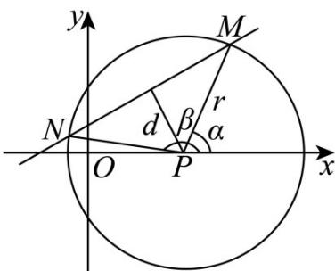

> [!faq]- 《第二章 直线和圆的方程（高效培优讲义）》官方解析
>
> > [!success]- **【答案】** (1) $(x-4)^{2}+y^{2}=25$ (2) $-\frac{7}{25}$
>
> > [!note]- **【解析】**
> > （1）设圆 P 的一般方程为 $x^{2} + y^{2} + Dx + Ey + F = 0$ ，
> >
> > 则 $\left\{ \begin{array}{l}3^{2} + 3E + F = 0,\\ (-3)^{2} - 3E + F = 0,\\ 4^{2} + 5^{2} + 4D + 5E + F = 0, \end{array} \right.$ 解得 $\left\{ \begin{array}{l}D = -8,\\ E = 0,\\ F = -9. \end{array} \right.$
> >
> > 所以圆 $P$ 的一般方程为 $x^{2} + y^{2} - 8x - 9 = 0$ ，故圆 $P$ 的标准方程为 $(x - 4)^{2} + y^{2} = 25$
> >
> > (2) 如图，点到直线的距离 $d = \frac{\left|\frac{\sqrt{3}}{3} \times 4 - 0 + \frac{2\sqrt{3}}{3}\right|}{\sqrt{\left(\frac{\sqrt{3}}{3}\right)^2 + (-1)^2}} = 3$
> >
> > 
> >
> > 又圆 P 的半径 r = 5 ，所以 $\cos\frac{\alpha - \beta}{2} = \frac{d}{r} = \frac{3}{5}$
> >
> > 所以 $\cos(\alpha-\beta)=2\cos^{2}\frac{\alpha-\beta}{2}-1=2\times\left(\frac{3}{5}\right)^{2}-1=-\frac{7}{25}$
> >
> > ## 方法技巧
> >
> > 确定圆的方程的主要方法是待定系数法，即列出关于 $a$ 、 $b$ 、 $r$ 的方程组，求 $a$ 、 $b$ 、 $r$ 或直接求出圆心 $(a,b)$ 和
> >
> > 半径 $r$ ，一般步骤为：
> >
> > (1) 根据题意，设所求的圆的标准方程为 $(x-a)^{2}+(y-b)^{2}=r^{2}$ ;
> >
> > (2) 根据已知条件，建立关于 $a$ 、 $b$ 、 $r$ 的方程组；
> >
> > (3) 解方程组，求出 $a$ 、 $b$ 、 $r$ 的值，并把它们代入所设的方程中去，就得到所求圆的方程。
