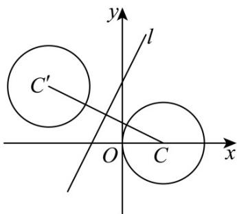

> [!faq]- 《第二章 直线和圆的方程（高效培优讲义）》官方解析
>
> > [!success]- **【答案】** (1) $x^{2}+y^{2}-4x=0$ $$ (2) \left(x + \frac {1 8}{5}\right) ^ {2} + \left(y - \frac {1 4}{5}\right) ^ {2} = 4 $$
>
> > [!note]- **【解析】**
> > （1）设圆 C 的一般方程为 $x^{2} + y^{2} + Dx + Ey + F = 0$ ，则
> >
> > $\left\{ \begin{array}{l} F = 0 \\ 16 + 4D + F = 0 \\ 4 + 4 + 2D + 2E + F = 0 \end{array} \right.$ ，解得 $\left\{ \begin{array}{l} D = -4 \\ E = 0 \\ F = 0 \end{array} \right.$
> >
> > ∴圆 C 的一般方程为 $x^{2} + y^{2} - 4x = 0$
> >
> > (2)
> >
> > 
> >
> > 由（1）得圆 C 的圆心为 $C(2,0)$ ，半径 r=2，圆 $C'$ 半径为 2.
> >
> > 设 $C^{\prime}(m,n)$ ，则 $CC^{\prime}\perp l$ ，且 $CC^{\prime}$ 的中点 $\left(\frac{m + 2}{2},\frac{n}{2}\right)$ 在直线 $l$ 上，
> >
> > $\therefore \left\{ \begin{array}{l} k_{CC'} = \frac{n}{m - 2} = -\frac{1}{2} \\ \frac{n}{2} = 2 \cdot \frac{m + 2}{2} + 3 \end{array} \right.$ ，解得 $\left\{ \begin{array}{l} m = -\frac{18}{5} \\ n = \frac{14}{5} \end{array} \right.$
> >
> > $\therefore \text{圆 } C'$ 的标准方程为 $\left(x + \frac{18}{5}\right)^2 + \left(y - \frac{14}{5}\right)^2 = 4$
