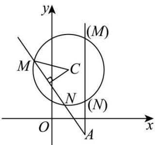
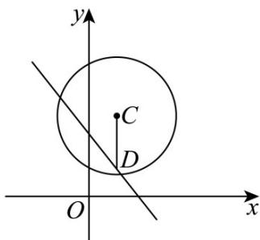

> [!faq]- 《第二章 直线和圆的方程（高效培优讲义）》官方解析
>
> > [!success]- **【答案】** (1)x=2 或 $15x+8y-22=0$ . (2)直线 $mx - y + 1 - m = 0$ 与圆 C 相交，理由见解析
>
> > [!note]- **【解析】**
> > （1）由圆 $C:(x - 1)^2 +(y - 3)^2 = 5$ 可得，圆心 $C(1,3)$ ，半径 $r = \sqrt{5}$
> >
> > 当直线 l 的斜率不存在时，直线 l 的方程为 x = 2。
> >
> > 圆心 $C(1,3)$ 到直线 l 的距离为 d=1，
> >
> > 此时 $\left|MN\right|=2\sqrt{r^{2}-d^{2}}=4$ ，符合题意.
> >
> > 当直线 $l$ 的斜率存在时，设直线 $l$ 的方程为 $y + 1 = k(x - 2)$
> >
> > 即 $kx - y - 2k - 1 = 0$
> >
> > 圆心 $C(1,3)$ 到直线 l 的距离为 $d=\frac{|k-3-2k-1|}{\sqrt{k^{2}+1}}=\frac{|k+4|}{\sqrt{k^{2}+1}}$
> >
> > 因为 $|MN| = 2\sqrt{r^2 - d^2} = 2\sqrt{5 - d^2} = 4$ ，所以 $d = 1$ 所以 $\frac{|k + 4|}{\sqrt{k^2 + 1}} = 1$
> >
> > 解得 $k = -\frac{15}{8}$ . 所以直线 $l$ 的方程为 $y + 1 = -\frac{15}{8} (x - 2)$ ，即 $15x + 8y - 22 = 0$ .
> >
> > 综上，所求直线的方程为 x = 2 或 $15x + 8y - 22 = 0$ .
> >
> > 
> >
> > (2) 法一：因为直线 $mx - y + 1 - m = 0$ 过定点 $D(1,1)$
> >
> > 又因为 $|CD| = \sqrt{(1 - 1)^2 + (3 - 1)^2} = 2 < \sqrt{5}$
> >
> > 所以点 $D(1,1)$ 在圆 C 内.
> >
> > 所以直线 $mx - y + 1 - m = 0$ 与圆 C 相交.
> >
> > 
> >
> > 法二：圆心 $C$ 到直线 $mx - y + 1 - m = 0$ 的距离 $d = \frac{|m - 3 + 1 - m|}{\sqrt{m^2 + 1}} = \frac{2}{\sqrt{m^2 + 1}}$
> >
> > <!-- source-part:2 pages:51-100 -->
> >
> > 因为 $\sqrt{m^{2}+1}$ 1，所以 $0 < \frac{1}{\sqrt{m^{2}+1}} \leq 1$
> >
> > 所以 $0 < \frac{2}{\sqrt{m^{2}+1}} \leq 2 < \sqrt{5}$
> >
> > 所以直线 $mx - y + 1 - m = 0$ 与圆 C 相交.
