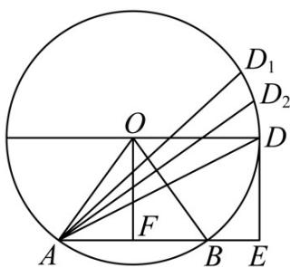

> [!faq]- 《第二章 直线和圆的方程（高效培优讲义）》官方解析
>
> > [!success]- **【答案】** C
>
> > [!note]- **【解析】**
> > 设 $\overline{AB}$ 与 $\overline{AD}$ 的夹角为 $\theta$ ，根据向量数量积的定义可得 $AD \cdot AB = |AB||AD| \cos \theta = 3|AD| \cos \theta$ 。要使 $\overline{AD} \cdot \overline{AB}$ 最大，只需要 $|AD| \cos \theta$ ，也就是 $\overline{AB} \cdot \overline{AD}$ 方向的投影最大，如图所示，D 为圆 O 上一动点（如
> >
> > 等位置），
> >
> > 过点 $D$ 作 $DE \perp AB$ 于点 $E$ ，则 $|AD| \cos \theta = |AE|$ ，所以 $AD \cdot AB = |AB||AE|$ .
> >
> > 
> >
> > 已知 $|AB|=3$ ，则 $AD\cdot AB=3|AE|$ 、 $|AE|$ 最大即可.此时OD//AB，且ED切于圆.
> >
> > 过点 O 作 $OF \perp AB$ 于点 F，此时 $\left|\begin{matrix} A E \\ |AE| \end{matrix}\right|$ 的最大值为 $\left|AF\right| + \left|FE\right| = \frac{1}{2}\left|AB\right| + \left|OD\right| = \frac{3}{2} + R = \frac{9}{2}$ （R 为圆 O 的半径）.
> >
> > 将 $|\overline{AE}|$ 的最大值 $\frac{9}{2}$ 代入 $\overline{AD} \cdot \overline{AB} = 3|\overline{AE}|$ ，可得 $\overline{AD} \cdot \overline{AB}$ 的最大值为 $3 \times \frac{9}{2} = \frac{27}{2}$ .
> >
> > 故选 **C**.
