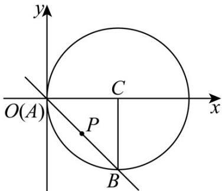

> [!faq]- 《第二章 直线和圆的方程（高效培优讲义）》官方解析
>
> > [!success]- **【答案】** (1) $y = x + 2\sqrt{2} - 2$ 或 $y = x - 2\sqrt{2} - 2$ (2) $y = -x$
>
> > [!note]- **【解析】**
> > （1）由已知得圆心 $C$ 的坐标为 $(2,0)$ ，半径 $r = 2$
> >
> > 因为直线 $l$ 与圆 $C$ 相切，所以圆心 $C(2,0)$ 到直线 $l$ 的距离 $d = r$
> >
> > 即 $\frac{|2 + b|}{\sqrt{2}} = 2$ ，解得 $b = 2\sqrt{2} -2$ 或 $-2\sqrt{2} -2$
> >
> > 故直线 l 的方程为 $y = x + 2\sqrt{2} - 2$ 或 $y = x - 2\sqrt{2} - 2$
> >
> > (2) 在直角 $\mathrm{V}ABC$ 中，因为 $|CA| = |CB| = r = 2$ ，所以 $\angle C = \frac{\pi}{2}$ ，则 $\mathrm{V}ABC$ 为等腰直角三角形，
> >
> > 因此直线 $m$ 与圆 $C$ 所截的弦长 $\left|AB\right| = \sqrt{\left|CA\right|^2 + \left|CB\right|^2} = 2\sqrt{2}$
> >
> > 所以，圆心到直线 $AB$ 的距离为 $\frac{1}{2} |AB| = \sqrt{2}$
> >
> > 显然，当直线 $m$ 垂直于 $x$ 轴时，直线 $m$ 的方程为 $x = 1$ ，此时圆心到直线 $m$ 的距离为1，不合乎题意；
> >
> > 所以，直线 $m$ 的斜率存在，设它的方程为 $y + 1 = k(x - 1)$ ，即 $kx - y - k - 1 = 0$
> >
> > 所以， $\frac{|2k - k - 1|}{\sqrt{k^2 + 1}} = \sqrt{2}$ ，解得 $k = -1$ ，则直线 $m$ 的方程为 $y = -x$
> >
> > 综上所述，直线 $m$ 的方程为 $y = -x$
> >
> > 
