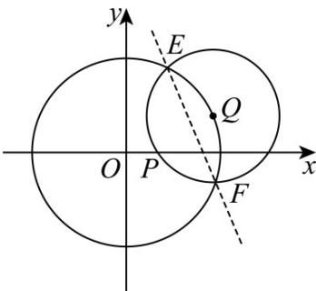

<!-- question-source:start -->
【变式2】在平面直角坐标系 $xOy$ 中，已知圆 $O: x^2 + y^2 = 9$ 及圆内一点 $P(1,0)$ ， $Q$ 是圆 $O$ 上的动点。以 $Q$ 为圆

心， $QP$ 为半径的圆 $Q$ ，与圆 $O$ 相交于 $E, F$ 两点，

(1)若圆 $Q$ 与圆 $x^{2} + y^{2} = r^{2}(r > 0)$ 恒有公共点，求 $r$ 的取值范围；

(2)证明：点 $P$ 到直线 $EF$ 的距离为定值，并求出此定值.
<!-- question-source:end -->

![[高中/课堂同步/题库/人教A版高中数学同步讲义(2026)/03_选择性必修第一册/第二章 直线和圆的方程/第二章 直线和圆的方程（高效培优讲义）/题型09_圆与圆的位置关系/questions/answers/Q00080802A1.md]]
