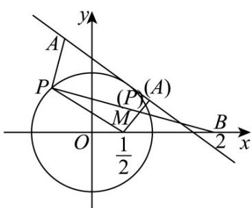

> [!faq]- 《第二章+直线和圆的方程（高效培优单元测试·提升卷）》官方解析
>
> > [!success]- **【答案】** A. $\frac{6}{5}$ B. $\frac{7}{3}$ C. $\frac{\sqrt{65}}{5}$ D. $\frac{7}{5}$
>
> > [!note]- **【解析】**
> > $\because m^{2}+n^{2}=2n-4m-4$ ， $\left(m+2\right)^{2}+\left(n-1\right)^{2}=1$ .
> >
> > 设P点坐标为 $\left(x,y\right)$ ，由题意 $x=m+2,y=1-n$ ，则 $x^{2}+y^{2}=1$ ， $\therefore P$ 点轨迹是以 $O(0,0)$ 点为圆心， $^{1}$ 为半径的圆，记为圆O，
> >
> > 设在x轴上存在定点M(a,0)，使得圆上任意一点P(x,y)，满足 $\left|PB\right|=2\left|PM\right|$ ，
> >
> > 则 $\sqrt{(x-2)^{2}+y^{2}}=2\sqrt{(x-a)^{2}+y^{2}}$
> >
> > 化简得 $3(x^{2}+y^{2})-4(2a-1)x+4(a^{2}-1)=0$
> >
> > 又∵ $x^{2}+y^{2}=1$ ，代入得 $4(1-2a)x+4a^{2}-1=0$ ，
> >
> > 要使等式恒成立，则 $1-2a=0$ ，即 $a=\frac{1}{2}$
> >
> > ∴存在定点 $M\left(\frac{1}{2},0\right)$ ，使圆上任意一点 P 满足 $\left|PB\right|=2\left|PM\right|$ ，
> >
> > 则 $2\left|AP\right| + \left|BP\right| = 2\left|AP\right| + 2\left|MP\right| = 2\left(\left|AP\right| + \left|MP\right|\right)$ $2\left|AM\right|$
> >
> > 当 A, P, M 三点共线 (A, M 位于 P 两侧) 时，等号成立.
> >
> > 又 A 点为直线 $3x + 4y - 5 = 0$ 上一动点，则 $\left|AM\right|$ 的最小值即为点 M 到直线的距离，
> >
> > 由 $M\left(\frac{1}{2},0\right)$ 到直线距离 $d = \frac{\left|\frac{3}{2} - 5\right|}{\sqrt{3^2 + 4^2}} = \frac{7}{10}$ ，则 $\left|AM\right|_{\min} = \frac{7}{10}$ .
> >
> > 故 $2|AP| + |BP|$ $2|AM|$ $2d = \frac{7}{5}$ .
> >
> > 如图，过 M 作直线 $3x + 4y - 5 = 0$ 的垂线段，垂线段与圆 O 的交点即为取最值时的点 P，此时取到最小值 $\frac{7}{5}$ .
> >
> > 故选：D.
> >
> > 
> >
> > ## 二、选择题：本题共3小题，每小题6分，共18分．在每小题给出的选项中，有多项符合题目要求．全部选对的得6分，部分选对的得部分分，有选错的得0分.
