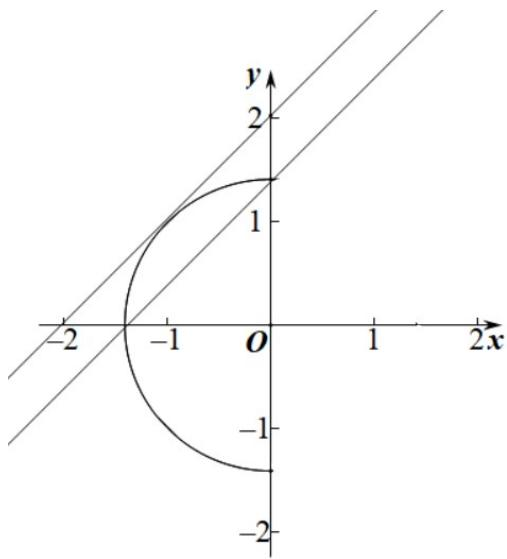

> [!faq]- 《第二章+直线和圆的方程（高效培优单元测试·提升卷）》官方解析
>
> > [!success]- **【答案】** $\sqrt{2} \leq b < 2$
>
> > [!note]- **【解析】**
> > 曲线 $x = -\sqrt{2 - y^{2}}$ 即 $x^{2} + y^{2} = 2(x \leq 0)$ ,
> >
> > 
> >
> > 如图所示，当即 $b = \sqrt{2}$ 时，直线 $y = x + b$ 与曲线 $x = -\sqrt{2 - y^2}$ 有两个公共点，
> >
> > 直线向左上移动，当直线 $y = x + b$ 与曲线 $x = -\sqrt{2 - y^2}$ 相切时，有一个公共点，
> >
> > 原点到直线 $y = x + b$ 的距离为半径，即 $\frac{|b|}{\sqrt{2}} = \sqrt{2}$ ，解得 $b = 2$
> >
> > 所以，当有两个公共点时 $\sqrt{2} \leq b < 2$
> >
> > 故答案为： $\sqrt{2} \leq b < 2$
